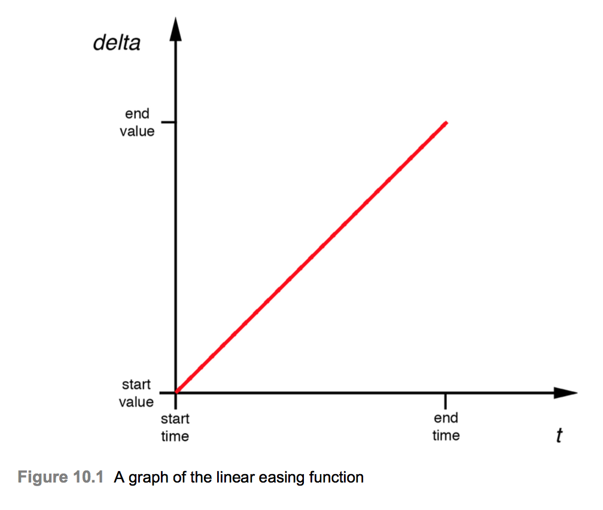

# Easing
* In life, as in art, the beautiful moves in curves. - Edward G. Bulwer-Lytton -
* 9장 `Layer Time`에서는 애니메이션 타이밍과 CAMediaTiming 프로토콜에 대하여 설명하였다. 이제 우리는 또 다른 시간 관련 매커니즘인 `Easing`라고 알려진 시스템에 대하여 살펴볼 것이다. Core Animation은 `Easing`을 사용하여 로봇 및 인공물처럼 보이는것 대신 자연스럽고 부드럽게 움직이는 애니메이션을 만든다. 이 장에서는 애니메이션의 `Easing curves`를 제어하고 사용자 정의하는 방법에 대하여 살펴볼 것이다.

## Animation Velocity
* 애니메이션은 시간이 지남에 따라 값이 변하는 것을 의미하며 이는 특정 비율 또는 속도로 변하는것을 함축한다. 애니메이션의 속도는 지속시간과 관련하여 다음 방정식을 이용하여 구할 수 있다.
```
Velocity = change / time
```
* `change`는 물체가 움직이는 거리(예를들어)이며, `time`은 애니메이션의 지속시간이다. 이동(position 또는 bounds 속성의 애니메이션과 같은)이 포함된 애니메이션의 경우 시각화가 더 쉽지만 애니메이티브 속성(예: 색상 또는 불투명도)에도 똑같이 적용된다.
* 위의 수식은 속도가 애니메이션 전체에서 일정하다고 가정한 것이다(8장 `Implicit Animations`에서 생성한 애니메이션의 경우). 애니메이션에 일정한 속도를 사용하는 것을 `Linear pacing`라고하며 기술적인 관점에서 보면 애니메이션을 구현하는 가장 간단한 방법이다. 또한 완전히 비현실적이다.
* 짧은 거리를 운전하는 자동차를 생각해보면 60mph에서 시작하지 않을것이고 목적지에 도착 시 즉시 0mph로 떨어질 것이다. 한 가지는 무한대로 가속해야 한다는 것이다.
* 현싲럭으로 천천히 전속력으로 가속화 될 것이고 목적지가 가까워지면 마침내 완만하게 멈출때까지 속도가 느려질 것이다.
* 다른 예로 표면에 떨어지는 물체는 정지상태로 시작한 다음 표면에 닿을때 까지 계속 가속한다. 현실세계의 모든 물체는 가속하고 감속한다. 그렇다면 애니메이션에서 이러한 종류의 가속을 어떻게 구현할까? 하나의 옵션은 물리 엔진을 사용하여 애니메이션 오브젝트의 마찰과 운동량을 현실적으로 모델링하는 것이지만 대부분의 경우 과잉이다. 애니메이션 사용자 인터페이스의 경우 우리는 레이어를 실제의 실물처럼 움직일 수 있는 몇가지 타이밍 방적식을 원하지만 계산하는것은 너무 복잡하다. 이러한 유형의 방정식에 대한 이름은 기능을 완화하는 것이며, 다행스럽게도 Core Animation에는 여러가지 기본 기능이 내장되어있어 사용할 준비가 되어있다.
### CAMediaTimingFunction
* Easing 함수를 사용하려면 CAMediaTimingFunction 클래스의 객체인 CAAnimation의 timingFunction 속성을 설정해야 한다. Implicit Animation의 타이밍 함수를 변경하려면 CATransaction의 `setAnimationTimingFunction` 메서드를 사용할 수도 있다. CAMediaTimingFunction을 만드는 데는 두 가지 방법이 있다. 가장 간단한 옵션은 `timingFunctionWithName` 생성자 메서드를 호출하는 것이다. 이것은 아래 상수 중 하나를 가져올 수 있다.
  * kCAMediaTimingFunctionLinear
  * kCAMediaTimingFunctionEaseIn
  * kCAMediaTimingFunctionEaseOut
  * kCAMediaTimingFunctionEaseInEaseOut
  * kCAMediaTimingFunctionDefault
* `kCAMediaTimingFunctionLinear`옵션은 linear paced timing function함수를 생성한다. linear pacing은 거의 순간족으로 가속되는 것을 모델링 한 다음 목표에 도착할 때까지 크게 느려지지 않는다.
* `kCAMediaTimingFunctionEaseIn` 상수는 느리게 시작하여 갑자기 멈추기 전에 최대 속도까지 점진적으로 가속하는 함수를 만든다. 이것은 앞에서 언급한 추락 된 무게 예제 또는 목표물에서 발사된 미사일과 같은 것에 적합하다.
* `kCAMediaTimingFunctionEaseOut` 상수는 그 반대이다. 이것은 최고속도로 시작하고 점차 속도가 느려진다. 이것은 일종의 감쇠효과가 있으며 문이 열리고 닫히는 애니메이션에 적합하다.
* `kCAMediaTimingFunctionEaseInEaseOut` 상수는 최고 속도까지 점진적 가속도를 생성한 다음 부드럽게 감속하여 정지한다. 이것은 일반적으로 대부분의 실제 객체가 움직이는 방식이며 대부분의 애니메이션에서 최상의 선택이다. 하나의 Easing 함수만 선택할 수 있다면 이 함수가 된다. 이 사실을 감안할 때 왜 이것이 기본값이 아닌지 궁금해 할 수 없다. 사실 UIView 애니메이션 메서드를 사용할 때 이것이 기본값이지만 CAAnimation을 만들 때는 직접 지정해야한다.
* `kCAMediaTimingFunctionDefault` 상수는 `kCAMediaTimingFunctionEaseInEaseOut`과 매우 유상한 특징을 가졌지만 최고 속도까지 약간 더 빠른 초기 가속도와 약간 더 점진적인 감속이 뒤따르는 가속도를 만든다. `kCAMediaTimingFunctionEaseInEaseOut`과 차이는 거의 눈에 띄지 않지만 Apple은 암시적 애니메이션의 기본값으로 더 나은 선택이라고 생각했다(대신 `kCAMediaTimingFunctionEaseInEaseOut`를 기본값으로 사용하는 UIKit에 대한 마음이 바뀌었다.). 이름에도 불구하고 명시적 CAAnimation을 만들 때 이 값이 기본값이 아니며 암시적 애니메이션의 기본 값으로만 사용된다(즉, 기본 레이어 액션 애니메이션은 `kCAMediaTimingFunctionDefault`를 타이밍 기능으로 사용한다.).
* 간단한 테스트 프로젝트를 만들어 다양한 Easing 함수를 시험해 볼 것이다.
```Swift
class ViewController: UIViewController {
    let colorLayer = CALayer()
    override func viewDidLoad() {
        super.viewDidLoad()
        
        colorLayer.frame = CGRect(x: 0, y: 0, width: 100, height: 100)
        colorLayer.position = CGPoint(x: view.bounds.size.width / 2, y: view.bounds.size.width / 2)
        colorLayer.backgroundColor = UIColor.red.cgColor
        view.layer.addSublayer(colorLayer)
    }
    
    override func touchesBegan(_ touches: Set<UITouch>, with event: UIEvent?) {
        super.touchesBegan(touches, with: event)
        
        CATransaction.begin()
        CATransaction.setAnimationDuration(1.0)
        CATransaction.setAnimationTimingFunction(CAMediaTimingFunction(name: kCAMediaTimingFunctionEaseOut))
        
        colorLayer.position = touches.first?.location(in: view) ?? colorLayer.position
        
        CATransaction.commit()
    }
}
```

### UIView Animation Easing
* UIView의 애니메이션 메서드도 구문과 상수가 다르지만 Easing 함수를 지원한다. UIView 애니메이션 메서드의 easing를 변경하려면 애니메이션 options 매개 변수에 다음 상수 중 하나를 추가한다.
  * UIViewAnimationOptionCurveEaseInOut
  * UIViewAnimationOptionCurveEaseIn
  * UIViewAnimationOptionCurveEaseOut
  * UIViewAnimationOptionCurveLinear

* 위의 것들은 CAMediaTimingFunction과 짝으로 일치한다. UIViewAnimationOptionCurveEaseInOut은 사용자가 지정하지 않으면 사용되는 기본값이다.(kCAMediaTimingFunctionDefault에 대한 UIKit에는 해당 항목이 없다.)
* 위의 함수들이 어떻게 동작하는지 예를 들어보자.(UIKit 애니메이션이 호승팅 된 레이어에서 작동하지 않기 때문에 이 예제에서는 호스팅 된 레이어를 사용하여 UIView로 전환하였다.)
```Swift
class ViewController: UIViewController {
    @IBOutlet weak var colorView: UIView!

    override func viewDidLoad() {
        super.viewDidLoad()

        colorView.backgroundColor = .red
    }
    
    override func touchesBegan(_ touches: Set<UITouch>, with event: UIEvent?) {
        UIView.animate(withDuration: 1.0, delay: 0.0, options: [.curveEaseInOut], animations: {
            guard let location = touches.first?.location(in: self.view) else { return }
            self.colorView.center = location
        }, completion: nil)
    }
}
```

### Easing and Keyframe Animations
* 8장의 색성 전환 KeyFrameAnimation은 색상 간의 션형 페이싱으로 인해 약간 이상해 보였으므로 색상 사이의 전환이 자연스럽지 않게 발생하였다. 이를 보정하기 위해 kCAMediaTimingFunctionEaseIn 보다 적절한 easing 함수를 적용할 수 있다. 이 함수는 색인이 있는 전구가 실제처럼 작동하는 것처럼 레이어가 색상을 변경함에 따라 약간의 펄스 효과를 추가한다.
* 우리는 전체 애니메이션에 걸쳐 균일하게 함수를 적용하고싶지 않다. 각 애니메이션 단계마다 Easing을 반복하여 각 color transition pulse가 순서대로 반복되도록 하려는 것이다.
* CAKeyframeAnimation에는 NSArray인 timingFunctions 속성이 있다. 이를 사용하여 애니메이션의 각 단계마다 다른 타이밍 함수를 지정할 수 있다. 함수는 각 키 프레임 쌍 사이의 애니메이션 속도를 설명하기 때문에 지정된 함수 수는 키 프레임 배열의 항목 수에서 1을 뺀 값과 같아야 한다.
* 이 경우 전체적으로 동일한 easing 함수를 사용하고자 하지만 실제로는 시퀀스 전체에서 한번 적용하지 않고 각 단계마다 함수를 반복해야 한다는 사실을 애니메이션이 알 수 있도록 함수 배열을 제공해야 한다. 우리는 단순히 동일한 함수의 여러 복사본을 포함하는 배열을 사용한다. 업데이트 된 프로젝트를 실행하면 이제 애니메이션이 좀 더 자연스러워 보일것이다.
```Swift
class ViewController: UIViewController {
    @IBOutlet weak var layerView: UIView!

    let colorLayer = CALayer()
    
    @IBAction func changeColor(_ sender: Any) {
        let animation = CAKeyframeAnimation(keyPath: "backgroundColor")
        animation.duration = 2.0
        animation.values = [
            UIColor.blue.cgColor,
            UIColor.red.cgColor,
            UIColor.green.cgColor,
            UIColor.blue.cgColor,
        ]
        
        let fn = CAMediaTimingFunction(name: kCAMediaTimingFunctionEaseIn)
        animation.timingFunctions = [fn, fn, fn]
        
        colorLayer.add(animation, forKey: nil)
    }
    
    override func viewDidLoad() {
        super.viewDidLoad()

        colorLayer.frame = CGRect(x: 50, y: 50, width: 100, height: 100)
        colorLayer.backgroundColor = UIColor.blue.cgColor
        
        layerView.layer.addSublayer(colorLayer)
    }
}
```

## Custom Easing Functions
* 8장에서는 애니메이션을 포함하도록 시계 프로젝트를 업데이트하였다. 그것은 좋아 보이지만 right easing function이 더 잘될것이다. 실제 아날로그 시계의 침이 움직이면 보통 천천히 시작한 다음 갑자기 멈추고 마지막 순간에 멈추기 시작한다. 표준 easing function 중 어느 것도 우리가 원하는 효과가 없다. 어떻게 새로운 것을 만들 수 있을까?
* `functionWithName` 생성자 외에도 CAMediaTimingFunction에는 네개의 부동 소수점 인수가 있는 constructor 메서드 인 `functionWithControlPoints`가 있다. 이 메서드를 사용하여 시계 애니메이션에 이상적으로 적합한 사용자 정의 easing 함수를 만들 수 있다. 그러나 이 것을 사용하는 방법을 이해하려면 `CAMediaTimingFunction`이 작동하는 방식에 대해 더 자세히 알아야 한다.

### The Cubic Bézier Curve
* CAMediaTimingFunction 함수의 기본 원리는 입력 시간을 시작 값과 끝 값 사이의 비례 변화로 변환한다는 것이다. 이를 x 축에 시간(t), y 축에 (delta)를 변경하여 간단한 그래프로 나타낼 수 있다. 따라서 선형 easing에 대한 그래프는 원점에서 간단한 대각선이다.

