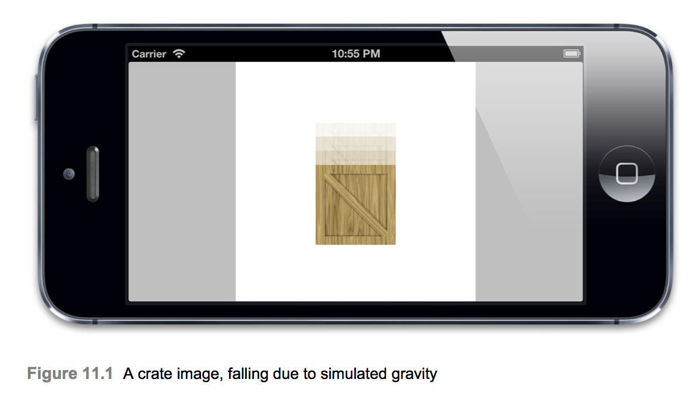
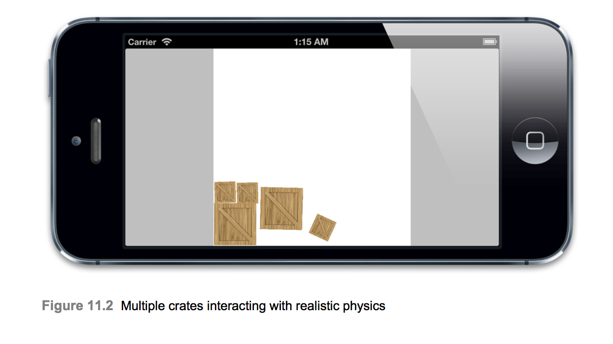

# Timer-Based Animation
* I can guide you, but you must do exactly as I say.
* 10장 `easing`에서 CAMediaTimingFunction을 보았다. 이 기능을 사용하면 가속 및 감속과 같은 물리적 효과를 시뮬레이션하여 애니메이션의 easing을 더 현실적으로 제어할 수 있었다. 그러나 더욱 현실적인 물리적 상호작용을 시뮬레이션하거나 사용자 입력에 따라 즉석에서 애니메이션을 수정하려는 경우엔 어떻게 해야할까? 이 장에서는 타이머 기반 애니메이션을 탐색하여 애니메이션이 프레임 단위로 작동하는 방식을 정확하게 제어할 수 있도록 한다.

## Frame Timing
* 애니메이션은 연속적인 움직임을 나타내는 것처럼 보이지만 디스플레이 픽셀이 고정 된 위치에 있을 때 현실적으로 불가능하다. 보통 디스플레이는 연속적인 움직임을 표현할 수 없다. 디스플레이가 할 수 있는 일은 모션으로 인식할 수 있을 만큼 충분히 빠른 정적 이미지 시퀀스를 표시하는 것이다. 이전에 iOS가 초당 60회씩 화면을 새로 고친다고 언급하였다. CAAnimation은 일을 표시할 새 프레임을 계산한 다음 각 화면에 업데이트와 동기화하여 그린다. CAAnimation의 대단함은 매번 표시할 것을 산출하기 위해 interporation 및 easing 계산을 수행하는데 있다.
* 10장에서 우리는 보간법을 수행하고 스스로를 easing하는 법을 배운 다음 표시할 프레임 시퀀스를 제공하여 CAKeyframeAnimation 인스턴스에 정확히 무엇을 그릴지 지시하였다. 그 시점에서 모든 Core Animation은 우리가 명령한 프레임들을 순서대로 보여주었다.

### NSTimer
* 실제로 우리는 `Chatper3 - Geometry`에서 시계 예제를 하였는데, 이는 NSTimer를 사용하여 침들을 움직이는 애니메이션을 적용하였다. 이 예제에서 침은 초당 한번만 업데이트 되지만 타이머를 초당 60회 속도로 실행하면 prinsiple이 달라지지 않는다.
* CAKeyframeAnimation 대신 NSTimer를 사용하기 위해 10장에서 튀는 공 애니메이션을 수정해보자. 타이머가 시작될 때마다 애니메이션 프레임을 계속해서 계산할 것이기 때문에 애니메이션의 fromValue, toValue, duration 및 현재 timeOffset을 저장하기 위해 클래스에 몇 가지 추가 속성이 필요하다.

```Swift
class ViewController: UIViewController {
    @IBOutlet weak var ballView: UIImageView!
    
    var timer: Timer?
    var duration: TimeInterval = 0
    var timeOffset: TimeInterval = 0
    var fromValue: Any = NSValue(cgPoint: CGPoint.zero)
    var toValue: Any = NSValue(cgPoint: CGPoint.zero)
    
    override func viewDidLoad() {
        super.viewDidLoad()
        
        ballView.image = UIImage(named: "Ball")
        
        animate()
    }
    
    override func touchesBegan(_ touches: Set<UITouch>, with event: UIEvent?) {
        animate()
    }
}

extension ViewController {
    func interpolate(from: CGFloat, to: CGFloat, time: CGFloat) -> CGFloat {
        return (to - from) * time + from
    }
    
    func interpolateFromValue(fromValue: Any, toValue: Any, time: CGFloat) -> Any {
        if let fromPoint = fromValue as? CGPoint, let toPoint = toValue as? CGPoint {
            let result = CGPoint(x: interpolate(from: fromPoint.x, to: toPoint.x, time: time), y: interpolate(from: fromPoint.y, to: toPoint.y, time: time))
            return NSValue(cgPoint: result)
        }
        
        return time < 0.5 ? fromValue : toValue
    }
    
    func quadraticEaseInOut(t: CGFloat) -> CGFloat {
        return t < 0.5 ? (2 * t * t) : (-2 * t * t) + (4 * t) - 1
    }
    
    func bounceEaseOut(t: CGFloat) -> CGFloat {
        if t < 4 / 11.0 {
            return (121 * t * t) / 16.0
        } else if (t < 8 / 11.0) {
            return (363 / 40.0 * t * t) - (99 / 10.0 * t) + 17 / 5.0
        } else if (t < 9/10.0) {
            return (4356 / 361.0 * t * t) - (35442 / 1805.0 * t) + 16061 / 1805.0
        }
        
        return (54 / 5.0 * t * t) - (513 / 25.0 * t) + 268 / 25.0;
    }
    
    func animate() {
        fromValue = NSValue(cgPoint: CGPoint(x: 120, y: 32))
        toValue = NSValue(cgPoint: CGPoint(x: 120, y: 268))
        duration = 3.0
        timeOffset = 0.0
        
        timer?.invalidate()
        
        timer = Timer.scheduledTimer(timeInterval: 1/60.0, target: self, selector: #selector(step), userInfo: nil, repeats: true)
    }
    
    func step(timer: Timer) {
        timeOffset = min(timeOffset  + 1/60.0, duration)
        
        var time = timeOffset / duration
        time = TimeInterval(bounceEaseOut(t: CGFloat(time)))
        
        let position = interpolateFromValue(fromValue: fromValue, toValue: toValue, time: CGFloat(time))
        ballView.center = (position as? NSValue ?? NSValue(cgPoint: CGPoint.zero)).cgPointValue
        
        if timeOffset > duration {
            self.timer?.invalidate()
            self.timer = nil
        }
    }
}
```

* 잘 작동하고 키 프레임 기반 버전과 거의 동일한 코드 양이다. 그러나 우리가 한번에 많은 것을 애니메이션으로 만들려고 한다면 이 접근법에는 몇 가지 문제가 있다. Timer는 모든 프레임을 새로 고침해야 하는 화면에 물건을 그리므로 최적의 방법은 아니다. 그 이유를 이해하려면 Timer가 어떻게 작동하는지 정확히 알아야 한다. iOS의 모든 스레드는 NSRunloop을 유지 관리한다. NSRunloop은 간단히 말해서 수행해야 할 작업 목록을 통해 끝없이 작동하는 루프이다. 아래와 같은 작업이 mainThread에 포함될 것이다.
  * 터치 이벤트 처리
  * 네트워크 패킷 송수신
  * GCD를 사용하여 예약 된 코드 실행
  * 타이머 동작 처리
  * 화면 다시 그리기

* Timer를 설정하면 적어도 지정된 시간이 경과할 때 까지 실행해서는 안된다는 지시와 함께 이 작업 목록에 삽입된다. 타이머가 작동하기까지 대기하는 시간의 상한선은 없다. 목록의 이전 작업이 완료된 후에만 발생한다. 대개 예약 된 시간의 몇 밀리 초 내에 수행되지만 이전 작업이 완료되는 데 시간이 오래 걸릴 수 있다.
* 화면 다시 그리기는 60초마다 발생하도록 예약되지만 타이머 동작과 마찬가지로 목록의 이전 작업에 의해 지연되어 실행 시간이 오래 걸릴 수 있다. 이러한 지연은 무작위이기 때문에 화면이 다시 그려지기 전에 매 60초당 한번 씩 실행되도록 예약된 타이머가 항상 작동한다는 것을 보장할 수 없다. 때로는 화면 업데이트 사이에 두번 씩 실행될 수 있으므로 건너 뛴 프레임이 생겨 애니메이션이 앞으로 이동하는 것처럼 보일 수 있다. 우리는 이것을 개선하기 위해 몇 가지 일을 할 수 있다.
  * CADisplayLink라는 특수 유형의 타이머라는 것이 있는데 이는 화면 새로 고침을 정확하게 작동하도록 설계되어있다.
  * 프레임이 제 시간에 발사된다고 가정하지 않고 실제 기록 된 프레임 지속 시간에 애니메이션을 기반으로 할 수 있다.
  * 우리는 애니메이션 타이머의 실행 루프모드를 조정하여 다른 이벤트에 의해 지연되지 않도록 할 수 있다.

### CADisplayLink
* CADisplayLink는 CoreAnimation에서 제공하는 Timer와 같은 클래스로 화면이 다시 그려지기 직전에 항상 실행된다. 인터페이스는 Timer와 매우 유사하므로 본질적으로 drop-in 대체 기능이지만 초 단위로 지정된 timeInterval 대신 CADisplayLink에는 발생시킬 때 마다 건너 뛸 프레임 수를 지정하는 정수 frameInterval 속성이 있다. 기본적으로 이 값은 1이며 모든 프레임을 실행하게 된다. 그러나 애니메이션 코드가 60분의 1초 내에 안정적으로 실행되는 데 너무 오래 걸리는 경우 frameInterval을 2로 지정하면 애니메이션은 초당 30 프레임으로 애니메이트 될 것이다.(3으로 하면 초당 20프레임이 됨)
* Timer대신 CADisplayLink를 사용하면 프레임 속도를 가능한 한 일관성 있게 유지함으로써 보다 부드러운 애니메이션을 생성할 수 있다. 그러나 CADisplayLink조차도 모든 프레임이 일정대로 진행될 것이라고 보장할 수 없다. 흩어진 작업이나 리소스가 부족한 배경 응용 프로그램과 같이 사용자가 제어할 수 없는 이벤트로 인해 애니메이션이 때때로 프레임을 건너뛸 수 있다. Timer를 사용하면 기회가 생길 때마다 타이머가 작동하지만 CADisplayLink는 다르게 작동한다. 예약 된 프레임이 누락되면 프레임을 건너뛰고 다음 예약된 프레임 시간에 업데이트 된다.

## Measuring Frame Duration
* NSTimer 또는 CADisplayLink를 사용하는지 여부에 관계없이, 1초의 1/60의 예상 시간보다 프레임 계산 시간이 더 오래 걸리는 시나리오를 처리해야 한다. 실제 프레임 시간을 미리 알 수 없으므로 이를 측정해야한다. CACurrentMediaTime() 함수를 사용하여 각 프레임의 시작 부분에 시간을 기록한 다음 이전 프레임에 대해 기록된 시간과 비교함으로써 이를 수행할 수 있다.
* 이 시간을 비교함으로써 타이밍 계산을 위해 하드 코딩 된 1/60값 대신 정확한 프레임 duration 측정 시간을 얻을 수 있다. 이러한 개선 사항으로 다음 예를 보자.

```Swift
class ViewController: UIViewController {
    @IBOutlet weak var ballView: UIImageView!
    
    var timer: CADisplayLink?
    var duration: CFTimeInterval = 1.0
    var timeOffset: CFTimeInterval = 0.0
    var lastStep: CFTimeInterval = 0
    var fromValue: Any = NSValue(cgPoint: CGPoint(x: 150, y: 32))
    var toValue: Any = NSValue(cgPoint: CGPoint(x: 150, y: 268))

    override func viewDidLoad() {
        super.viewDidLoad()

        ballView.image = UIImage(named: "Ball")
        
        animate()
    }
    
    override func touchesBegan(_ touches: Set<UITouch>, with event: UIEvent?) {
        animate()
    }
}

extension ViewController {
    func interpolate(from: CGFloat, to: CGFloat, time: CGFloat) -> CGFloat {
        return (to - from) * time + from
    }
    
    func interpolateFromValue(fromValue: Any, toValue: Any, time: CGFloat) -> Any {
        if let fromPoint = fromValue as? CGPoint, let toPoint = toValue as? CGPoint {
            let result = CGPoint(x: interpolate(from: fromPoint.x, to: toPoint.x, time: time), y: interpolate(from: fromPoint.y, to: toPoint.y, time: time))
            return NSValue(cgPoint: result)
        }
        
        return time < 0.5 ? fromValue : toValue
    }
    
    func bounceEaseOut(t: CGFloat) -> CGFloat {
        if t < 4 / 11.0 {
            return (121 * t * t) / 16.0
        } else if (t < 8 / 11.0) {
            return (363 / 40.0 * t * t) - (99 / 10.0 * t) + 17 / 5.0
        } else if (t < 9/10.0) {
            return (4356 / 361.0 * t * t) - (35442 / 1805.0 * t) + 16061 / 1805.0
        }
        
        return (54 / 5.0 * t * t) - (513 / 25.0 * t) + 268 / 25.0;
    }
    
    func animate() {
        ballView.center = CGPoint(x: 150, y: 32)
        
        duration = 1.0
        timeOffset = 0.0
        fromValue = NSValue(cgPoint: CGPoint(x: 150, y: 32))
        toValue = NSValue(cgPoint: CGPoint(x: 150, y: 268))
        
        timer?.invalidate()
        
        lastStep = CACurrentMediaTime()
        timer = CADisplayLink(target: self, selector: #selector(step))
        timer?.add(to: RunLoop.main, forMode: .defaultRunLoopMode)
    }
    
    func step(timer: CADisplayLink) {
        let thisStep = CACurrentMediaTime()
        let stepDuration = thisStep - lastStep
        lastStep = thisStep
        
        timeOffset = min(timeOffset + stepDuration, duration)
        
        var time = timeOffset / duration
        time = CFTimeInterval(bounceEaseOut(t: CGFloat(time)))
        
        let position = interpolateFromValue(fromValue: fromValue, toValue: toValue, time: CGFloat(time))
        ballView.center = (position as? NSValue ?? NSValue(cgPoint: CGPoint.zero)).cgPointValue
        
        if timeOffset >= duration {
            self.timer?.invalidate()
            self.timer = nil
        }
    }
}
```

## Run Loop Modes
* CADisplayLink를 생성할 때 실행 루프를 지정하고 루프 모드를 실행해야 한다. 실행 루프의 경우 사용자 인터페이스 업데이트가 항상 주 스레드에서 수행되어야 하므로 Main 실행 루프(Main Thread에서 호스팅되는 실행 루프)를 사용하였다. 그러나 모드의 선택은 명확하지 않다. 실행 루프에 추가된 모든 태스크에는 우선 순위를 결정하는 모드가 있다. 사용자 인터페이스가 항상 원활하게 유지되도록 하기 위해 iOS는 사용자 인터페이스 관련 작업에 우선 순위를 부여하고 UI 활동이 너무 많으면 잠시 동안 다른 작업의 실행을 중지할 수 있다.
* 이에 대해 일반적인 예는 UIScrollView를 사용하여 스크롤하는 경우이다. 스크롤하는 동안 scrollView 내용을 다시 그리는 작업이 다른 작업보다 우선하므로 표준 NSTimer 및 네트워크 이벤트는 발생하지 않을 수 있다. 실행 루프 모드에 대한 일반적인 선택 사항은 다음과 같다.
  * NSDefaultRunLoopMode - 표준 우선 순위
  * NSRunLoopCommonModes - 높은 우선 순위
  * UITrackingRunLoopMode - UIScrollView 및 기타 컨트롤 애니메이션을 적용하는데 사용된다.

* 이 예제에서는 NSDefaultRunLoopMode를 사용했지만 애니메이션이 원활하게 실행되도록 NSRunLoopCommonModes를 대신 사용할 수 있다. 이 모드를 사용할 경우 애니메이션이 높은 프레임 속도로 실행될 때 주의해야한다. 왜냐하면 타이머와 같은 다른 작업 또는 스크롤과 같은 다른 iOS 애니메이션은 애니메이션이 끝날 때 까지 업데이트를 중지하기 때문이다.
* CADisplayLink는 동시에 여러개 사용이 가능하므로 NSDefaultRunLoopMode 및 UITrackingRunLoopMode에 추가하여 다른 UIKit 컨트롤 애니메이션의 성능을 방해하지 않으면서 스크롤이 중단되지 않도록 할 수 있다.
```Swift
timer = CADisplayLink(target: self, selector: #selector(step))
timer?.add(to: RunLoop.main, forMode: .defaultRunLoopMode)
timer?.add(to: RunLoop.main, forMode: .UITrackingRunLoopMode)
```
* CADisplayLink와 마찬가지로 NSTimer는 `scheduledTimerWithTimeInterval` 대신 대체 설정 코드를 사용하여 다른 실행 루프 모드를 사용하도록 구성할 수 있다.
```Swift
timer = Timer.scheduledTimer(timeInterval: 1/60.0, target: self, selector: #selector(step), userInfo: nil, repeats: true)
RunLoop.main.add(timer, forMode: .commonModes)
```

## Physical Simulation
* 10장에서 키프레임 애니메이션의 동작을 복제하기 위해 타이머 기반 애니메이션을 사용해왔지만 사실 실제로 작동하는 방식에는 근본적인 차이가 있다. 키 프레임 구현시 사전에 모든 프레임을 계산해야 했지만, 새로운 솔루션에서는 요구에 따라 계산한다. 이것은 사용자 입력에 따라 애니메이션 로직을 즉석에서 수정하거나 물리 엔진과 같은 다른 실시간 애니메이션 시스템과 통합할 수 있다는 것을 의미힌다.

### Chipmunk
* 현재의 Easing 기반 바운스 애니메이션 대신 물리학을 사용하여 사실적인 중력 시뮬레이션을 만든다. 2D에서 조차 정확하게 물리 시뮬레이션은 매우 복잡하기 때문에 이것을 처음부터 구현하려고 하지 않을 것이다. 대신 오픈소스 물리 라이브러리 또는 엔진을 사용할 수 있다.
* 우리가 사용할 물리엔진은 `Chipmunk`이다. 다른 2D 물리 라이브러리(예: Box2D)를 사용할 수 있지만 `Chipmunk`는 C++대신 순수 C로 작성돼있으므로 Objective-C 프로젝트에 쉽게 통합할 수 있다. Chipmunk는 다양한 종류가 있으며, Objective-C 바인딩을 사용하는 `Indie`버전을 포함한다. 일반 C버전은 무료이지만 이 예제에서는 이 버전을 사용할 것이다. 버전 6.1.4는 서면 작성 당시 최신 버전이다. [여기](http://chipmunk-physics.net)에서 다운로드 할 수 있다.
* Chipmunk 물리 엔진은 전체적으로 매우 크고 복잡하지만 다음 클래스만 사용한다.
  * cpSpace - 모든 물리학 체제의 컨테이너이다. 이것은 크기와(선택적으로) 중력 벡터를 가지고 있다.
  * cpBody - 단단하고 비탄력적인 객체이다.이것은 공간에서의 위치와 질량, 순간, 마찰계수 등과 같은 다른 물리적 특성을 가지고 있다.
  * cpShape - 충돌을 감지하는데 사용되는 추상적인 기하학적 모양이다. 여러 모양이 본문에 첨부될 수 있으며 cpShape의 구체적인 하위 클래스가 서로 다른 모양 유형을 나타낸다.

* 이 예제에서는 중력의 영향을 받는 나무상자를 모델링한다. 화면 상에있는 나무상자의 시각적 표현(UIImageView)과 이것을 표현하는 물리적 모델(사각형 상자를 나타내는데 사용할 다각형 cpShape 하위 클래스인 cpBody 및 cpPolyShape)을 모두 포함하는 Crate 클래스를 생성한다.
* Chipmunk의 C 버전을 사용하면 Objective-C의 참조 계산 모델을 지원하지 않기 때문에 몇 가지 문제가 발생하므로 명시적으로 객체를 생성하고 해제해야한다. 이를 단순화하기 위해 cpay와 cpBody의 수명을 crate 클래스의 `init` 메소드에서 생성하고 dealloc에서 해제하여 Crate 클래스에 연결한다. 나무 상자의 물리적 속성의 구성은 상당히 복잡하지만 Chipmunk 설명서를 읽는다면 의미가 있다.
* 뷰 컨트롤러는 이전처럼 타이머 로직과 함께 cpSpace를 관리한다. 각 단계에서 우리는 cpSpace(물리 계산을 수행하고 전 세계의 모든 몸체를 재배치)를 업데이트 한 다음 bodies를 반복하고 해당 bodies을 모델링 한 bodies와 일치하도록 Crate views의 위치를 업데이트한다.(이 경우 실제로는 하나의 바디만 있지만 나중에 더 추가될 것이다.)
* Chipmunk는 UIKit에 대해 역 좌표계를 사용한다.(Y 축은 위를 향함) 물리 모델을 뷰와 동기화하여 유지하기 쉽게하기 위해 geomeryFlipped 속성(3장 참조)을 사용하여 컨테이너 뷰의 지오메트리를 반전하므로 모델과 뷰가 모두 동일한 좌표계를 사용한다.
* Crate 예제 코드는 아래와 같다. 어디에서나 cpSpace 객체를 해제하지는 않는다. 어쨋든 이 간단한 예제에서는 앱 수명기간 동안 공간이 존재하므로 실제 문제는 아니지만 실제 시나리오에서는 Crate 본체와 동일한 방식으로 이를 처리해야 한다. 독립형 Cocoa 객체로 래핑하고 Chipmunk 객체의 수명 주기를 관리하는데 사용한다.


```Swift
class Crate: UIImageView {
    let MASS: cpFloat = 100
    
    var body: UnsafeMutablePointer<cpBody>
    var shape: UnsafeMutablePointer<cpShape>
    
    override init(frame: CGRect) {
        body = cpBodyNew(MASS, cpMomentForBox(MASS, cpFloat(frame.size.width), cpFloat(frame.size.height)))
        
        let corners = [
            cpv(0, 0),
            cpv(0, cpFloat(frame.size.height)),
            cpv(cpFloat(frame.size.width), cpFloat(frame.size.height)),
            cpv(cpFloat(frame.size.width), 0),
        ]
        
        shape = cpPolyShapeNew(body, Int32(corners.count), UnsafeMutablePointer(mutating: corners), cpv(cpFloat(-frame.size.width) / 2, cpFloat(-frame.size.height) / 2))
        
        super.init(frame: frame)
        
        image = #imageLiteral(resourceName: "Crate")
        contentMode = UIViewContentMode.scaleAspectFill
        
        cpShapeSetFriction(shape, 0.5)
        cpShapeSetElasticity(shape, 0.8)
        
    }
    
    required init?(coder aDecoder: NSCoder) {
        fatalError("init(coder:) has not been implemented")
    }
}

class ViewController_11_3: UIViewController {
    @IBOutlet weak var containerView: UIView!
    
    let GRAVITY = 1000
    
    var space: UnsafeMutablePointer<cpSpace>?
    var timer: CADisplayLink?
    var lastStep: CFTimeInterval = 0
    
    override func viewDidLoad() {
        super.viewDidLoad()
        
        containerView.layer.isGeometryFlipped = true
        
        space = cpSpaceNew()
        cpSpaceSetGravity(space, cpv(0, -(Float(GRAVITY))))
        
        let crate = Crate(frame: CGRect(x: 100, y: 0, width: 100, height: 100))
        containerView.addSubview(crate)
        
        cpSpaceAddBody(space, crate.body)
        cpSpaceAddShape(space, crate.shape)
        
        lastStep = CACurrentMediaTime()
        timer = CADisplayLink(target: self, selector: #selector(step))
        timer?.add(to: RunLoop.main, forMode: .defaultRunLoopMode)
    }
}

extension ViewController_11_3 {
    func updateShape(shape: UnsafeMutablePointer<cpShape>?, unused: UnsafeMutableRawPointer?) -> Void {
        let crate = shape?.pointee.data.assumingMemoryBound(to: Crate.self).pointee
        let body = shape?.pointee.body
        crate?.center = cpBodyGetPos(body)
        crate?.transform = CGAffineTransform(rotationAngle: CGFloat(cpBodyGetAngle(body)))
    }
    
    func step(timer: CADisplayLink) {
        let thisStep = CACurrentMediaTime()
        let stepDuration = thisStep - lastStep
        lastStep = thisStep
        
        cpSpaceStep(space, cpFloat(stepDuration))
        
        let b: cpSpaceShapeIteratorFunc = { shape, data in
            let crate = shape?.pointee.data.assumingMemoryBound(to: Crate.self).pointee
            let body = shape?.pointee.body
            crate?.center = cpBodyGetPos(body)
            crate?.transform = CGAffineTransform(rotationAngle: CGFloat(cpBodyGetAngle(body)))
        }
        
        cpSpaceEachShape(space, b, nil)
    }
}
```

### Adding User Interaction
* 다음 단계는 Crate가 화면 하단에서 떨어지지 않도록 볼 가장자리에 보이지 않는 벽을 추가하는 것이다. 우리가 상자에 사용했던 것과 같은 다른 직사각형 cpPolyShape로 이것을 구현한다고 생각할 수 있지만, 상자와 충돌할 때가 아니라 상자를 볼 때 감지하기를 원하므로 단색이 아닌 속이 빈 사각형이 필요하다.
* 네 개의 cpSegmentShape 객체를 cpSpace에 추가하여 구현할 수 있다.(cpSegmentShape는 직선 세그먼트를 나타내므로 4개의 사각형을 결합하여 직사각형을 형성할 수 있다.) 우리가 했던 것처럼 새로운 cpBody 인스턴스 대신 공간의 staticBody 속성(중력의 영향을 받지 않는 움직이지 않는 Body)에 연결한다. 테두리 상자가 화면에서 떨어지거나 떨어지는 나무 상자가 떨어질 때 떼어내는 것을 원하지 않기 때문에 각 상자를 사용한다.
* 또한 서로 상호작용할 수 있도록 몇 개의 상자를 추가할 것이다. 마지막으로 가속도계 지원을 추가하여 휴대 전화를 기울이면 중력 벡터가 조정된다.(이것을 테스트 하려면 화면을 회전하더라도 시뮬레이터가 가속도계 이벤트를 생성하지 않기 때문에 실제 장치에서 실행해야 한다.) 아래는 업데이트 된 코드를 보여주며, 그림 12.2는 결과를 보여준다.
* 예제가 가로모드로 고정되어 있기 때문에 x 및 y 값을 가속도계 벡터로 바꿨다. 세로 모드에서 예제를 실행하는 경우 중력 방향이 화면에 표시된 것과 일치하는지 다시 확인해야 한다. 잘못 이해했는지 알 수 있다. 나무 상자가 위쪽이나 옆으로 떨어질 것이다.


```Swift
class ViewController_11_4: UIViewController {
    let GRAVITY = 1000
    
    var space: UnsafeMutablePointer<cpSpace>?
    var timer: CADisplayLink?
    var lastStep: CFTimeInterval = 0
    
    override func viewDidLoad() {
        super.viewDidLoad()

        view.layer.isGeometryFlipped = true
        
        space = cpSpaceNew()
        cpSpaceSetGravity(space, cpv(0, -(Float)(GRAVITY)))
        addWallShapeWithStart(start: cpv(0,0), end: cpv(300,0))
        addWallShapeWithStart(start: cpv(300,0), end: cpv(300,300))
        addWallShapeWithStart(start: cpv(300,300), end: cpv(0,300))
        addWallShapeWithStart(start: cpv(0,300), end: cpv(0,0))
        
        addCrateWithFrame(frame: CGRect(x: 0, y: 0, width: 32, height: 32))
        addCrateWithFrame(frame: CGRect(x: 32, y: 0, width: 32, height: 32))
        addCrateWithFrame(frame: CGRect(x: 64, y: 0, width: 64, height: 64))
        addCrateWithFrame(frame: CGRect(x: 128, y: 0, width: 32, height: 32))
        addCrateWithFrame(frame: CGRect(x: 0, y: 32, width: 64, height: 64))
        
        lastStep = CACurrentMediaTime()
        timer = CADisplayLink(target: self, selector: #selector(step))
        timer?.add(to: RunLoop.main, forMode: .defaultRunLoopMode)
    }
}

extension ViewController_11_4 {
    func addCrateWithFrame(frame: CGRect) {
        let crate = Crate(frame: frame)
        view.addSubview(crate)
        cpSpaceAddBody(self.space, crate.body)
        cpSpaceAddShape(self.space, crate.shape)
    }
    
    func addWallShapeWithStart(start: cpVect, end: cpVect) {
        let wall = cpSegmentShapeNew(self.space?.pointee.staticBody, start, end, 1)
        cpShapeSetCollisionType(wall, 2)
        cpShapeSetFriction(wall, 0.5)
        cpShapeSetElasticity(wall, 0.8)
        cpSpaceAddStaticShape(self.space, wall)
    }
    
    func step(timer: CADisplayLink) {
        let thisStep = CACurrentMediaTime()
        let stepDuration = thisStep - lastStep
        lastStep = thisStep
        
        cpSpaceStep(space, cpFloat(stepDuration))
        
        let b: cpSpaceShapeIteratorFunc = { shape, data in
            let crate = shape?.pointee.data.assumingMemoryBound(to: Crate.self).pointee
            let body = shape?.pointee.body
            crate?.center = cpBodyGetPos(body)
            crate?.transform = CGAffineTransform(rotationAngle: CGFloat(cpBodyGetAngle(body)))
        }
        
        cpSpaceEachShape(space, b, nil)
    }
    
    func accelerometor(accelerometer: UIAccelerometer, acceleration: UIAcceleration) {
        cpSpaceSetGravity(space, cpv(acceleration.x * GRAVITY, aceleration.y * GRAVITY))
    }
}
```

### Simulation Time and Fixed Time Steps
* 프레임 지속 시간을 계산하고 이를 사용하여 애니메이션을 진행하는 것은 easing 기반 애니메이션에 대한 좋은 해결책 이었지만 물리 시뮬레이션을 발전시키는 데 이상적이지 않다. 물리 시뮬레이션을위한 가변 시간 간격을 갖는 것은 다음 두 가지 이유로 나쁜 일이다.
  * 타임 스텝이 고정 된 정확한 값으로 설정되지 않으면 피직스 시뮬레이션이 결정적이지 않다. 이것은 똑같은 정확한 입력이 주어지면 다른 경우에 다른 결과를 생성 할 수 있음을 의미한다. 때로는 중요하지 않지만 물리 기반 게임에서는 플레이어가 똑같은 행동을하면 결과가 달라지기 때문에 플레이어가 혼란 스러울 수 있다. 또한 테스트가 더 어려워진다.
  * 성능 결함이나 전화와 같은 인터럽션으로 인해 건너 뛴 프레임은 잘못된 동작을 유발할 수 있다. 총알과 같이 빠르게 움직이는 물체를 고려해야한다. 각 프레임에서 시뮬레이션은 총알을 앞으로 이동시키고 충돌을 확인한다. 프레임 사이의 시간이 길어지면 총알이 하나의 시뮬레이션 단계로 더 이동하고 벽이나 다른 장애물을 가로 지르지 않고 바로 통과하여 충돌을 놓칠 수 있다.
* 우리가 이상적으로 원하는 것은 우리의 물리 시뮬레이션을위한 짧은 고정 시간 단계를 가지고 있지만, 우리의 통제를 벗어나는 상황으로 인해 예측할 수없는 디스플레이 다시 그리기와 동기화하여 우리의 견해를 업데이트하는 것이다.
* 다행히도 우리 모델 (이 경우 Chipmunk cpSpace의 cpBody 객체)이 우리의 뷰 (화면 상에 우리의 상자를 나타내는 UIView 객체)와 분리되어 있기 때문에 이것은 매우 쉽다. 디스플레이 프레임 시간과 무관하게 시뮬레이션 단계 시간을 추적하고 각 디스플레이 프레임에 대해 여러 시뮬레이션 단계를 수행하면된다.
간단한 루프를 사용하여이 작업을 수행 할 수 있다. 우리의 CADisplayLink가 프레임을 다시 그려야한다고 알릴 때마다 CACurrentMediaTime ()을 기록한다. 그런 다음 물리 시간이 표시 시간까지 걸릴 때까지 작은 증분 (이 경우 1/120 초)으로 반복적으로 물리 시뮬레이션을 진행한다. 그러면 화면 새로 고침 준비를 위해 물리학 자의 현재 위치와 일치하도록 뷰를 업데이트 할 수 있다.
Listing 11.5는 크 레이트 시뮬레이션의 고정 단계 버전 코드를 보여준다.

```Objective
#define SIMULATION_STEP (1/120.0)
- (void)step:(CADisplayLink *)timer {
//calculate frame step duration
CFTimeInterval frameTime = CACurrentMediaTime();
//update simulation
while (self.lastStep < frameTime) {
cpSpaceStep(self.space, SIMULATION_STEP);
self.lastStep += SIMULATION_STEP; }
 
//update all the shapes
cpSpaceEachShape(self.space, &updateShape, NULL); }
```

### Avoiding the Spiral of Death
* 고정 시뮬레이션 시간 단계를 사용할 때 반드시 지켜야 할 한 가지는 물리 계산을 수행하는 실제 시간이 시뮬레이션 된 시간 단계를 초과하지 않는다는 것이다. 이 예에서는 우리의 물리 시뮬레이션을 위해 1/120 초의 임의의 시간 단계를 선택했다. Chipmunk는 빠르며 예제는 간단하므로 cpSpaceStep ()이 그 시간 내에 제대로 완료되어야하고 프레임 업데이트를 지연시키지 않을 것이다.
* 그러나 우리는 수백 개의 객체가 상호 작용하는보다 복잡한 장면을 가지고 있다고 가정한다. 물리 계산은 더욱 복잡해지고 cpSpaceStep ()은 실제로 완료하는 데 1 / 120 초 이상 걸릴 수 있다. 우리는 물리 단계의 시간을 측정하지 않다. 왜냐하면 우리는 프레임 업데이트와 비교하면 사소한 것으로 가정하기 때문에 시뮬레이션 단계가 시뮬레이션하는 시간보다 오래 걸리면 프레임 업데이트가 지연 될 것이다.
* 그것은 더 악화된다 : 프레임이 업데이트하는 데 더 오랜 시간이 걸리는 경우, 시뮬레이션은 시뮬레이션 된 시간을 실시간으로 동기화하기 위해 더 많은 단계를 수행해야한다. 그런 다음 추가 단계를 수행하면 프레임 업데이트가 계속 지연된다. 결과적으로 응용 프로그램이 효과적으로 정지 될 때까지 프레임 속도가 느려지고 느려지므로이를 죽음의 나선형이라고한다.
주어진 장치에서 실제 단계를 측정하고 고정 된 시간 단계를 자동으로 조정하는 코드를 추가 할 수 있지만 실제로는 과도한 것일 수 있다. 지원할 가장 느린 장치에 대해 오류와 테스트를 위해 충분한 여유를 두십시오. 물리 계산이 시뮬레이션 된 시간의 50 % 이상을 차지하는 경우 시뮬레이션 시간 단계를 늘리거나 장면을 단순화하는 것을 고려하십시오. 시뮬레이션 시간 간격이 1/60 초 (전체 화면 프레임 업데이트)가 소요되는 시점까지 증가하면 CADisplayLink frameInterval을 증가시켜 애니메이션 프레임 속도를 초당 30 프레임 이하로 줄여야합니다. 무작위로 프레임을 건너 뛰기 시작하지 않으면 애니메이션 모양이 흐려진다.

