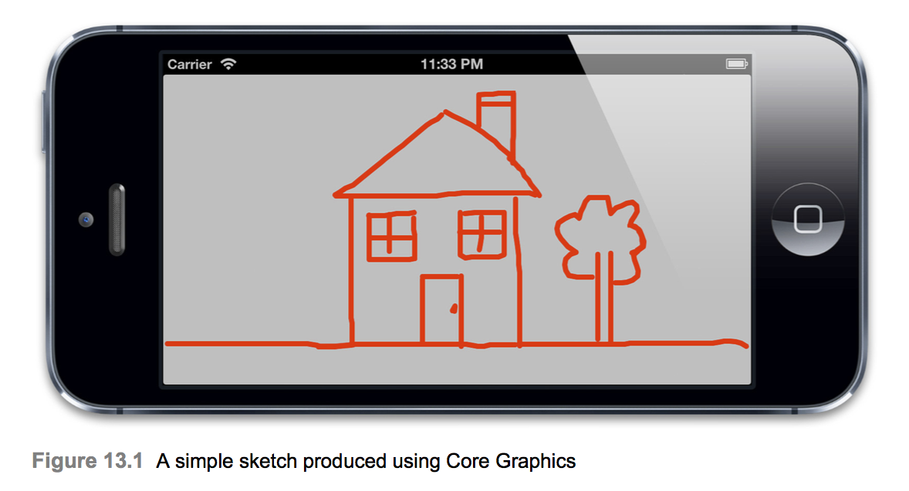
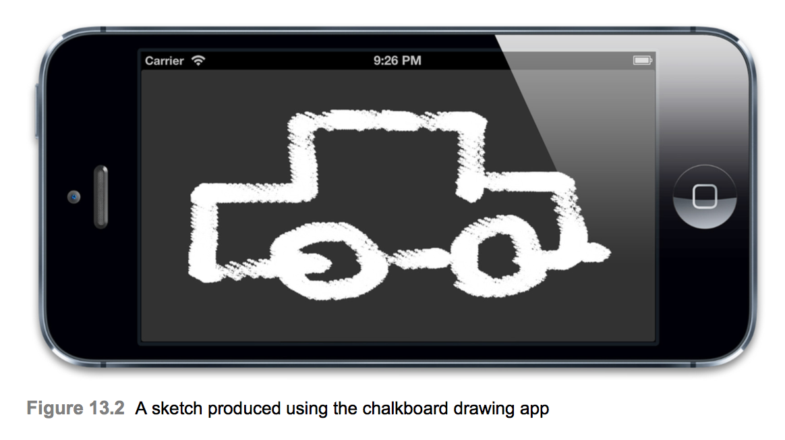
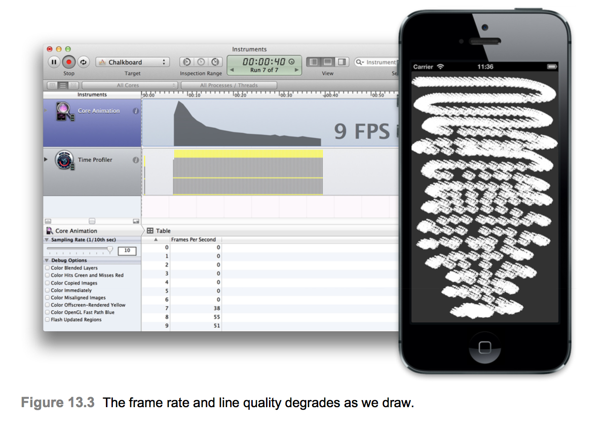

# Efficient Drawing
* More computing sins are committed in the name of efficiency (without necessarily achieving it) than for any other single reason—including blind stupidity. - William Allan Wulf
* 12장 `Tuning for Speed`에서 Instruments를 사용하여 Core Animation 성능문제를 진단하는 방법을 살펴보았다. iOS 앱을 제작할 때 많은 잠재적인 성능 함정이 있지만 이 장에서는 드로잉 성능과 관련된 문제에 중점을 둔다.

## Software Drawing
* 드로잉이라는 용어는 일반적으로 Core Animation의 맥락에서 소프트웨어 드로잉(즉, GPU 지원이 아닌 드로잉)을 의미한다. iOS의 소프트웨어 드로잉은 주로 COre Graphics 프레임 워크를 사용하여 수행되며 때로는 필요하지만 Core Animation 및 OpenGL에서 하드웨어 가속 렌더링 및 합과 비교할 때 속도가 느리다.
* 소프트웨어 드로잉은 속도가 느린 것 외에도 많은 메모리가 필요하다. CALayer는 그 자체로 메모리가 비교적 적다. RAM의 중요한 공간을 차지하는 것은 Backing Image 일뿐이다. contents 속성에 직접 이미지를 할당하더라도 이미지의 단일(압축되지 않은) 복사본을 저장하는데 필요한 메모리를 초과하는 추가 메모리는 사용하지 않는다. 동일한 이미지가 여러 레이어의 내용으로 사용되면 해당 메모리는 복제되지 않고 공유된다.
* 그러나 `CALayerDelegate -drawLayer: inContext` 메소드 또는 `UIView -drawRect` 메소드 (후자는 이전 래퍼를 감싸는 래퍼)를 구현하자마자 오프 스크린 드로잉 컨텍스트가 레이어에 대해 만들어지며 해당 컨텍스트는 레이어의 너비 x 높이(픽셀이 아니라 포인트) x 4바이트의 메모리를 요구한다. Retina iPad의 전체화면 레이어의 경우 2048*1536*4 바이트로 RAM에 저장해야하는 전체 12MB이지만 레이어를 다시 그릴 때마다 다시 채워야 한다. 소프트웨어 도면은 비용이 많이 들기 때문에 절대적으로 필요한 경우가 아니면 view를 다시 그리지 않는게좋다. 드로잉 성능 향상의 비결은 일반적으로 가능한 한 적은 드로잉을 시도하는 것이다.

## Vector Graphics
* Core Graphics 드로잉을 사용하는 일반적인 이유는 이미지나 레이어 효과를 사용하여 쉽게 생성할 수 없는 벡터 그래픽에 대한 것이다. 벡터 드로잉에는 다음이 포함될 수 있다.
  * 임의의 다각형
  * 대각선 또는 곡선
  * 컨텍스트
  * 그라디언트

* 예를들어 보자. 아래 예제는 기본적인 라인 드로잉 애플리케이션을 위한 코드이다. 이 응용 프로그램은 UIBezierPath의 점으로 사용자 Touch를 변환한 다음 뷰에 그린다. 이 경우 DrawingView라는 UIView 하위 클래스에 모든 드로잉 로직이 포함되어 있지만(뷰컨트롤러는 비어있음) 원하는 경우 뷰컨트롤러에서 터치 핸들링을 구현할 수 있다.


```Swift
class DrawingView: UIView {
    let path = UIBezierPath()
    
    override func awakeFromNib() {
        super.awakeFromNib()
        
        path.lineJoinStyle = .round
        path.lineCapStyle = .round
        
        path.lineWidth = 5
    }
    
    override func touchesBegan(_ touches: Set<UITouch>, with event: UIEvent?) {
        if let point = touches.first?.location(in: self) {
            path.move(to: point)
        }
    }
    
    override func touchesMoved(_ touches: Set<UITouch>, with event: UIEvent?) {
        if let point = touches.first?.location(in: self) {
            path.addLine(to: point)
            setNeedsDisplay()
        }
    }
    
    override func draw(_ rect: CGRect) {
        super.draw(rect)
        UIColor.clear.setFill()
        UIColor.red.setStroke()
        path.stroke()
    }
}
```
* 위 구현의 문제점은 드로잉이 많을수록 느리게 진행된다는 것이다. 우리가 손가락을 움직일 때마다 전체 UIBezierPath를 다시 그리기 때문에 경로가 복잡해지면서 프레임 속도가 떨어져 수행해야하는 그리기 작업이 매 프레임마다 증가한다. 더 나은 접근 방식이 필요하다.
* Core Animation은 하드웨어 지원을 통해 이러한 유형의 도형을 그리는데 필요한 스페셜리스트 클래스를 제공한다(6장에서 자세히 설명함).
* CAShapeLayer를 사용하여 다각형, 선 및 곡선을 그릴 수 있다. 그라디언트는 CAGradientLayer를 사용하여 그릴 수 있다. 이것들은 모두 Core Graphics를 사용하는 것보다 훨씬 빠르며 이미지를 생성하는 오버헤드를 피할 수 있다.
* Core Graphics 대신 CAShapeLayer를 사용하도록 드로잉 앱을 수정하면 성능이 크게 향상된다. 성능은 필연적으로 경로의 복잡성이 증가함에 따라 저하되지만 프레임 속도와 상당한 차이를 만들기 위해서는 매우 복잡한 도면이 필요하다.
```Swift
class DrawingView: UIView {
    let path = UIBezierPath()
    
    override class var layerClass: AnyClass {
        return CAShapeLayer.self
    }
    
    override func awakeFromNib() {
        super.awakeFromNib()
        
        if let layer = self.layer as? CAShapeLayer {
            let shapeLayer: CAShapeLayer = layer
            shapeLayer.strokeColor = UIColor.red.cgColor
            shapeLayer.fillColor = UIColor.clear.cgColor
            shapeLayer.lineJoin = kCALineJoinRound
            shapeLayer.lineCap = kCALineCapRound
            shapeLayer.lineWidth = 5
        }
    }
    
    override func touchesBegan(_ touches: Set<UITouch>, with event: UIEvent?) {
        if let point = touches.first?.location(in: self) {
            path.move(to: point)
        }
    }
    
    override func touchesMoved(_ touches: Set<UITouch>, with event: UIEvent?) {
        if let point = touches.first?.location(in: self) {
            path.addLine(to: point)
            if let layer = self.layer as? CAShapeLayer {
                layer.path = self.path.cgPath
            }
        }
    }
    
    override func draw(_ rect: CGRect) {
        super.draw(rect)
        UIColor.clear.setFill()
        UIColor.red.setStroke()
        path.stroke()
    }
}
```

## Dirty Rectangles
* Core Graphics 드로잉을 CAShapeLayer 또는 다른 벡터 그래픽 레이어 중 하나로 대체하는 것이 가끔은 불가능하다. 드로잉 어플리케이션을 고려해보자. 현재 구현에서는 벡터 드로잉에 이상적인 직선을 사용한다. 그러나 우리가 칠판과 비슷한 질감으로 우리의 라인에 적용된 어플리케이션을 만든다고 가정해보자. 분필을 시뮬레이션하는 간단한 방법은 작은 `브러시 스트로크`이미지를 사용하여 사용자의 손가락이 닿는 곳의 화면에 붙여 넣을 수 있지만 CAShapeLayer를 사용하면 이 방법을 사용할 수 없다.
* 각 브러시 스트로크에 대해 개별 레이어를 만들 수는 있지만 매우 좋지 않다. 스크린상의 레이어의 수에 대한 실질적인 상한선은 최대 수백에 이르며, 우리는 이를 훨씬 빨리 초과할 것이다.이것은 우리가 Core Graphics 드로잉을 사용하는 것(OpenGL을 사용하여 훨씬 더 복잡한 것을하고 싶지 않다면)과 같은 상황이다. 첫 번재 칠판 구현은 아래와 같다.



```Swift
class ViewController_13_3: UIViewController {

    override func viewDidLoad() {
        super.viewDidLoad()

    }
}

class DrawingView_13_3: UIView {
    
    let BRUSH_SIZE: CGFloat = 32
    var strokes: [CGPoint] = []
    
    override func touchesBegan(_ touches: Set<UITouch>, with event: UIEvent?) {
        if let point = touches.first?.location(in: self) {
            addBurshStrokePoint(point: point)
        }
    }
    
    override func touchesMoved(_ touches: Set<UITouch>, with event: UIEvent?) {
        if let point = touches.first?.location(in: self) {
            addBurshStrokePoint(point: point)
        }
    }
    
    override func draw(_ rect: CGRect) {
        super.draw(rect)
        for stroke in strokes {
            let brushRect = CGRect(x: stroke.x - BRUSH_SIZE / 2, y: stroke.y - BRUSH_SIZE / 2, width: BRUSH_SIZE, height: BRUSH_SIZE)
            let image = #imageLiteral(resourceName: "Chalk")
            image.draw(in: brushRect)
        }
    }
}

extension DrawingView_13_3 {
    func addBurshStrokePoint(point: CGPoint) {
        strokes.append(point)
        setNeedsDisplay()
    }
}
```

* 이것은 시뮬레이터에서 상당히 잘 수행되지만 실제 장치에서는 좋지 않다. 문제는 대다수의 장면이 변경되지 않았더라도 손가락이 움직일 때마다 이전의 모든 브러시 획을 다시 그리는 것이다. 드로잉이 많을수록 프레임 속도가 느려지므로 프레임 속도가 떨어지면 시간이 지날수록 새로운 획의 간격이 커진다.
* 이 성능을 어떻게 향상시킬 수 있을까?



* 불필요한 그림을 줄이려면 Mac OS와 iOS 모두 화면에 리드로잉이 필요한 영역과 그렇지 않은 영역으로 나눠야한다. 다시 그려야할 부분을 `Dirty`영역이라고 한다. 클리핑과 블렌드의 복잡성으로 인해 직사각형이 아닌 영역을 다시 그리는 것은 실용적이지 않기 때문에, 주어진 뷰와 겹치는 더티 영역 부분 주위를 포함한 모든 사각형이 다시 그려진다.
* 뷰가 수정되면 다시 그려야 할 수도 있다. 그러나 뷰의 일부만 변경되어 전체 백업 이미지를 다시 그리는 것은 낭비이다. Core Animation은 일반적으로 사용자 지정 그리기 코드에 대해 알지 못하므로 더티 사각형을 단독으로 계산할 수 없다. 그러나 이 정보를 제공할 수 있다.
* setNeddsDisplayInRect를 호출하여 더티라고 표시한다. 영향을 받는 사각형을 매개 변수로 전달한다. 그러면 다음 표시 업데이트 전에 자동으로 뷰의 `drawRet` 메서드(또는 레이어 delegate의 drawLayer)가 호출된다.
* drawLayer에 전달 된 CGContext는 더티 사각형에 맞게 자동으로 클리핑된다. 해당 사각형 크기를 확인하려면 `CGContextGetClipBoundingBox()`함수를 이용하여 컨텍스트 자체에서 이를 가져온다. drawrect를 사용하면 CGRect가 매개 변수로 직접 전달되므로 더 간단하다.
* 이 직사각형과 겹치는 부분만 그림으로 제핸해야한다. 더티 CGRect 외부에서 그릴 내용은 자동으로 자르지만 중복 된 그리기 명령을 평가하고 무시하는데 CPU 시간이 낭비될것이다.
* Core Graphics를 사용하는 대신 자신의 그림을 클리핑하면 불필요한 처리를 피할 수 있다. 즉, 클리핑 로직이 복잡한 경우 Core Graphics에서 처리하는 것이 더 나을것이다. 그렇게 효율적으로 할 수만 있다면 자신만의 그림을 클립할 수 있다.
* 아래는 현재 브러시 스트로크 주변의 직사각형만 다시 그리는 `addBrushStrokeAtPoint` 메소드의 업데이트 된 버전을 보여준다. 마지막 브러시획 주변의 뷰 부분만 새로 고치는 것 외에도 `CGRectIntersectsRect()`를 사용하여 업데이트 된 영역과 겹치지 않는 오래된 브러시 획을 다시 그리지 않는다.


```Swift
class DrawingView_13_4: UIView {
    
    let BRUSH_SIZE: CGFloat = 32
    var strokes: [CGPoint] = []
    
    override func touchesBegan(_ touches: Set<UITouch>, with event: UIEvent?) {
        if let point = touches.first?.location(in: self) {
            addBurshStrokePoint(point: point)
        }
    }
    
    override func touchesMoved(_ touches: Set<UITouch>, with event: UIEvent?) {
        if let point = touches.first?.location(in: self) {
            addBurshStrokePoint(point: point)
        }
    }
    
    override func draw(_ rect: CGRect) {
        super.draw(rect)
        for stroke in strokes {
            let brushRect = CGRect(x: stroke.x - BRUSH_SIZE / 2, y: stroke.y - BRUSH_SIZE / 2, width: BRUSH_SIZE, height: BRUSH_SIZE)
            let image = #imageLiteral(resourceName: "Chalk")
            image.draw(in: brushRect)
        }
    }
}

extension DrawingView_13_3 {
    func addBurshStrokePoint(point: CGPoint) {
        strokes.append(point)
        setNeedsDisplay(brushRectForPoint(point: point))
    }
    
    func brushRectForPoint(point: CGPoint) -> CGRect {
        return CGRect(x: point.x - BRUSH_SIZE / 2, y: point.y - BRUSH_SIZE / 2, width: BRUSH_SIZE, height: BRUSH_SIZE)
    }
}
```

## Asynchronous Drawing
* UIKit의 단일 스레드 특성은 일반적으로 기본 스레드에서 백업 이미지를 업데이트 해야 한다는 것을 의미한다. 즉, 드로잉은 사용자 상호 작용을 방해하고 전체 앱 반응을 멈추게 할 수 있다. 드로잉이 느리다는 것을 도와줄 수는 없지만 사용자가 완료할 때까지 기다리는 것을 피할 수 있다면 좋을 것이다.
* 이 문제를 해결하는 방법은 여러가지가 있다. 경우에 따라 뷰 내용을 미리 별도의 스레드에 끌어다 놓은 다음 결과 이미지를 레이어 내용으로 직접 설정할 수 있다. 그러나 이것은 설정하는 것이 어려울 수 있으며 특정 경우에만 적용할 수 있다. Core Animation은 `CATiledLayer`와 `drawsAsynchronously` 속성의 몇가지 대안을 제공한다.

### CATiledLayer
* 우리는 6장에서 CATiledLayer에 대해 간단히 살펴보았다. 레이어를 독립적으로 업데이트되는 개별 타일(더티 직사각형 개념의 일종)로 세분하는 것 외에도 CATiledLayer는 각 타일의 `drawLayer: inContext`메소드를 동시에 여러 스레드에 호출하는 흥미로운 기능을 가지고 있다. 이렇게하면 사용자 인터페이스를 차단하는 것을 피할 수 있으며 다중 프로세서 코어를 활용하여 빠른 타일 드로잉을 할 수 있다. 하나의 타일을 가진 CATiledLayer는 비동기적으로 업데이트되는 이미지뷰를 구현하는 저렴한 방법이다.

### drawsAsynchronously
* iOS6에서 Apple은 CALayer에 흥미로운 새 속성을 추가했다.
drawsAsynchronously 속성은 `drawLayer: inContext` 메서드에 전달된 CGContext를 수정하여 사용자 상호 작용을 차단하지 않도록 드로잉 명령의 실행을 연기할 수 있도록 한다. 이것은 CATiledLayer가 사용하는 것과 같은 비동기 드로잉이 아니다. `drawLayer: inContext`메소드 자체는 메인 스레드에서만 호출되지만, CGContext는 진행하기 전에 각 그리기 명령이 완료될 때 까지 기다리지 않는다. 대신 메서드를 반환하고 메서드가 반환 된 후 명령을 대기열에 두고 백그라운드 스레드에서 실제 그리기를 수행한다.
* Apple에 따르면 이 기능은 드로잉 앱이나 UITableViewCell과 같이 빈번히 다시 그려지는 뷰에 가장 적합하며 한 번만 그리거나 가끔씩 그려지는 레이어 내용에 어떤 이점도 제공하지 않는다.

## Summary
* 이 장에서는 코어 그래픽을 사용하여 소프트웨어 드로잉에 대한 성능 문제를 논의하고 드로잉 성능을 향상 시키거나 수행할 드로잉의 양을 줄일 수 있는 몇가지 방법에 대해 살펴보았다.