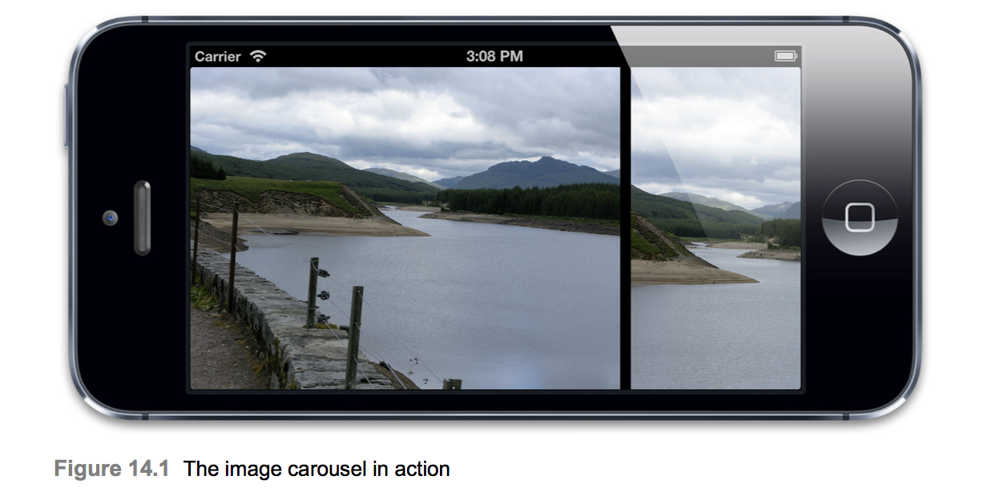
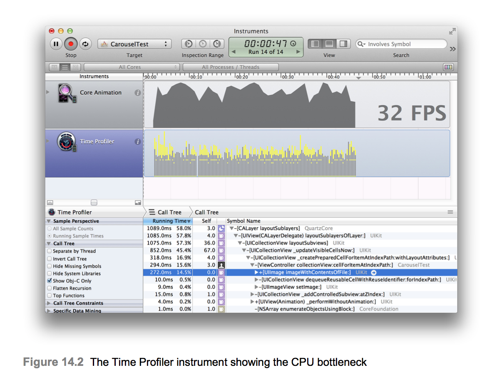
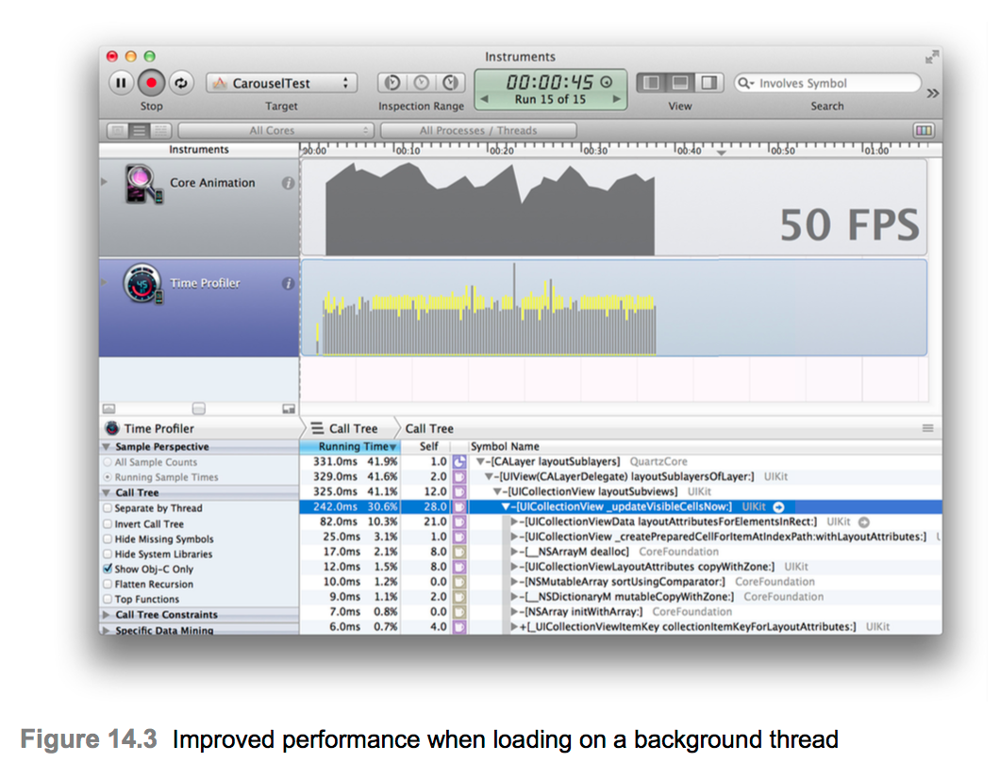
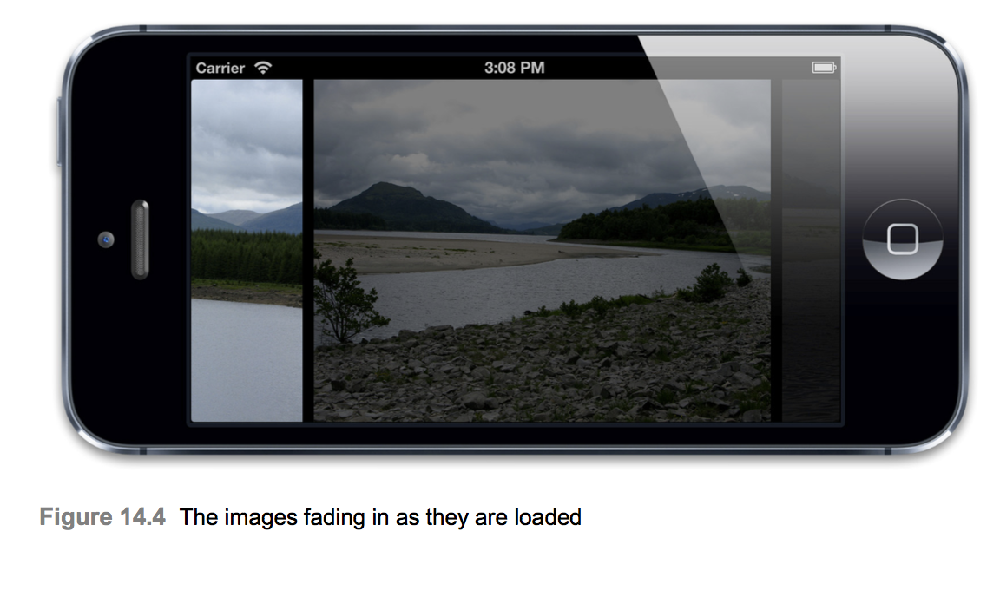
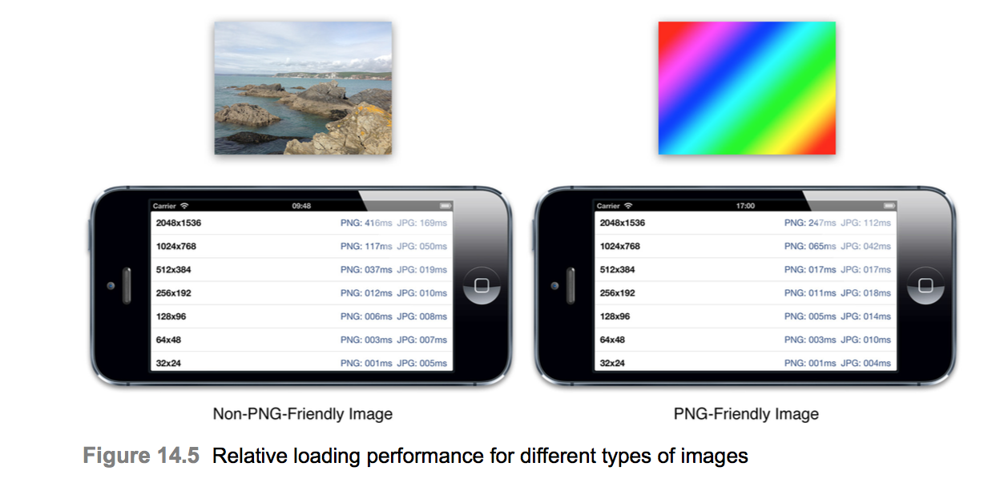
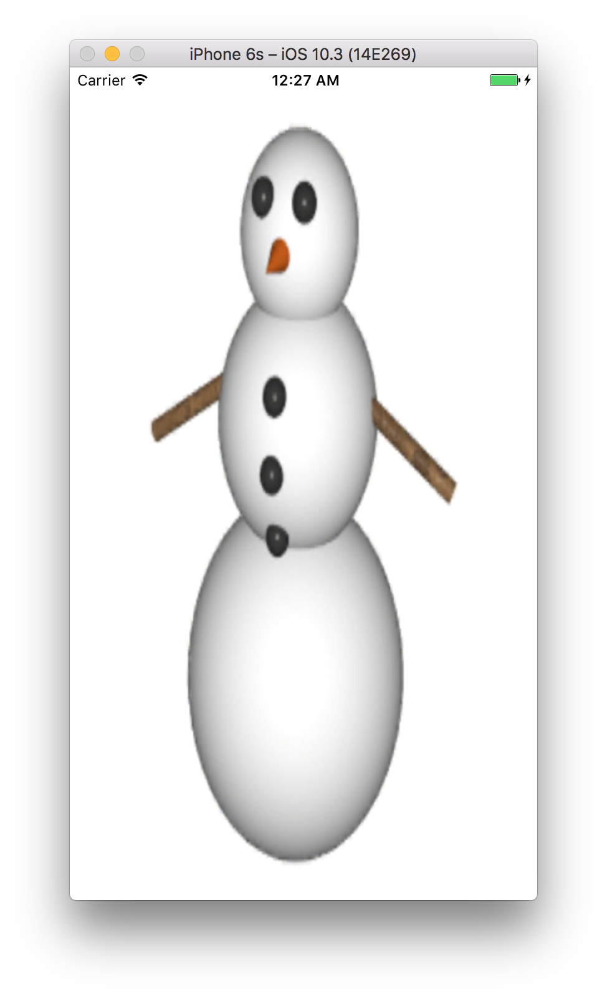

# Image IO
* `The idea of latency is worth thinking about. - Kevin Patterson`
* 13장 `Efficient Drawing`에서 Core Graphics 드로잉과 관련된 성능 문제와 이를 수정하는 방법을 살펴보았다. 드로잉 성능과 밀접하게 관련된 것은 이미지 성능이다. 이 장에서는 플래시 드라이브 또는 네트워크 연결을 통해 이미지로드 및 표시를 최적화하는 방법을 연구한다.

## Loading and latency
* 실제로 이미지를 그리는데 걸리는 시간은 일반적으로 성능에 있어 제한 요소가 아니다. 이미지는 많은 양의 메모리를 소비하므로 앱이 표시해야하는 모든 이미지를 메모리에 한번에 로드하는 것은 실용적이지 않을 수 있다. 즉, 앱이 실행되는 동안 주기적으로 이미지를 로드하거나 언로드 해야 한다.
* 이미지 파일을 로드할 수 있는 속도는 CPU뿐 만 아니라 IO(입력/출력) 대기 시간에 의해서도 제한된다. iOS 기기의 플래시 저장 용량은 기존 하드 디스크보다 빠르지만 RAM보다 약 200배 정도 느리므로 눈에 띄는 지연을 방지하기 위해 로드를 신중하게 관리해야 한다.
* 가능하면 응용 프로그램의 실행주기(예를들어 실행시 또는 화면 전환 사이)에서 눈에 띄지 않는 시간에 이미지를 로드해라. 버튼을 누르고 화면 상에 반응을 보는 것 사이의 maximum comfortable delay은 애니메이션 프레임 사이의 16ms보다 많은 약 200ms이다. 앱이 처음 시작될 때 이미지를 로드하는데 더 많은 시간을 할애할 수 있지만 20초 이내에 시작하지 않으면 iOS 워치 독 타이머가 앱을 종료한다.
* 경우에 따라 모든 것을 미리로드하는 것이 실용적이지는 않다. 잠재적으로 수천개의 이미지가 표함될 수 있는 이미지 캐러셀과 같은 것을 사용하지 말아라. 사용자는 속도 저하 없이 이미지를 빠르게 넘길 수 있지만 모든 이미지를 미리로드할 수는 없다. 너무 오래 걸리고 너무 많은 메모리를 소비한다.
* 이미지는 때로 원격 네트워크 연결에서 검색해야 할 수도 있다. 플래시 드라이브에서 로드하는 것보다 훨씬 많은 시간이 걸릴 수 있으며 연결문제(몇 초 동안 시도한 후)로 인해 완전히 실패할 수도 있다. 주 스레드에서 네트워크 로딩을 수행할 수 없으며 사용자는 정지된 화면에서 기다릴 것이다. 그러므로 백그라운드 스레드를 사용해야 한다.

### Threaded Loading
* 12장 `Tuning for Speed`의 연락처 목록 예제에서 이미지는 스크롤하면서 주 스레드에서 실시간으로 로드할 수 있을정도로 작았다. 그러나 큰 이미지의 경우 로드가 너무 오래 걸리고 스크롤이 더듬어 져 잘 작동하지 않는다. 스크롤링 애니메이션은 기본 실행 루프에서 업데이트되므로 렌더링 서버 프로세스에서 실행되는 CAAnimation보다 CPU관련 성능 문제에 더 취약하다.
* 아래 예제는 UICollectionView를 사용하여 구현된 기본 이미지 회전식 메뉴의 코드이다. 이미지로드는 `collectionView: cellForItem` 메소드의 주 스레드에서 동기적으로 수행된다.



```Swift
class CollectionViewCell_14_1: UICollectionViewCell {
    @IBOutlet weak var imageView: UIImageView!
}

class ViewController_14_1: UIViewController {
    @IBOutlet weak var collectionView: UICollectionView!
    
    var imagePaths: [String] = []
    
    override func viewDidLoad() {
        super.viewDidLoad()
        
        imagePaths = Bundle.main.paths(forResourcesOfType: "png", inDirectory: "VacationPhotos")
    }
}

extension ViewController_14_1: UICollectionViewDataSource {
    func collectionView(_ collectionView: UICollectionView, numberOfItemsInSection section: Int) -> Int {
        return imagePaths.count
    }
    
    func collectionView(_ collectionView: UICollectionView, cellForItemAt indexPath: IndexPath) -> UICollectionViewCell {
        guard let cell = collectionView.dequeueReusableCell(withReuseIdentifier: "CollectionViewCell_14_1", for: indexPath) as? CollectionViewCell_14_1 else {
            return UICollectionViewCell()
        }
        
        let imagePath = imagePaths[indexPath.row]
        cell.imageView.image = UIImage(contentsOfFile: imagePath)
        
        return cell
    }
}
```

* 회전식 컨베이어의 이미지는 약 700KB 크기의 800 × 600 픽셀 PNG로 아이폰 5가 1 초의 60 분의 1 이내에 로드 하기에는 너무 크다. 이러한 이미지는 carousel가 스크롤 될 때 즉시 로드되고, 예상대로 스크롤이 버벅인다. Time Profiler 도구 (그림 14.2 참조)는 UIImage + imageWithContentsOfFile : 메소드에서 많은 시간을 소비하고 있음을 보여줍니다. 분명 이미지로드가 병목 현상입니다.



* 여기서 성능을 향상시키는 유일한 방법은 이미지로드를 다른 스레드로 옮기는 것이다. 이것은 실제 로딩 시간을 줄이는 데는 도움이되지 않는다(시스템이 로드 된 이미지 데이터를 처리하는 데 CPU 시간을 더 줄이기 때문에 약간 더 나빠질 수도 있다).하지만 이는 메인 스레드가 계속 진행될 수 있음을 의미한다 사용자 입력에 응답하고 스크롤을 움직이는 것과 같은 다른 일을 한다.
백그라운드 스레드에서 이미지를로드하려면 CGD 또는 NSOperationQueue를 사용하여 자체 스레드 로딩 솔루션을 만들거나 CATiledLayer를 사용할 수 있다. 원격 네트워크에서 이미지를 로드하려면 비동기 NSURLConnection을 사용할 수 있지만 로컬 저장 파일에는 매우 효율적인 옵션이 아니다.

### GCD and NSOperationQueue
* GCD (Grand Central Dispatch)와 NSOperationQueue는 둘 다 스레드에서 순차적으로 실행되는 블록 대기열을 허용한다는 점에서 비슷하다. NSOperationQueue는 Objective-C 인터페이스 (GCD에서 사용되는 전역 C 함수와 반대)를 가지고 있으며 작업 우선 순위 및 종속성에 대한 세밀한 제어를 제공하지만 조금 더 많은 설정 코드가 필요하다.
* 아래는 GCD를 사용하여 메인 스레드가 아닌 우선 순위가 낮은 백그라운드 대기열에 이미지를 로드하는 업데이트 된 `-collectionView : cellForItemAtIndexPath :` 메소드를 보여준다. 백그라운드 스레드에서 뷰에 액세스하는 것이 안전하지 않기 때문에 실제로 새로 로드 된 이미지를 셀에 적용하기 전에 메인 스레드로 다시 전환한다.
* 셀은 UICollectionView에서 재활용되므로 이미지를 로드하는 동안 셀이 다른 인덱스로 재사용되지 않았는지 확인할 수 없습니다. 이미지가 잘못된 셀에 로드되는 것을 방지하기 위해 로드 전에 셀에 인덱스로 태그를 지정하고 이미지를 설정하기 전에 태그가 변경되지 않았는지 확인한다.

```Swift
class ViewController_14_2: UIViewController {
    @IBOutlet weak var collectionView: UICollectionView!
    
    var imagePaths: [String] = []
    
    override func viewDidLoad() {
        super.viewDidLoad()
        
        imagePaths = Bundle.main.paths(forResourcesOfType: "png", inDirectory: "Vacation Photos")
    }
}

extension ViewController_14_2: UICollectionViewDataSource {
    func collectionView(_ collectionView: UICollectionView, numberOfItemsInSection section: Int) -> Int {
        return imagePaths.count
    }
    
    func collectionView(_ collectionView: UICollectionView, cellForItemAt indexPath: IndexPath) -> UICollectionViewCell {
        guard let cell = collectionView.dequeueReusableCell(withReuseIdentifier: "CollectionViewCell_14_2", for: indexPath) as? CollectionViewCell_14_2 else {
            return UICollectionViewCell()
        }
        
        let imageTag = 99
        
        cell.imageView.tag = imageTag
        cell.tag = indexPath.row
        
        DispatchQueue.global().async {
            let index = indexPath.row
            let imagePath = self.imagePaths[index]
            let image = UIImage(contentsOfFile: imagePath)
            
            DispatchQueue.main.async {
                if index == cell.tag {
                    cell.imageView.image = image
                }
            }
        }
        
        return cell
    }
}
```

* 이 업데이트 된 버전을 실행하면 원래의 비 스레드 버전보다 성능이 좋지만 여전히 완벽하지는 않다(그림 14.3 참조). `imageWithContentsOfFile :` 메소드가 더 이상 CPU 시간 추적의 상단에 나타나지 않아서 로딩 지연이 수정되었음을 알 수 있다. 문제는 우리 회전식 캐 러셀의 유일한 성능 병목 현상이 이미지 파일의 실제 로딩이라고 가정하고 있었지만 그 경우는 아니다. 이미지 파일 데이터를 메모리에 로드하는 것은 문제의 첫 번째 부분 일뿐이다.



### Deferred Decompression
* 이미지 파일이 로드되면 이미지 파일을 압축 해제해야한다. 이 압축 풀기는 계산 상으로 복잡한 작업이 될 수 있으며 상당한 시간이 걸린다. 압축 해제 된 이미지는 원본보다 훨씬 많은 메모리를 사용한다.
* 로딩과 압축 해제에 소비 된 상대적인 CPU 시간은 이미지 형식에 따라 다르다. PNG 이미지의 경우 파일 크기가 비례 적으로 크기 때문에 JPEG의 경우보다 로드가 오래 걸리지만 압축 해제는 상대적으로 빠르다. 특히 Xcode는 빠른 디코딩을 위한 최적의 설정을 사용하여 프로젝트에 포함 된 PNG를 다시 압축하므로 상대적으로 빠릅니다. JPEG 압축 해제 알고리즘은 PNG에서 사용되는 zip 기반 알고리즘보다 더 복잡하기 때문에 JPEG 이미지는 더 작고 더 빨리 로드되지만 압축 해제 단계는 더 비싸다.
* 이미지를 로드 할 때, iOS는 보통 메모리를 절약 하기위해 압축 해제를 연기한다. 그리기 시점에서 압축을 풀어야하기 때문에 실제로 이미지를 그릴 때 성능상의 문제가 발생할 수 있다 (가능한 최악의 경우).
* 지연 압축 해제를 피하는 가장 간단한 방법은 `UIImage + imageNamed :` 메소드를 사용하여 이미지를 로드하는 것이다. `+ imageWithContentsOfFile :` (및 다른 모든 UIImage로드 메소드)와는 달리, 이 메소드는로드 직후 이미지를 압축 해제합니다 (이 장의 뒷부분에서 설명 할 다른 이점도 있음). 문제는 `+ imageNamed :` 애플리케이션 리소스 번들 내에서 로드 된 이미지에만 적용되므로 사용자가 생성 한 콘텐츠 나 다운로드 한 이미지에는 사용할 수 없다.
* 이미지를 즉시 압축 해제하는 또 다른 방법은 레이어의 내용으로 지정하거나 UIImageView의 이미지 속성으로 지정하는 것입니다. 불행히도 이 작업은 메인 스레드에서 수행되어야 하므로 일반적으로 성능 문제에 도움이되지 않는다.
* 세 번째 방법은 다음과 같이 UIKit을 우회하여 대신 ImageIO 프레임 워크를 사용하여 이미지를 로드하는 것이다.

```Objective-C
NSInteger index = indexPath.row;
NSURL *imageURL = [NSURL fileURLWithPath:self.imagePaths[index]]; NSDictionary *options = @{(__bridge id)kCGImageSourceShouldCache: @YES}; CGImageSourceRef source = CGImageSourceCreateWithURL(
(__bridge CFURLRef)imageURL, NULL);
CGImageRef imageRef = CGImageSourceCreateImageAtIndex(source, 0,
(__bridge CFDictionaryRef)options);
UIImage *image = [UIImage imageWithCGImage:imageRef]; CGImageRelease(imageRef);
CFRelease(source);
```

* 이렇게하면 이미지를 만들 때 `kCGImageSourceShouldCache` 옵션을 사용하여 이미지를 즉시 압축 해제하고 이미지의 수명 동안 압축 해제 된 버전을 유지할 수 있다.
* 마지막 옵션은 정상적으로 UIKit을 사용하여 이미지를 로드하지만 즉시 CGContext에 그린다. 이미지는 그려지기 전에 압축 해제되어야하므로 압축 해제가 즉시 이루어진다. 이 작업을 수행하는 이점은 UI 자체를 차단할 필요가 없도록 드로잉을 백그라운드 스레드(예 :로드 자체)에서 수행 할 수 있다는 점이다.
* 압축해제를 강제하기 위하여 이미지를 미리 그릴 때 취할 수 있는 두 가지 접근 방법이 있다.
  * 이미지의 단일 픽셀을 단일 픽셀 크기의 CGContext로 그린다. 이것은 여전히 ​​전체 이미지의 압축을 풀지만 드로잉 자체는 본질적으로 시간이 필요하지 않다. 단점은 로드 된 이미지가 특정 장치에서 그리기 위해 최적화되지 않을 수 있으며 결과적으로 앞으로 그리는 데 더 오래 걸릴 수 있다는 점이다. 또한 iOS가 메모리를 절약하기 위해 압축 해제 된 이미지를 다시 삭제할 수도 있다.
  * 전체 이미지를 CGContext에 그려서 원래 이미지를 버리고 컨텍스트 내용에서 생성 된 새 이미지로 바꾼다. 이것은 하나의 픽셀을 그리는 것보다 계산 상으로 많은 비용이 들지만 결과 이미지는 특정 iOS 장치에서 그리기에 최적화되며 원본 압축 이미지는 삭제되었으므로 iOS가 갑자기 압축 해제 된 버전을 다시 버리도록 결정할 수 없다. 메모리를 절약해라.
* 애플이 이러한 종류의 트릭을 사용하여 표준 이미지 압축 해제 로직을 우회하는 것을 권장하지는 않는다는 점은 주목할 가치가 있다.(이유는 기본 동작을 선택했다.) 큰 이미지를 많이 사용하는 어플리케이션을 개발한다면, 훌륭한 성능을 원하면 시스템을 게임해야 할 때가 있다.
+ `imageNamed :`를 사용하는 것이 옵션이 아니라고 가정하면, 전체 이미지를 CGContext로 드로잉하는 것이 가장 효과적 인 것처럼 보인다. 추가 드로잉 단계를 사용하면 다른 압축 해제 기술과 비교하여 불량하게 수행 할 수 있다고 생각할 수도 있지만, 새로 생성 된 이미지 (생성 된 특정 장치에 맞게 최적화 됨)는 이후의 모든 사용 시마다 더 빠르게 그려진다 당신은 원본을 유지한다. 또한 이미지를 실제 크기보다 작게 표시하려는 경우 올바른 크기로 다시 그려서 배경 스레드에 표시하면 표시 될 때마다 크기 조정을 다시 적용하는 것보다 더 나은 성능을 발휘한다( 이 예제에서는로드 된 이미지의 크기가 정확하기 때문에 여기서는 특별한 이점이 적용되지 않는다).

* `-collectionView : cellForItemAtIndexPath :` 메소드를 수정하여 디스플레이하기 전에 이미지를 다시 그리면 (스크롤링 14.3 참고) 이제 스크롤이 완벽하게 원활하다.

```Swift
class CollectionViewCell_14_3: UICollectionViewCell {
    @IBOutlet weak var imageView: UIImageView!
}

class ViewController_14_3: UIViewController {
    @IBOutlet weak var collectionView: UICollectionView!
    
    var imagePaths: [String] = []
    
    override func viewDidLoad() {
        super.viewDidLoad()
        
        imagePaths = Bundle.main.paths(forResourcesOfType: "png", inDirectory: "Vacation Photos")
    }
}

extension ViewController_14_3: UICollectionViewDataSource {
    func collectionView(_ collectionView: UICollectionView, numberOfItemsInSection section: Int) -> Int {
        return imagePaths.count
    }
    
    func collectionView(_ collectionView: UICollectionView, cellForItemAt indexPath: IndexPath) -> UICollectionViewCell {
        guard let cell = collectionView.dequeueReusableCell(withReuseIdentifier: "CollectionViewCell_14_3", for: indexPath) as? CollectionViewCell_14_3 else {
            return UICollectionViewCell()
        }
        
        let imageTag = 99
        
        cell.imageView.tag = imageTag
        cell.tag = indexPath.row
        
        DispatchQueue.global().async {
            let index = indexPath.row
            let imagePath = self.imagePaths[index]
            var image = UIImage(contentsOfFile: imagePath)
            
            UIGraphicsBeginImageContextWithOptions(cell.imageView.bounds.size, true, 0)
            image?.draw(in: cell.imageView.bounds)
            image = UIGraphicsGetImageFromCurrentImageContext()
            UIGraphicsEndImageContext()
            
            DispatchQueue.main.async {
                if index == cell.tag {
                    cell.imageView.image = image
                }
            }
        }
        
        return cell
    }
}

```

### CATiledLayer
* 6 장, "특수 레이어"에서 설명한 것처럼 CATiledLayer는 사용자 상호 작용을 차단하지 않고 매우 큰 이미지를 비동기식으로로드하고 표시하는 데 사용할 수 있다. 그러나 CATiledLayer를 사용하여 UICollectionView의 모든 셀에 대해 별도의 CATiledLayer 인스턴스를 만들어 각 캐 러셀 이미지를로드 할 수 있다.
* 이런 식으로 CATiledLayer를 사용할 때 몇 가지 단점이 있습니다.
  * 큐잉과 캐싱을위한 CATiledLayer 알고리즘은 노출되어 있지 않으므로 우리의 목적에 맞게 조정되어 있기를 바란다.
  * CATiledLayer는 이미 우리 타일과 크기가 같고 이미 압축이 풀린 (다시 그려서 레이어 내용으로 직접 사용할 수 있음) 경우에도 우리 이미지를 CGContext로 다시 그려야한다.
* Listing 14.4는 CATiledLayer를 사용하는 이미지 회전식 메뉴의 재 구현을 보여준다.

```Swift
class CollectionViewCell_14_4: UICollectionViewCell {
    @IBOutlet weak var imageView: UIImageView!
}

class ViewController_14_4: UIViewController {
    @IBOutlet weak var collectionView: UICollectionView!
    
    var imagePaths: [String] = []
    
    override func viewDidLoad() {
        super.viewDidLoad()
        
        imagePaths = Bundle.main.paths(forResourcesOfType: "png", inDirectory: "Vacation Photos")
    }
}

extension ViewController_14_4: UICollectionViewDataSource {
    func collectionView(_ collectionView: UICollectionView, numberOfItemsInSection section: Int) -> Int {
        return imagePaths.count
    }
    
    func collectionView(_ collectionView: UICollectionView, cellForItemAt indexPath: IndexPath) -> UICollectionViewCell {
        guard let cell = collectionView.dequeueReusableCell(withReuseIdentifier: "CollectionViewCell_14_4", for: indexPath) as? CollectionViewCell_14_4 else {
            return UICollectionViewCell()
        }
        var tileLayer = cell.contentView.layer.sublayers?.last
        if tileLayer == nil {
            tileLayer = CATiledLayer()
            tileLayer?.frame = cell.bounds
            tileLayer?.contentsScale = UIScreen.main.scale
            tileLayer?.setValue(indexPath.row, forKey: "index")
            tileLayer?.delegate = self
            cell.contentView.layer.addSublayer(tileLayer ?? CATiledLayer())
        }
        
        tileLayer?.contents = nil
        tileLayer?.setValue(indexPath.row, forKey: "index")
        tileLayer?.setNeedsDisplay()
        
        return cell
    }
}

extension ViewController_14_4: CALayerDelegate {
    func draw(_ layer: CALayer, in ctx: CGContext) {
        let index = layer.value(forKey: "index") as? Int ?? 0
        let imagePath = imagePaths[index]
        let tileImage = UIImage(contentsOfFile: imagePath) ?? UIImage()
        
        let aspectRatio = tileImage.size.height / tileImage.size.width
        var imageRect = CGRect.zero
        
        imageRect.size.width = layer.bounds.size.width
        imageRect.size.height = layer.bounds.size.height * aspectRatio
        imageRect.origin.y = (layer.bounds.size.height - imageRect.size.height) / 2
        
        UIGraphicsPushContext(ctx)
        tileImage.draw(in: imageRect)
        UIGraphicsPopContext()
    }
}
```

* 여기서 설명할 가치가 있는 몇 가지 트릭을 사용했다.
  * 픽셀, 노트 포인트, 픽셀에서 타일 렌더링 레이어의 타일 크기는 타일이 셀 크기와 정확히 일치하는지 확인하기 위해 화면 크기로 크기를 곱한다.
  * `Inthe-drawLayer : inContext :` 메서드는 올바른 이미지를 로드 할 수 있도록 전달자와 관계가 있다. 우리는 KALC의 기능을 이용하여 KVC를 사용하여 임의의 값을 저장 및 검색하고 각 레이어에 올바른 이미지 인덱스를 태그 할 수 있다.
* 우리의 우려에도 불구하고 CATiledLayer는이 경우 매우 잘 작동한다. 성능 문제는 사라지고 필요한 코드의 양은 GCD 접근법과 유사하다. 유일한 사소한 문제는로드 후 각 이미지가 화면에 나타나는 것처럼 눈에 띄는 페이드 인이 있다는 것이다 (그림 14.4 참조).



* CATiledLayer fadeDuration 속성을 사용하여 페이드 인 속도를 조정하거나 페이드를 모두 제거 할 수 있지만 실제 문제는 해결되지 않는다. 이미지로드가 시작될 때와 준비가 완료 될 때 사이에 항상 지연이 있다 그릴 것이다, 그리고 그 것이다
* 스크롤 할 때 새로운 이미지가 팝업된다. 이 문제는 CATiledLayer에만 국한되지 않는다. 또한 GCD 기반 버전에도 영향을 미친다.
* 앞서 설명한 모든 이미지로드 및 캐싱 기술을 사용하더라도 이미지가 너무 커서 실시간으로 로드하고 표시 할 수없는 경우가 있다. 13 장에서 언급했듯이 iPad의 전체 화면 망막 이미지는 2048 × 1536의 해상도를 가지며 12MB의 RAM (압축되지 않은 이미지)을 소비합니다. 3 세대 iPad의 하드웨어는 1/60 초 이내에 그러한 이미지를 로드, 압축 해제 및 표시 할 수 없다. 애니메이션 스터 터를 피하기 위해 백그라운드 스레드로 로드하더라도 회전식 캐 러셀에서 여전히 간격이 표시된다.
* 실제 이미지가 로드되는 동안 그 사이에 플레이스홀더 이미지를 표시 할 수 있지만 이것은 문제를 덮으려는 것 뿐이다. 우리는 그것보다 더 잘할 수 있다.

### Resolution Swapping
* 레티 나 해상도 (Apple의 마케팅에 따르면)는 사람의 눈이 정상적인 시력 거리에서 구별 할 수있는 가장 작은 픽셀 크기를 나타낸다. 그러나 정적 픽셀에만 적용된다. 당신이 움직이는 이미지를 볼 때, 당신의 눈은 디테일에 덜 민감하고, 더 낮은 해상도의 이미지는 망막의 품질과 구별이되지 않는다.
* 매우 큰 동영상 이미지를 빠르게 로드하고 표시해야하는 경우 간단한 해결책은 캐러 셀이 움직이는 동안 속임수를 쓰고 더 작은 (또는 낮은 해상도의) 이미지를 표시 한 다음 정지 시점에 full-res 이미지를 스왑하는 것이다. 다시 말하면 우리는 각각의 이미지를 각각 다른 해상도로 저장할 필요가 있다는 것을 의미한다. 그러나 다행스럽게도 그것은 우리가 여전히 망막과 비 망막을 모두 지원해야하기 때문에 일반적인 관행이다.
* 원격 소스 또는 사용자의 사진 보관함에서 이미지를 로드하고 쉽게 사용할 수 있는 저해상도 버전이 없는 경우 큰 이미지를 더 작은 CGContext로 그려 결과를 동적으로 생성할 수 있고 이는 나중에 사용하기 위해 어딘가에 저장할 수 있다.
* 이미지 스왑을 예약하려면 UIScrollView (UITableView 및 UICollectionView와 같은 다른 scrollview 기반 컨트롤)의 UIScrollViewDelegate 프로토콜의 일부로 호출되는 몇 가지 대리자 메서드를 활용할 수 있다.

```Swift
func scrollViewDidEndDragging(_ scrollView: UIScrollView, willDecelerate decelerate: Bool)
func scrollViewDidEndDecelerating(_ scrollView: UIScrollView)
```

* 이 방법을 사용하여 회전식 캐 러셀이 정지 한 때를 감지하고 그 시점까지 이미지의 고해상도 버전로드를 연기 할 수 있다. 이미지의 저해상도 및 고해상도 버전이 색상 균형 측면에서 완벽하게 일치하는 한 전환은 거의 눈에 띄지 않는다. 동일한 그래픽 응용 프로그램이나 스크립트를 사용하여 동일한 컴퓨터에서 생성해야한다.

## Caching
* 표시 할 이미지 수가 많으면 미리로드하는 것이 실용적이지는 않지만 로드하는 데 문제가 있으면 곧 버려야한다. 그들은 화면 밖으로 움직인다. 로드 후 이미지를 선택적으로 캐싱하면 사용자가 이미 본 이미지에서 앞뒤로 스크롤 할 때 팝업을 반복하지 않아도된다.
* 캐싱은 원칙적으로 간단하다. 값 비싼 계산 (또는 플래시 드라이브 또는 네트워크에서로드 한 파일)의 결과를 메모리에 저장하기 때문에 필요할 때 다시 액세스 할 수 있다. 문제는 캐싱이 본질적으로 절충안이라는 것이다. 메모리를 사용하는 대가로 성능을 얻지 만 메모리가 제한된 리소스이기 때문에 모든 것을 무한정 캐시 할 수는 없다.
* 언제 그리고 무엇을 캐시 할 것인가 (그리고 얼마나 오래 걸릴지)를 결정하는 것은 항상 쉽지는 않다. 다행히도 대부분의 경우 iOS가 이미지 캐싱을 처리한다.(오호..)

### The +imageNamed: Method
* 이전에 `[UIImage imageNamed :]`를 사용하여 이미지를 로드하면 이미지가 그려 질 때까지 지연되지 않고 즉시 이미지의 압축을 풀 수 있다는 이점이 있다. 하지만 ` imageNamed :` 메소드는 또 다른 중요한 이점을 가지고 있다. 자동으로 압축 해제 된 이미지를 캐시에 저장하여 나중에 다시 사용할 수 있다(소름..). 직접 참조를 유지하지 않아도된다.
* 일반적인 iOS 앱 (예 : 아이콘, 버튼 및 배경 이미지)에서 사용할 대부분의 이미지의 경우 `+ imageNamed :` 메소드를 사용하여 이미지를 로드하는 것이 가장 간단하고 효과적인 방법이다. nib 파일에 포함 된 이미지는 동일한 메커니즘을 사용하여 로드되므로 실제로 구현하지 않고도 암묵적으로 사용하게된다.
* 하지만 `+ imageNamed :` 메서드는 마법의 총알이 아니다. 사용자 인터페이스 가구에 최적화되어 있으며 응용 프로그램에서 표시해야하는 모든 유형의 이미지에 적합하지 않다. 이미지 캐싱 메커니즘을 구현하는 것이 좋은 이유는 다음과 같다.
  * `+ imageNamed :` 메소드는 응용 프로그램 번들 자원 디렉토리에서 가장 가까운 것으로 추측한다. 실제로 많은 양의 큰 이미지를 표시하는 대부분의 앱은 인터넷이나 사용자의 카메라 롤에서 로드해야하므로 `+ imageNamed :`는 작동하지 않는다.
  * `+ imageNamed :` 캐시는 모든 응용 프로그램 인터페이스 이미지 (버튼, 배경 등)를 저장하는 데 사용된다. 사진과 같이 큰 이미지로 캐시를 채우면 iOS가 해당 인터페이스 이미지를 제거하여 공간을 확보 할 확률이 높아져 앱을 탐색 할 때 성능이 저하 될 수 있으므로 그 이미지를 다시 로드해야한다. 캐 러셀 이미지에 별도의 캐시를 사용하면 나머지 앱 이미지와 수명을 분리 할 수 ​​있다.
  * `+ imageNamed :` 캐싱 메커니즘이 공개되지 않고 매우 작은 컨트롤이다. 예를 들어, 이미지를 로드하기 전에 이미 캐시되었는지 여부를 테스트 할 수 없으며 캐시 크기를 제어 할 수 없으며 더 이상 필요없는 캐시에서 객체를 제거 할 수 없다.

### Custom Caching
* 별개의 캐싱 시스템을 만드는 것은 중요하지 않다. 필 칼튼 (Phil Karlton)은 "컴퓨터 무결성과 이름 짓기라는 두 가지 어려운 문제가 컴퓨터 과학에만 있다."라고 했다.
* 이미지 캐시를 직접 작성한다면 어떻게 해야할까요? 관련된 과제를 살펴 보자.
  * Choosing a suitable cache key - 캐시 키는 캐시에서 이미지를 고유하게 식별하는 데 사용된다. 런타임에 이미지를 만드는 경우 캐시 된 이미지를 다른 이미지와 구별하는 문자열을 생성하는 방법이 항상 명확하지는 않다. 이미지 회전식 캐 러셀의 경우 이미지 파일 이름이나 셀 인덱스를 사용할 수 있기 때문에 매우 간단하다.
  * Speculative caching - 데이터를 생성하거나 로드하는 노력이 많으면 처음으로 필요하기 전에 데이터를 로드하고 캐시 할 수 있다. Speculative preloading logic은 본질적으로 어플리케이션에 따라 다르지만, 회전식 캐 루셀의 경우 특정 위치 및 스크롤 방향에 대해 다음 이미지가 정확히 결정될 수 있기 때문에 비교적 간단하게 구현할 수 있다.
  * Cache invalidation - 이미지 파일이 변경되면 캐시 된 버전을 업데이트 해야한다는 것을 어떻게 알 수 있습니까? 이것은 Phil Karlton이 말했듯이 매우 어려운 문제이지만, 다행스럽게도 어플리케이션 리소스에서 정적 이미지를로드 할 때 걱정할 필요가 없다. 사용자가 제공 한 이미지 (예기치 않게 수정되거나 덮어 쓰기 될 수 있음)의 경우 이미지를 캐시 할 때의 타임 스탬프를 저장하고 파일의 수정 된 날짜와 비교하는 것이 좋다.
  * Cache reclamation - 캐시 공간 (메모리)이 부족할 때 먼저 버릴 내용을 어떻게 결정합니까? 캐시 된 항목의 재사용 가능성을 결정하기 위해 추측 알고리즘을 작성해야 할 수도 있다. 고맙게도, 캐시 교정 문제에 대해 Apple은 NSCache라는 편리한 범용 솔루션을 제공한다.

### NSCache
* NSCache는 NSDictionary와 매우 유사하게 동작한다. `-setObject : forKey :` 및 `-object : forKey :` 메소드를 이용해 키를 사용하여 캐시에서 오브젝트를 삽입하고 검색 할 수 있다. 차이점은 딕셔너리와 달리 NSCache는 시스템의 메모리가 부족할 때 저장된 객체를 자동으로 삭제한다는 점이다.
* NSCache가 객체 폐기시기를 결정하는 데 사용하는 알고리즘은 문서화되어 있지 않지만, 총 캐시 크기를 설정하는 `-setCountLimit :` 메소드와 저장된 각 객체에 대한 구체적인 "비용"을 지정하는 `forKey : cost :`를 사용하여 동작 방법에 대한 힌트를 제공 할 수 있다.
* 비용은 개체를 다시 만드는 상대적인 노력을 나타 내기 위해 개체에 지정할 수있는 숫자 값이다. 큰 이미지에 많은 비용을 할당하면 캐시는 저장하기에 더 비싼 객체이며 "값 비싼"객체를 버리면 "값싼"객체보다 성능에 큰 영향을 줄 수 있음을 알게된다. `-setTotalCostLimit :`를 사용하여 항목 수 대신 총 캐시 크기를 지정할 수 있다.
* NSCache는 범용 캐싱 솔루션이며, 필요하다면 특정 캐로 셀에 더 잘 최적화 된 맞춤 캐싱 클래스를 만들 수 있다. (예를 들어 캐시 된 이미지 인덱스와 현재 가운데 인덱스의 차이를 기반으로 먼저 어느 이미지를 놓을 지 결정할 수 있다.)하지만 NSCache는 현재 캐싱 요구 사항에 충분해야한다. 우리는 조숙한 최적화에 빠지기를 원하지 않는다.
* 캐 러셀 예제를 이미지 캐시와 기본적인 투기 적 사전로드 구현으로 확장하고 새로운 이미지에 대한 팝인 효과를 향상시키는 지 살펴 봅시다.

```Swift
class CollectionViewCell_14_5: UICollectionViewCell {
    @IBOutlet weak var imageView: UIImageView!
}

class ViewController_14_5: UIViewController {
    @IBOutlet weak var collectionView: UICollectionView!
    
    var imagePaths: [String] = []
    var cache = NSCache<AnyObject, UIImage>()

    override func viewDidLoad() {
        super.viewDidLoad()
        
        imagePaths = Bundle.main.paths(forResourcesOfType: "png", inDirectory: "Vacation Photos")
    }
}

extension ViewController_14_5 {
    @discardableResult
    func loadImageAtIndex(index: Int) -> UIImage? {
        if let image = cache.object(forKey: index as AnyObject) {
            return image
        }
        
        cache.removeObject(forKey: index as AnyObject)
        
        DispatchQueue.global().async {
            let imagePath = self.imagePaths[index]
            var image = UIImage(contentsOfFile: imagePath) ?? UIImage()
            
            UIGraphicsBeginImageContextWithOptions(image.size, true, 0)
            image.draw(at: CGPoint.zero)
            image = UIGraphicsGetImageFromCurrentImageContext()!
            UIGraphicsEndImageContext()
            
            DispatchQueue.main.async {
                self.cache.setObject(image, forKey: index as AnyObject)
                let indexPath = IndexPath(item: index, section: 0)
                if let cell = self.collectionView.cellForItem(at: indexPath) as? CollectionViewCell_14_5 {
                    cell.imageView.image = image
                }
            }
        }
        
        return nil
    }
}

extension ViewController_14_5: UICollectionViewDataSource {
    func collectionView(_ collectionView: UICollectionView, numberOfItemsInSection section: Int) -> Int {
        return imagePaths.count
    }
    
    func collectionView(_ collectionView: UICollectionView, cellForItemAt indexPath: IndexPath) -> UICollectionViewCell {
        guard let cell = collectionView.dequeueReusableCell(withReuseIdentifier: "CollectionViewCell_14_5", for: indexPath) as? CollectionViewCell_14_5 else {
            return UICollectionViewCell()
        }
        
        cell.imageView.image = loadImageAtIndex(index: indexPath.item)
        if indexPath.item < imagePaths.count - 1 {
            loadImageAtIndex(index: indexPath.item + 1)
        }
        
        if indexPath.item > 0 {
            loadImageAtIndex(index: indexPath.item - 1)
        }
        
        return cell
    }
}
```

* 훨씬 낫다! 매우 빠르게 스크롤하는 경우에는 여전히 팝업이 있지만 정상 스크롤의 경우에는 매우 드문 경우이며, 캐싱은 어쨌든 로드가 적다는 것을 의미한다. 우리의 프리 로딩 로직은 현재 매우 미숙 한 상태이며, 회전 속도의 방향과 회전 속도를 고려하여 향상 될 수 있지만 캐시되지 않은 버전보다 훨씬 더 낫다.

## File Format
* 이미지로드 성능은 더 큰 이미지 파일 형식을 로드하는 데 걸리는 시간과 더 작은 이미지 파일 형식을 압축 해제하는 데 걸린 시간 사이의 균형에 결정적으로 달려 있다. Apple의 많은 설명서에는 PNG가 iOS의 모든 이미지에 선호되는 형식이지만 여전히 오래된 정보이며 오도 된 내용이다.
* PNG 이미지가 사용하는 무손실 압축 알고리즘은 JPEG 이미지에 사용되는 더 복잡한 손실 알고리즘보다 약간 빠른 압축 해제를 허용하지만, 이 차이는 일반적으로 (비교적 느린) 플래시 저장 액세스 지연으로 인해 로드 시간의 차이에 비하면 정말 왜소하다.
* 아래는 이미지를 다양한 크기로 로드하고 소요 시간을 표시하는 간단한 벤치마킹 앱의 코드이다. 공정한 테스트를 위해 각 이미지의 결합 된로드 및 드로잉 시간을 측정하여 결과 이미지의 압축 해제 성능도 고려해야한다. 보다 정확한 판독을 위해 평균 로딩 시간을 가질 수 있도록 각 이미지를 최소 1 초 이상 반복적으로 로드하고 그린다.

```Swift
class TableViewCell_14_6: UITableViewCell {
    @IBOutlet weak var sizeLabel: UILabel!
    @IBOutlet weak var timeLabel: UILabel!
}

class ViewController_14_6: UIViewController {
    @IBOutlet weak var tableView: UITableView!

    let imageFolder = "Coast Photos"
    
    let items = [
        "2048x1536",
        "1024x768",
        "512x384",
        "256x192",
        "128x96",
        "64x48",
        "32x24",
    ]
    
    override func viewDidLoad() {
        super.viewDidLoad()
        
        tableView.dataSource = self
    }
}

extension ViewController_14_6 {
    func loadImageForOneSec(path: String) -> CFTimeInterval {
        UIGraphicsBeginImageContext(CGSize(width: 1, height: 1))
        
        var imagesLoaded = 0
        var endTime: CFTimeInterval = 0
        let startTime = CFAbsoluteTimeGetCurrent()
        
        while endTime - startTime < 1 {
            let image = UIImage(contentsOfFile: path)
            
            image?.draw(at: CGPoint.zero)
            
            imagesLoaded += 1
            endTime = CFAbsoluteTimeGetCurrent()
        }
        
        UIGraphicsEndImageContext()
        
        return (endTime - startTime) / CFTimeInterval(imagesLoaded)
    }
    
    func loadImageAtIndex(index: Int) {
        DispatchQueue.global().async {
            let fileName = self.items[index]
            let pngPath = Bundle.main.path(forResource: fileName, ofType: "png", inDirectory: self.imageFolder) ?? ""
            let jpgPath = Bundle.main.path(forResource: fileName, ofType: "jpg", inDirectory: self.imageFolder) ?? ""
            
            let pngTime = self.loadImageForOneSec(path: pngPath) * 1000
            let jpgTime = self.loadImageForOneSec(path: jpgPath) * 1000
            
            DispatchQueue.main.async {
                let indexPath = IndexPath(row: index, section: 0)
                if let cell = self.tableView.cellForRow(at: indexPath) as? TableViewCell_14_6 {
                    cell.timeLabel.text = String(format: "PNG: %03ims, JPG: %03ims", pngTime, jpgTime)
                }
            }
        }
    }
}

extension ViewController_14_6: UITableViewDataSource {
    func tableView(_ tableView: UITableView, numberOfRowsInSection section: Int) -> Int {
        return items.count
    }
    
    func tableView(_ tableView: UITableView, cellForRowAt indexPath: IndexPath) -> UITableViewCell {
        guard let cell = tableView.dequeueReusableCell(withIdentifier: "TableViewCell_14_6", for: indexPath) as? TableViewCell_14_6 else {
            return UITableViewCell()
        }
        
        cell.sizeLabel.text = "\(items[indexPath.row])"
        cell.timeLabel.text = "Loading..."
        
        loadImageAtIndex(index: indexPath.row)
        
        return cell
    }
}
```

* PNG 및 JPEG 압축 알고리즘은 다양한 이미지 유형에 맞춰 조정된다. JPEG는 사진과 같이 노이즈가 많은 부정확 한 이미지에 적합하다. PNG는 색상, 선 또는 정확한 그라디언트의 플랫 영역에 더 적합하다. 좀 더 공정한 벤치마킹을하기 위해 사진과 무지개 색 그라디언트의 두 가지 이미지로 실행한다. 각 이미지의 JPEG 버전은 기본 Photoshop "고품질"설정 인 60 %를 사용하여 인코딩되었다. 
* 그림 14.5는 결과를 보여준다.


* 벤치 마크에서 보여 주듯이 PNG가 아닌 이미지의 경우 이미지가 매우 작지 않은 한 JPEG는 동일한 크기의 PNG보다 로드하는 것이 빠르다. PNG에 친숙한 이미지의 경우 중간에서 큰 이미지의 경우보다 여전히 더 좋습니다.
* 이 점에서 JPEG는 이미지 회전식 앱의 더 나은 선택이었다. PNG 대신 JPEG를 사용했다면 스레드 로딩 및 캐싱 트릭 중 일부가 전혀 필요하지 않았을 수 있다.
* 불행히도 JPEG 이미지를 항상 사용할 수있는 것은 아니다. 이미지에 투명도가 필요하거나 JPEG 알고리즘을 사용하여 제대로 압축되지 않는 미세한 세부 사항이있는 경우 다른 형식을 사용할 수 밖에 없다. Apple은 iOS 용 PNG 및 JPEG로드 코드 경로를 특별히 최적화 했으므로 일반적으로 선호되는 형식이다. 즉, 특정 상황에서 유용 할 수있는 다른 옵션이 있다.

### Hybrid Images
* 알파 투명도가 포함 된 이미지의 경우 PNG를 사용하여 알파 채널을 압축하고 JPEG를 사용하여 이미지의 RGB 부분을 압축 한 다음로드 한 후 결합하여 두 가지 장점을 모두 활용할 수 있다. 이는 각 형식의 강점을 발휘하여 PNG 품질에 근접하고 JPEG 파일 크기와 로딩 성능이 근접한 이미지를 생성한다.
* 아래는 별도의 색상 및 마스크 이미지를 로드 한 다음 런타임에 결합하는 코드를 보여준다.

```Swift
class ViewController_14_7: UIViewController {
    @IBOutlet weak var imageView: UIImageView!

    override func viewDidLoad() {
        super.viewDidLoad()
        
        let image = UIImage(named: "Snowman")
        let mask = UIImage(named: "SnowmanMask")
        
        let graySpace = CGColorSpaceCreateDeviceGray()
        let maskRef = mask?.cgImage?.copy(colorSpace: graySpace)
        
        //combine images
        let resultRef = image?.cgImage?.masking(maskRef!)
        let result = UIImage(cgImage: resultRef!)
        
        imageView.image = result
    }
}
```

* 이 방법으로 각 이미지에 대해 두 개의 개별 파일을 사용하는 것은 약간 번거로울 수 있다. JPNG 라이브러리 (https://github.com/nicklockwood/JPNG)는이 기술을 재사용 할 수있는 오픈 소스를 제공한다.이 기술을 사용하면 두 이미지를 단일 파일로 압축하고 + imageNamed: 및 + imageWithContentsOfFile : 메소드를 사용하여 하이브리드 이미지를 직접로드 할 수 있다.

### JPEG 2000
* iOS는 TIFF 및 GIF와 같은 JPEG 및 PNG 이외에도 다양한 이미지 형식을 지원하지만 대부분 JPEG 또는 PNG보다 압축, 품질 및 성능이 더 좋지 않으므로 신경 쓰지 않아도된다.
* 그러나 iOS 5에서 Apple은 JPEG 2000 이미지 형식에 대한 지원을 추가했다. 이것은 작은 팡파르와 함께 추가되었으며 잘 알려지지 않았다. Xcode-JPEG 2000 이미지가 Interface Builder에 나타나지 않아도 제대로 지원되지 않는다.
* JPEG 2000 이미지는 런타임시 (장치 및 시뮬레이터 모두에서) 작동하지만 주어진 파일 크기에 대해 JPEG보다 우수한 이미지 품질을 제공 할뿐 아니라 알파 투명도를 완벽하게 지원한다. 그러나 JPEG 2000 이미지는 PNG 또는 JPEG보다 로드 및 표시 속도가 크게 떨어 지므로 파일 크기를 줄이는 것이 런타임 성능보다 우선 순위가 높을 경우에만 실제로는 좋은 옵션이다.
* 미래의 iOS 버전에서 크게 향상 될 경우를 대비하여 JPEG 2000을 지켜 볼 가치가 있지만, 지금은 하이브리드 이미지가 비슷한 파일 크기 및 품질에 대해 더 나은 성능을 제공한다.

### PVRTC
* 현재 시중에 나와있는 모든 iOS 장치는 GPU로 Imagination Technologies의 PowerVR 그래픽 칩을 사용한다. PowerVR 칩은 PVRTC (PowerVR Texture Compression)라는 독점적 이미지 압축 표준을 지원한다. 
* iOS에서 사용할 수있는 대부분의 이미지 포맷과 달리 PVRTC 이미지는 미리 압축 해제 할 필요없이 직접 화면에 그릴 수 있다. 즉,로드 후 압축 해제 단계가 없으며 메모리의 크기가 다른 이미지 유형보다 현저히 적다 (사용되는 압축 설정에 따라 크기의 1/16 정도).
* 그러나 PVRTC에는 몇 가지 단점이 있다.
  * 로드 할 때 RAM 사용량은 적지 만 PVRTC 파일은 JPEG보다 크기 때문에 압축 알고리즘이 파일 크기가 아닌 성능에 맞게 최적화되어 있으므로 내용에 따라 PNG보다 클 수 있다.
  * PVRTC 이미지는 정확히 정사각형이어야하며 power-of-two dimensions를 가져야한다. 소스 이미지가 이러한 요구 사항을 충족시키지 못하면 PVRTC로 변환하기 전에 원본 이미지가 늘리거나 빈 공간을 채워야한다.
  * 특히 투명성이있는 이미지의 경우 품질이 환상적이지 않다. 일반적으로 크게 압축 된 JPEG 파일처럼 보인다.
  * PVRTC 이미지는 코어 그래픽을 사용하여 그릴 수 없으며 일반적인 UIImageView에 표시되거나 레이어 내용으로 직접 사용될 수 없다. OpenGL 텍스처로 PVRTC 이미지를 로드 한 다음 CAEAGLLayer 또는 GLKView에 표시하기 위해 한 쌍의 삼각형에 매핑해야한다.
  * PVRTC 이미지를 그리기위한 OpenGL 컨텍스트를 생성하는 것은 초기에는 상당히 비싸다. 동일한 컨텍스트에 많은 이미지를 그릴 계획이 아니라면 PVRTC 사용의 성능 이점을 상쇄 할 수 있다.
  * PVRTC 이미지는 비대칭 압축 알고리즘을 사용한다. 그들은 거의 즉시 압축을 풀지만 압축하는 데는 오랜 시간이 걸린다. 현대적이고 빠른 데스크탑 Mac에서는 하나의 큰 PVRTC 이미지를 생성하는 데 1 분 이상 걸릴 수 있다. 따라서 iOS 장치에서 즉시 생성 할 수 없다.

* OpenGL을 사용하는데 신경 쓰지 않고 미리 이미지를 생성 할 수 있다면 PVRTC는 iOS에서 사용할 수있는 다른 형식과 비교하여 놀라운 로딩 성능을 제공한다. 예를 들어, 현대적인 iOS 기기 (Retina iPad 화면을 채울 정도로 충분히 큼)에서 1 초도 안되는 시간에 2048 × 2048 개의 PVRTC 이미지를 메인 스레드에 로드하고 표시 할 수 있다. 다른 형식을로드 할 때 필요한 스레딩 및 캐싱의 복잡성을 피할 수 있다.
* Xcode에는 PVRTC 이미지를 생성하기 위해 `texturetool`이라는 명령 줄 도구가 포함되어 있지만 액세스가 어렵다(Xcode 응용 프로그램 번들 내에 있음). 기능면에서는 제한적이다. 더 나은 옵션은 `Imagination Technologies PVRTexTool`을 사용하는 것이다.이 소프트웨어는 [이곳](http://www.imgtec.com/powervr/insider/sdkdownloads)에서 PowerVR SDK의 일부로 무료로 다운로드 할 수 있다.
* `PVRTexTool`을 설치 한 후 터미널에서 다음 명령을 사용하여 적절한 크기의 PNG 이미지를 PVRTC 파일로 변환 할 수 있다.
```
/Applications/Imagination/PowerVR/GraphicsSDK/PVRTexTool/CL/OSX_x86/PVRTexToolCL -i {input_file_name}.png -o {output_file_name}.pvr -legacypvr -p -f PVRTC1_4 -q pvrtcbest
```
* 아래는 PVRTC 이미지를 로드하고 표시하는데 필요한 코드를 보여준다(6 장의 CAEAGLLayer 예제 코드에서 수정).



```Swift
import UIKit
import QuartzCore
import GLKit

class ViewController_14_8: UIViewController {

    @IBOutlet weak var glView: UIView!
    var glContext: EAGLContext!
    var glLayer: CAEAGLLayer!
    var frameBuffer: UnsafeMutablePointer<GLuint>! = UnsafeMutablePointer<GLuint>.allocate(capacity: 1)
    var colorRenderBuffer: UnsafeMutablePointer<GLuint>! = UnsafeMutablePointer<GLuint>.allocate(capacity: 1)
    var framebufferWidth: UnsafeMutablePointer<GLint>! = UnsafeMutablePointer<GLint>.allocate(capacity: 1)
    var framebufferHeight: UnsafeMutablePointer<GLint>! = UnsafeMutablePointer<GLint>.allocate(capacity: 1)
    var effect: GLKBaseEffect!
    var textureInfo: GLKTextureInfo!
    
    func setUpBuffers() {
        glGenFramebuffers(1, &frameBuffer.pointee)
        glBindFramebuffer(GLenum(GL_FRAMEBUFFER), frameBuffer.pointee)

        glGenRenderbuffers(1, &colorRenderBuffer.pointee)
        glBindRenderbuffer(GLenum(GL_RENDERBUFFER), colorRenderBuffer.pointee)
        glFramebufferRenderbuffer(GLenum(GL_FRAMEBUFFER), GLenum(GL_COLOR_ATTACHMENT0), GLenum(GL_RENDERBUFFER), colorRenderBuffer.pointee)
        
        glContext.renderbufferStorage(Int(GL_RENDERBUFFER), from: glLayer)
        
        glGetRenderbufferParameteriv(GLenum(GL_RENDERBUFFER), GLenum(GL_RENDERBUFFER_WIDTH), &framebufferWidth.pointee)
        glGetRenderbufferParameteriv(GLenum(GL_RENDERBUFFER), GLenum(GL_RENDERBUFFER_HEIGHT), &framebufferHeight.pointee)
        
        if glCheckFramebufferStatus(GLenum(GL_FRAMEBUFFER)) != GLenum(GL_FRAMEBUFFER_COMPLETE) {
            print("Failed to make complete framebuffer object: \(glCheckFramebufferStatus(GLenum(GL_FRAMEBUFFER)))")
        }
    }
    
    func tearDownBuffers() {
        if frameBuffer.pointee == 0 {
            glDeleteFramebuffers(1, &frameBuffer.pointee)
            frameBuffer.pointee = 0
        }
        
        if colorRenderBuffer.pointee == 0 {
            glDeleteFramebuffers(1, &colorRenderBuffer.pointee)
            colorRenderBuffer.pointee = 0
        }
    }
    
    func drawFrame() {
        glBindFramebuffer(GLenum(GL_FRAMEBUFFER), frameBuffer.pointee)
        glViewport(0, 0, framebufferWidth.pointee, framebufferHeight.pointee)
        
        effect.prepareToDraw()
        
        glClear(GLbitfield(GL_COLOR_BUFFER_BIT))
        glClearColor(0, 0, 0, 0)
        
        let vertices: [GLfloat] = [
            -1.0, -1.0,
            -1.0, 1.0,
            1.0, 1.0,
            1.0, -1.0,
            ]
        
        let textCoords: [GLfloat] = [
            0, 1,
            0, 0,
            1, 0,
            1, 1,
        ]
        
        glEnableVertexAttribArray(GLuint(GLKVertexAttrib.position.rawValue))
        glEnableVertexAttribArray(GLuint(GLKVertexAttrib.texCoord0.rawValue))
        glVertexAttribPointer(GLuint(GLKVertexAttrib.position.rawValue), 2, GLenum(GL_FLOAT), GLboolean(GL_FALSE), 0, vertices)
        glVertexAttribPointer(GLuint(GLKVertexAttrib.texCoord0.rawValue), 2, GLenum(GL_FLOAT), GLboolean(GL_FALSE), 0, textCoords)
        glDrawArrays(GLenum(GL_TRIANGLE_FAN), 0, 4)
        
        glBindRenderbuffer(GLenum(GL_RENDERBUFFER), colorRenderBuffer.pointee)
        glContext.presentRenderbuffer(Int(GL_RENDERBUFFER))
    }
    
    override func viewDidLoad() {
        super.viewDidLoad()
        
        glContext = EAGLContext(api: .openGLES2)
        EAGLContext.setCurrent(glContext)
        
        glLayer = CAEAGLLayer(layer: glView.layer)
        glLayer.frame = glView.bounds
        glLayer.isOpaque = false
        glView.layer.addSublayer(glLayer)
        
        glLayer.drawableProperties = [
            kEAGLDrawablePropertyRetainedBacking: NSNumber(value: false),
            kEAGLDrawablePropertyColorFormat: kEAGLColorFormatRGBA8
        ]
        
        glActiveTexture(GLenum(GL_TEXTURE0))
        
        let imageFile = Bundle.main.path(forResource: "Snowman", ofType: "pvr") ?? ""
        textureInfo = try? GLKTextureLoader.texture(withContentsOfFile: imageFile, options: nil)
        
        let texture = GLKEffectPropertyTexture()
        texture.enabled = GLboolean(GL_TRUE)
        texture.envMode = .decal
        texture.name = textureInfo.name
        
        effect = GLKBaseEffect()
        effect.texture2d0.name = texture.name
        
        setUpBuffers()
        drawFrame()
    }
    
    deinit {
        tearDownBuffers()
        EAGLContext.setCurrent(nil)
    }
}
```

* 보시다시피, 그렇게하는 것은 어렵지 않지만 일반 응용 프로그램 (OpenGL 기반 게임과 반대되는)에서 PVRTC 이미지를 사용하는 데 관심이있는 경우 GLView 라이브러리 (https://github.com/nicklockwood/GLView)는 UIImageView의 대부분의 기능을 복제하는 간단한 GLImageView 클래스를 제공하지만 사용자가 OpenGL 코드를 작성하지 않아도 PVRTC 이미지를 표시 할 수 있다.

## Summary
* 이 장에서는 이미지로드 및 압축 해제와 관련된 성능 문제를 조사하고 다양한 해결 방법 및 솔루션을 살펴 보았습니다.
* 15 장, "레이어 성능"에서는 레이어 렌더링 및 합성과 관련된 성능 문제에 대해 설명합니다.
