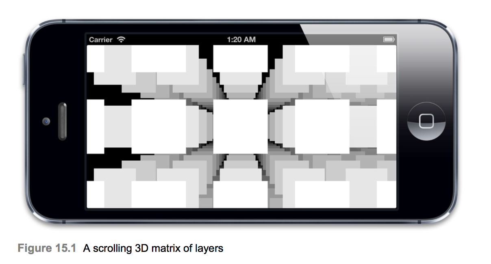

# Layer Performance
* Doing more things faster is no substitute for doing the right things. - Stephen R. Covey -
* 14 장 "이미지 IO"에서는 애니메이션 프레임 속도에 영향을 줄 수있는 성능 오류를 피하기 위해 이미지를 효율적으로 로드하고 표시하는 방법에 대해 설명했다. 이 마지막 장에서는 레이어 트리 자체의 성능과 레이어 트리를 최대한 활용하는 방법에 대해 알아 보자.

## Inexplicit Drawing
* 레이어 백업 이미지는 Core Graphics를 사용하여 직접 그려 지거나 파일에서로드 된 이미지를 제공하거나 contents를 사용하여 직접 설정하거나 오프 스크린 CGContext에서 미리 그릴 수 있다. 앞의 두 장에서는이 두 시나리오를 모두 최적화하는 방법에 대해 설명했다. 그러나 명시 적으로 배경 이미지를 만드는 것 외에도 특정 레이어 속성을 사용하거나 특정 뷰 또는 레이어 하위 클래스를 사용하여 암시 적으로 배경 이미지를 만들 수도 있다.
* 소프트웨어 드로잉이 필요하지 않은 경우 소프트웨어 도면을 실수로 도입하는 것을 피할 수 있도록 언제 어떻게 이런 일이 발생하는지 정확히 이해하는 것이 중요하다.

### Text
* CATextLayer와 UILabel은 텍스트를 레이어의 뒷면 이미지에 직접 그린다. 이 두 클래스는 실제로 텍스트 렌더링에 대해 근본적으로 다른 접근법을 사용한다. iOS 6 이전 버전에서 UILabel은 WebKit의 `HTML 렌더링 엔진`을 사용하여 텍스트를 그리는 반면 CATextLayer는 `Core Text`를 사용한다. 후자는 더 빠르며 많은 텍스트를 그릴 필요가있는 모든 경우에 우선적으로 사용해야하지만 소프트웨어 드로잉이 필요하기 때문에 하드웨어 가속 합성에 비해 본질적으로 느리다.
* 가능하면 텍스트가 포함 된 뷰의 프레임을 변경하지 마십시오. 텍스트가 다시 그려지기 때문이다. 예를 들어 크기가 자주 변경되는 레이어 모서리에 정적 텍스트 블록을 표시해야하는 경우 텍스트를 하위 레이어에 배치하십시오.

### Rasterization
* 4 장의 "Visual Effects"에서 CALayer의 `shouldRasterize` 속성에 대해 겹치는 반투명 레이어로 블렌딩 글리치를 해결하는 방법과 복잡한 레이어 하위 트리를 드로잉 할 때 성능 최적화 기법으로 12 장 "Tuning for Speed"를 다시 언급했다.
* shouldRasterize 속성을 활성화하면 레이어가 오프 스크린 이미지로 그려진다. 그러면 해당 이미지가 실제 레이어의 내용과 하위 레이어 대신 캐시되고 그려진다. 하위 레이어가 많거나 복잡한 효과가 적용된 경우 일반적으로 프레임마다 모든 것을 다시 그리는 것보다 비용이 적다. 그러나 처음에는 래스터화 된 이미지를 생성하는 데 시간이 걸리며 추가 메모리를 소비한다.
* Resterization은 적절하게 사용될 때 큰 성능 향상을 제공 할 수 있지만 (12 장에서 보았 듯이) 모든 프레임에서 내용이 변경되는 레이어를 래스터 화하지 않는 것이 중요하다. 이는 캐싱의 이점을 무효화하고 실제로 성능을 악화시키기 때문이다.
* Resterization를 제대로 사용하고 있는지 테스트하려면 `Color Hits Green 및 Missed Red` 인스트루먼트를 사용하여 래스터화 된 이미지 캐시가 자주 플러시되는지 확인하십시오(이 레이어는 래스터화에 적합한 레이어가 아니거나 불필요하게 다시 그려지는 변경 사항을 무의식적으로 변경하고 있음을 나타낸다).

## Offscreen Rendering
* 오프 스크린 렌더링은 지정된 레이어 속성의 조합이 사전 합성없이 레이어를 화면에 직접 그릴 수 없다는 것을 나타낼 때마다 호출된다. 오프 스크린 렌더링은 반드시 소프트웨어 드로잉을 의미하지는 않지만, 디스플레이 되기 전에 레이어가 먼저 (CPU 또는 GPU에 의해) 오프 스크린 컨텍스트로 렌더링되어야 함을 의미한다. 오프 스크린 렌더링을 트리거하는 레이어 속성은 다음과 같다.
  * Roundedcorners(whencombinedwithmasksToBounds) 
  * Layer masks
  * Drop shadows
* 종종 래스터 화를 오프 스크린 렌더링이 필요한 레이어의 최적화로 활성화하는 것이 좋지만 레이어 / 하위 레이어를 자주 다시 그리지 않아도되는 경우에만 유용하다.
* 오프 스크린 렌더링이 필요하고 애니메이션을 적용해야하는 (또는 애니메이션 하위 레이어가있는) 레이어의 경우 CAShapeLayer, contentsCenter 또는 shadowPath를 사용하여 성능에 미치는 영향을 줄이면서 비슷한 모양을 얻을 수 있다.

### CAShapeLayer
* cornerRadius와 masksToBounds는 별다른 오버 헤드가 없지만, 결합하면 오프 스크린 렌더링을 트리거한다. 때때로 둥근 모서리와 클립 하위 레이어를 레이어 경계에 표시하고 싶지만 둥근 모서리로 클립 할 필요는 없으며이 경우 CAShapeLayer를 사용하여 이 오버 헤드를 피할 수 있다.
* UIBezierPath (Listing 15.1)의 편리한 `+ bezierPathWithRoundedRect : cornerRadius :` 생성자를 사용하여 둥근 사각형을 그려 성능 오버 헤드없이 레이어의 (직사각형) 경계에 클립핑 할 수 있다. 이것은 cornerRadius를 사용하는 것보다 빠르지만, masksToBounds 속성이 더 이상 성능 패널티를 발생시키지 않는다는 것을 의미한다.

```Swift
class ViewController_15_1: UIViewController {
    @IBOutlet weak var layerView: UIView!

    override func viewDidLoad() {
        super.viewDidLoad()
        
        let blueLayer = CAShapeLayer()
        blueLayer.frame = CGRect(x: 0, y: 0, width: 100, height: 100)
        blueLayer.position = layerView.layer.position
        blueLayer.fillColor = UIColor.blue.cgColor
        blueLayer.path = UIBezierPath(roundedRect: CGRect(x: 0, y: 0, width: 100, height: 100), cornerRadius: 20).cgPath
        
        layerView.layer.addSublayer(blueLayer)
    }
}
```

### Stretchable Images
* 둥근 사각형을 생성하는 또 다른 방법은 2 장 "Backing Image"에서 언급 한 `contentsCenter` 속성과 결합 된 원형 내용 이미지를 사용하여 신축성있는 이미지를 생성하는 것이다 (목록 15.2 참조). 이론적으로 CAShapeLayer를 사용하는 것보다 렌더링 속도가 약간 빨라야한다. 스트레치 가능한 이미지를 그리려면 18 개의 삼각형 (3x3 격자로 배열 된 9 개의 사각형을 사용하여 늘릴 수있는 이미지 만 렌더링 됨)이 필요하다. 반면 부드러운 곡선을 렌더링하려면 더 많은 이미지가 필요하다. 실제로 이 차이는 중요하지 않을 수 있다.

```Swift
class ViewController_15_2: UIViewController {

    override func viewDidLoad() {
        super.viewDidLoad()

        let blueLayer = CALayer()
        blueLayer.frame = CGRect(x: 50, y: 50, width: 100, height: 100)
        blueLayer.contentsCenter = CGRect(x: 0.5, y: 0.5, width: 0, height: 0)
        blueLayer.contentsScale = UIScreen.main.scale
        blueLayer.contents = #imageLiteral(resourceName: "Rounded").cgImage
        
        view.layer.addSublayer(blueLayer)
    }
}
```

### shadowPath
* 2 장에서 shadowPath 속성에 대해 언급했다. 레이어가 사각형이나 둥근 사각형과 같은 단순한 기하학적 모양(투명 파트나 하위 레이어가 포함되지 않은 경우)이면 그림자 경로를 쉽게 만들 수 있다. 모양이 일치하므로 Core Animation이 그림자를 그려야하는 계산을 크게 단순화하여 화면 밖에서 레이어를 사전 구성하지 않아도된다. 이것은 성능에 큰 차이를 만든다.
* 레이어의 모양이 더 복잡한 경우 정확한 그림자 패스를 생성하는 것이 어려울 수 있다. 이 경우 페인트 프로그램을 사용하여 그림자를 배경 이미지로 미리 생성하는 것이 좋다.

## Blending and Overdraw
* 12 장에서 언급했듯이 GPU가 각 프레임을 그릴 수있는 픽셀 수(채우기 속도라고 함)에는 제한이 있으며, 픽셀로 전체 화면을 편안하게 그릴 수는 있지만 중복 된 레이어 (오버 드로)로 인해 동일한 영역을 여러 번 다시 칠할 필요가 있으면 그리는 것이 지연될 수 있다.
* GPU는 다른 레이어에서 완전히 가려진 레이어의 픽셀을 삭제하지만 레이어가 가려져 있는지 여부를 계산하는 것은 복잡하고 프로세서 집약적 일 수 있다. 겹치는 여러 반투명 픽셀(혼합)의 색상을 함께 병합하는 것도 비용이 많이 든다. 필요하지 않으면 레이어가 투명도를 사용하지 않도록하여 프로세스 속도를 높일 수 있다. 가능할 때마다 다음을 수행해야한다.
  * Set the backgroundColor of your view to a fixed, opaque color.
  * Set the opaque property of the view to YES.
* 이렇게하면 블렌딩이 줄어든다(컴포지션이 레이어 뒤의 아무 것도 최종 픽셀 색상에 기여하지 않는다는 것을 알기 때문에). 코어 애니메이션은 각 중첩 픽셀을 개별적으로 테스트하지 않고 완전히 흐리게 처리 된 레이어를 모두 삭제할 수 있기 때문에 과도한 계산을 빠르게 처리한다.
* 이미지를 사용하는 경우 엄격하게 필요하지 않으면 알파 투명도를 피하십시오. 이미지가 고정 된 배경색 앞에 표시되거나 포그라운드에서 상대적으로 움직일 필요가없는 정적 배경 이미지 인 경우 이미지 배경을 미리 채우고 런타임 블렌딩을 피할 수 있다.
* 텍스트를 사용하는 경우 흰색 배경 (또는 다른 단색)의 UILabel은 투명한 배경이있는 UILabel보다 효율적이다.
* 마지막으로 shouldRasterize 속성을 적절하게 사용하면 정적 레이어 계층 구조를 각 프레임마다 다시 만들 필요가 없는 단일 이미지로 축소 할 수 있으므로 하위 레이어 간의 블렌딩 및 오버 드로로 인한 성능 저하를 피할 수 있다.

## Reducing Layer Count
* 레이어를 할당하고, 그것을 전처리하고, IPC를 통해 렌더링 서버에 보내어 패키징 한 다음 OpenGL 지오메트리로 변환하는 오버 헤드로 인해 화면 상에 한 번에 표시 할 수있는 레이어의 수에 실질적인 상한선이 있다.
* 정확한 한도는 iOS 기기, 레이어 유형, 레이어 내용 및 속성에 따라 다르지만 일반적으로 레이어 수가 수백 또는 수천에 도달하면 비록 레이어 들이 오버헤드가 큰 작업을 아무것도하지 않아도 레이어의 품질 문제가 발생하기 시작한다.

### Clipping
* 레이어에 다른 종류의 최적화를 수행하기 전에 가장 먼저 확인해야 할 사항은 레이어가 보이지 않을 경우 레이어를 만들어 윈도우에 첨부하지 않는 것이다. 레이어는 다음과 같은 다양한 이유로 보이지 않을 수 있다.
  * 화면 경계 외부 또는 부모 레이어 경계에 위치합니다.
  * 다른 불투명 한 레이어에 의해 완전히 가려집니다.
  * 완전히 투명합니다.

* Core Animation은 가시적 장면에 기여하지 않는 레이어를 제거하는 작업을 상당히 잘 수행하지만 Core Animation보다 먼저 레이어가 필요하지는 않은지를 코드가 결정할 수 있다. 이상적으로는 레이어 객체가 생성되기 전에 이를 확인하여 불필요하게 레이어를 만들고 구성하는 오버 헤드를 피하는 것이 좋다.
* 예를 들어 봅시다. 아래는 레이어의 간단한 스크롤 3D 매트릭스를 생성하는 코드를 보여준다. 이것은 특히 움직일 때 매우 멋지게 보인다(그림 15.1 참조). 그러나 각 레이어는 단순한 색상의 사각형이므로 트로잉하는데 특히 비싸지 않다.

```Swift
class ViewController_15_3: UIViewController {
    @IBOutlet weak var scrollView: UIScrollView!

    let WIDTH = 10
    let HEIGHT = 10
    let DEPTH = 10
    
    let SIZE = 100
    let SPACING = 150
    
    let CAMERA_DISTANCE = 500
    
    override func viewDidLoad() {
        super.viewDidLoad()

        scrollView.contentSize = CGSize(width: (WIDTH - 1) * SPACING, height: (HEIGHT - 1) * SPACING)
        
        var transform = CATransform3DIdentity
        transform.m34 = -1.0 / CGFloat(CAMERA_DISTANCE)
        scrollView.layer.sublayerTransform = transform
        
        for z in (0 ..< DEPTH).reversed() {
            for y in 0 ..< HEIGHT {
                for x in 0 ..< WIDTH {
                    let layer = CALayer()
                    layer.frame = CGRect(x: 0, y: 0, width: SIZE, height: SIZE)
                    layer.position = CGPoint(x: x * SPACING, y: y * SPACING)
                    layer.zPosition = CGFloat(-z * SPACING)
                    
                    layer.backgroundColor = UIColor(white: CGFloat(1 - CGFloat(z) * (1.0 / CGFloat(DEPTH))), alpha: 1).cgColor
                    
                    scrollView.layer.addSublayer(layer)
                }
            }
        }
        
        print("\(DEPTH * HEIGHT * WIDTH)")
    }
}
```

* WIDTH, HEIGHT 및 DEPTH 상수는 생성되는 레이어 수를 제어한다. 이 경우 10 × 10 × 10 개의 레이어가 있으므로 총 1000개이며 이 중 한 번에 몇백 개만 화면에 표시된다.
* WIDTH 및 HEIGHT 상수를 100으로 늘리면 앱이 느려지게 됩니다. 이제 100,000 개의 레이어를 만들었으므로 성능이 저하 된 것은 놀라운 일이 아니다.
* 그러나 실제로 화면 상에 보이는 레이어의 수는 전혀 증가하지 않았으므로 여분의 것들을 그리지 않는다. 앱이 느린 이유는 모든 레이어를 관리해야하기 때문이다. 대부분은 렌더링 작업에 기여하지 않지만 Core Animation이 프레임을 폐기하기 전에 각 레이어의 위치를 계산하도록 강요함으로써 프레임 속도를 없앴다.

* 레이어가 균일 한 격자로 배열되어 있다는 것을 알기 때문에 실제로 레이어를 만들거나 위치를 개별적으로 계산할 필요없이 화면에 표시 될 레이어를 수학적으로 결정할 수 있다. 계산은 관점을 고려해야하기 때문에 중요하지 않다. 그러나 우리가 그 일을 선행하게 된다면 나중에 Core Animation이 훨씬 더 복잡한 작업을하지 않아도 되고 불필요하게 레이어 오브젝트를 생성하고 배치 할 필요가 없게된다.
* 우리의 앱을 리펙토링하여 레이어가 미리 할당 된 것이 아닌 화면이 스크롤 될 때 동적으로 인스턴스화 되도록합시다. 그렇게하면 우리는 그것들을 생성하기 전에 그것들이 필요한지 여부를 계산할 수 있다. 다음으로 시야 밖의 레이어를 제거 할 수 있도록 보이는 영역을 계산하는 코드를 추가한다. 아래는 업데이트 된 코드를 보여준다.

```Swift
class ViewController_15_4: UIViewController {
    @IBOutlet weak var scrollView: UIScrollView!
    
    
    override func viewDidLoad() {
        super.viewDidLoad()
        
        scrollView.contentSize = CGSize(width: (WIDTH - 1) * SPACING, height: (HEIGHT - 1) * SPACING)
        
        var transform = CATransform3DIdentity
        transform.m34 = -1.0 / CGFloat(CAMERA_DISTANCE)
        scrollView.layer.sublayerTransform = transform
        
        print("\(DEPTH * HEIGHT * WIDTH)")
    }
    
    override func viewDidLayoutSubviews() {
        updateLayers()
    }
    
    func updateLayers() {
        var bounds = scrollView.bounds
        bounds.origin = scrollView.contentOffset
        bounds = bounds.insetBy(dx: CGFloat(-SIZE / 2), dy: CGFloat(-SIZE / 2))
        
        var visibleLayers: [CALayer] = []
        
        for z in (0 ..< DEPTH).reversed() {
            var adjusted = bounds
            adjusted.size.width /= PERSPECTIVE(CGFloat(z * SPACING))
            adjusted.size.height /= PERSPECTIVE(CGFloat(z * SPACING))
            adjusted.origin.x -= (adjusted.size.width - bounds.size.width) / 2
            adjusted.origin.y -= (adjusted.size.height - bounds.size.height) / 2
            
            for y in 0 ..< HEIGHT {
                if CGFloat(y * SPACING) < adjusted.origin.y || CGFloat(y * SPACING) >= adjusted.origin.y + adjusted.size.height {
                    continue
                }
                
                for x in 0 ..< WIDTH {
                    if CGFloat(x * SPACING) < adjusted.origin.x || CGFloat(x * SPACING) >= adjusted.origin.x + adjusted.size.width {
                        continue
                    }
                    
                    let layer = CALayer()
                    layer.frame = CGRect(x: 0, y: 0, width: SIZE, height: SIZE)
                    layer.position = CGPoint(x: x * SPACING, y: y * SPACING)
                    layer.zPosition = CGFloat(-z * SPACING)
                    layer.backgroundColor = UIColor(white: CGFloat(1 - CGFloat(z) * (1.0 / CGFloat(DEPTH))), alpha: 1).cgColor
                    
                    visibleLayers.append(layer)
                }
            }
        }
        
        scrollView.layer.sublayers = visibleLayers
    }
}

extension ViewController_15_4: UIScrollViewDelegate {
    func scrollViewDidScroll(_ scrollView: UIScrollView) {
        updateLayers()
    }
}
```

* 여기에 사용 된 계산의 수학은 이 특정 문제에 매우 구체적이지만 원칙은 다른 상황에도 적용된다. (UITableView 또는 UICollectionView를 사용할 때 어떤 셀을 표시해야하는지 파악하기 위해 비슷한 배경을 사용한다.) 결과적으로 우리 앱은 한 번에 몇백 개 이상을 인스턴스화 할 필요가 없기 때문에 성능 문제없이 수십만 개의 "가상"레이어를 처리 할 수있게되었다.

## Object Recycling
* 많은 수의 비슷한 뷰 또는 레이어를 관리 할 때 사용할 수 있는 또 다른 트릭은 이를 재활용하는 것이다. iOS에서는 객체 재활용이 매우 일반적인 패턴이다. UITableView 및 UICollectionView 셀과 MKMapView의 주석 핀에 사용되며 다른 많은 예제와 함께 사용된다.
* 객체 재활용의 기본 원칙은 `동일한 객체 풀`을 만드는 것이다. 특정 개체의 인스턴스(이 경우 계층)를 마치면 개체 풀에 추가한다. 인스턴스가 필요할 때마다 풀에서 하나를 가져온다. 풀이 비어있는 경우에만 새 풀을 만든다.
* 이것의 장점은 객체를 끊임없이 생성하고 해제하는 오버 헤드 (메모리 할당 / 할당 해제가 필요하므로 비용이 많이 듦)를 피하고 인스턴스간에 변경되지 않는 속성을 다시 적용하지 않아도된다는 것이다.
* 매트릭스 풀 그림을 업데이트하여 객체 풀을 사용하도록 합시다 (아래 코드 참조).

```Swift
class ViewController_15_5: UIViewController {
    @IBOutlet weak var scrollView: UIScrollView!
    
    var recyclePool = NSMutableSet()
    
    override func viewDidLoad() {
        super.viewDidLoad()
        
        scrollView.contentSize = CGSize(width: (WIDTH - 1) * SPACING, height: (HEIGHT - 1) * SPACING)
        
        var transform = CATransform3DIdentity
        transform.m34 = -1.0 / CGFloat(CAMERA_DISTANCE)
        scrollView.layer.sublayerTransform = transform
        
        print("\(DEPTH * HEIGHT * WIDTH)")
    }
    
    override func viewDidLayoutSubviews() {
        updateLayers()
    }
    
    func updateLayers() {
        var bounds = scrollView.bounds
        bounds.origin = scrollView.contentOffset
        bounds = bounds.insetBy(dx: CGFloat(-SIZE / 2), dy: CGFloat(-SIZE / 2))
        
        recyclePool.addObjects(from: scrollView.layer.sublayers ?? [])
        
        CATransaction.begin()
        CATransaction.setDisableActions(true)
        
        var recycled = 0
        var visibleLayers: [CALayer] = []
        
        for z in (0 ..< DEPTH).reversed() {
            var adjusted = bounds
            adjusted.size.width /= PERSPECTIVE(CGFloat(z * SPACING))
            adjusted.size.height /= PERSPECTIVE(CGFloat(z * SPACING))
            adjusted.origin.x -= (adjusted.size.width - bounds.size.width) / 2
            adjusted.origin.y -= (adjusted.size.height - bounds.size.height) / 2
            
            for y in 0 ..< HEIGHT {
                if CGFloat(y * SPACING) < adjusted.origin.y || CGFloat(y * SPACING) >= adjusted.origin.y + adjusted.size.height {
                    continue
                }
                
                for x in 0 ..< WIDTH {
                    if CGFloat(x * SPACING) < adjusted.origin.x || CGFloat(x * SPACING) >= adjusted.origin.x + adjusted.size.width {
                        continue
                    }
                    
                    var layer: CALayer!
                    if let object = recyclePool.anyObject() as? CALayer {
                        layer = object
                        recycled += 1
                        recyclePool.remove(object)
                    } else {
                        layer = CALayer()
                        layer.frame = CGRect(x: 0, y: 0, width: SIZE, height: SIZE)
                    }
                    
                    layer.position = CGPoint(x: x * SPACING, y: y * SPACING)
                    layer.zPosition = CGFloat(-z * SPACING)
                    layer.backgroundColor = UIColor(white: CGFloat(1 - CGFloat(z) * (1.0 / CGFloat(DEPTH))), alpha: 1).cgColor
                    
                    visibleLayers.append(layer)
                }
            }
        }
        CATransaction.commit()
        
        scrollView.layer.sublayers = visibleLayers
        
        print(visibleLayers.count, recycled)
    }
}

extension ViewController_15_5: UIScrollViewDelegate {
    func scrollViewDidScroll(_ scrollView: UIScrollView) {
        updateLayers()
    }
}
```

* 이 경우 하나의 유형의 레이어 객체만 가질 수 있지만 UIKit은 식별자 문자열을 사용하여 별도의 풀에 저장된 여러 재활용 가능한 객체 유형을 구별하기도한다.
* 레이어 속성을 설정할 때 애니메이션을 억제하기 위해 CATransaction을 사용하고 있음을 알았을 것이다. 일단 디스플레이에 속성을 추가하기 전에 한 번만 레이어의 속성을 설정 했으므로 이전에는 이 작업이 필요하지 않았다. 그러나 이제 레이어가 재활용되고 있으므로 보이는 레이어의 속성이 수정 될 때 일반적으로 발생하는 암시적 애니메이션을 비활성화해야한다.

## Core Graphics Drawing
* 화면에 디스플레이에 영향을 미치지 않는 뷰 또는 레이어를 제거한 후에도 레이어 수를 더 줄이는 방법이있을 수 있다. 예를 들어 정적 컨텐츠를 표시하기 위해 여러 UILabel 또는 UIImageView 인스턴스를 사용하는 경우 잠재적으로 모든 인스턴스를 `-drawRect :`를 사용하는 단일 뷰로 대체하여 복잡한 뷰 계층 구조의 모양을 복제 할 수 있다.
* 소프트웨어 드로잉이 GPU 합성보다 느리고 추가 메모리가 필요하다는 것을 알고 있기 때문에 반 직관적 인 것처럼 보일 수 있지만, 성능은 레이어 수에 의해 제한되는 상황에서 소프트웨어 도면은 실제로 과도한 레이어 할당 및 조작을 피함으로써 성능을 향상 시킬 수 있다.
* 이 경우 직접 드로잉을 수행하는 것은 Resterization를 비슷한 성능 상충 관계가 있지만 레이어 트리에서 하위 레이어를 모두 제거 할 수 있다는 것을 의미한다(shouldRasterize를 사용할 때와 마찬가지로).

## The -renderInContext: Method
* 코어 그래픽을 사용하여 정적 레이아웃을 그리는 것이 때로는 UIView 인스턴스의 계층 구조를 사용하는 것보다 빠를 수도 있지만 UIView 인스턴스를 사용하면 동등한 드로잉 코드를 직접 작성하는 것보다 간결하고 융통성이 있다. 특히 인터페이스 빌더를 사용하여 레이아웃을 작성하는 경우. 성능 조정을 위해 이러한 이점을 희생해야하는 것은 수치스럽다.
* 다행히도 당신은 필요가 없습니다. 많은 수의 뷰 또는 레이어를 갖는 것은 레이어가 실제로 스크린에 첨부 된 경우에만 문제가됩니다. 레이어 트리에 연결되지 않은 레이어는 렌더링 서버로 보내지지 않으며 성능이 처음 생성되고 구성 된 후에는 성능에 영향을 미치지 않는다.
* CALayer `-renderInContext :` 메서드를 사용하면 레이어 및 그 하위 레이어의 스냅 샷을 Core Graphics 컨텍스트에 그려 넣을 수 있고 이미지를 UIImageView 내부 또는 다른 CALayer의 내용으로 직접 표시 할 수 있는 이미지로 캡처 할 수 있다. 이 방법을 사용하면 레이어를 레이어 트리에 연결해야하는 shouldRasterize를 사용하는 것과 달리 지속적인 성능 비용이 없다.
* 레이어 내용이 변경 될 때이 이미지를 새로 고치는 책임은(캐싱 및 캐시 무효화를 자동으로 처리하는 shouldRasterize를 사용하는 것과 달리) 사용자가 결정할 수 있지만 일단 이미지가 처음 생성 된 후에는 Core Animation에 복잡한 레이어 트리를 유지하도록 요청하는 것보다이 프레임 워크의 성능 오버 헤드가 현저히 줄어 든다.

## Summary
* 이 장에서는 Core Animation 레이어를 사용할 때의 일반적인 성능 병목 현상을 조사하고이를 방지하거나 완화하는 방법에 대해 설명했다. 몇백 개의 실제 레이어 만 생성하여 수천 개의 가상 레이어가 포함 된 장면을 관리하는 방법을 배웠다.
* 또한 필요한 경우 레이어 내용을 선택적으로 래스터화 또는 드로잉하여 CPU와 GPU간에 작업을 재배포하는 유용한 트릭을 배웠다.
* Core Animation에 관해서는 (적어도 Apple이 우리에게 새로운 것을 만들어 낼 때까지) 그게 전부이다.
