# Transforms
- 4장 'Visual Effects'에서는 레이어 및 그 내용의 모양을 나타내는 몇 가지 기술을 배웠다.
이 장에서는 레이어를 회전, 재배치, 왜곡하는 데 사용할 수 있는 CGAffineTransform과 3차원 표면으로 변경할 수 있는 CATransform3D에 대해서 배울것이다.


### Affine Transforms
- 3장 'Layer Geometry'에서 UIView 변형 속성을 사용하여 시계를 회전시켰지만 실제로 어떤 일이 일어나는지 설명하지 않았다.
UIView 변형 속성은 CGAffineTransform 유형이며 2차원 회전, 비율 및 변환을 나타내는데 사용한다.
- CGAffineTransform은 2D 행 벡터(이 경우 CGPoint)를 곱하여 그 값을 변환할 수 있는 2X3 행렬이다.
아래 그림에서 일반 CGPoint에서 CGAffineTransform행렬과 곱셈을 하기 위해선 수열을 맞춰야 하므로 임시적인 값으로 채운다.(실제로  이값은 결과를 변경하지 않는다.)
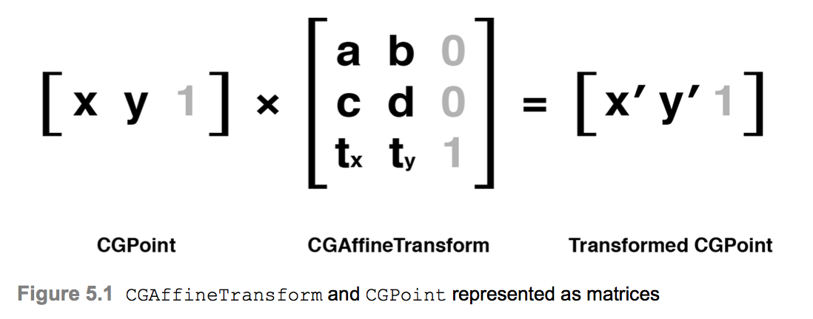
- 이러한 이유로 2x3 대신에 3x3 매트릭스로 표현 된 2D 변환을 종종 보게된다.
- 변환 행렬을 레이어에 적용하면 레이어 사각형의 코너가 개별적으로 변형되어 새로운 사각형 모양이 만들어진다.
CGAffineTransform의 `affine`은 행렬에 사용되는 값이 무엇이든간에 변환 이전에 평행 한 레이어의 선이 변형 후에도 평행을 유지한다는 것을 의미한다.
아래는 affine과 nonaffine의 차이점을 보여준다.
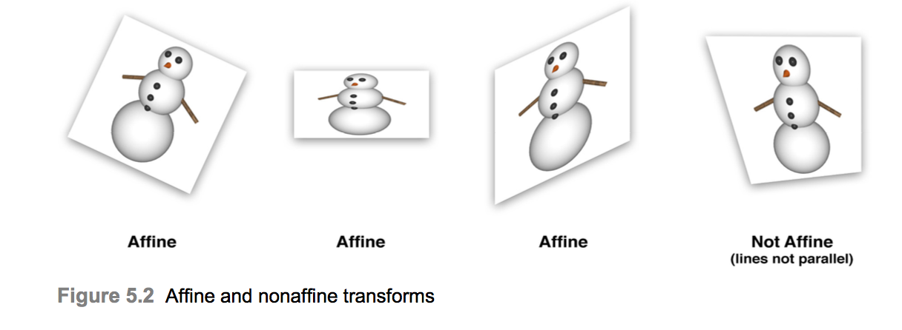

### Creating a CGAffineTrasnform
- 행렬 수학에 대해서 설명하기엔 이 장의 범위를 벗어나며, 다행히 행렬에 익숙하지 않은 개발자더라도 Core Graphics에서 행렬을 간단한 변환으로 임의의 변환을 구축할 수 있는 많은 내장함수를 제공한다.
아래 함수는 각각 처음부터 새로운 CGAffineTransform 행렬을 만든다.
  - CGAffineTrasnformMakeRotation(CGFloat angle)
  - CGAffineTrasnformMakeScale(CGFloat sx, CGFloat sy)
  - CGAffineTransformMakeTranslation(CGFloat tx, CGFloat ty)
- 아래는 회전 변환 함수 예이다.
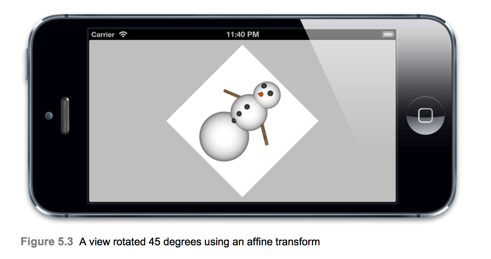
```Swift
class ViewController: UIViewController {
    @IBOutlet weak var layerView: UIView!

    override func viewDidLoad() {
        super.viewDidLoad()
        
        let image = UIImage(named: "Snowman")
        layerView.layer.contents = image?.cgImage
        layerView.layer.contentsGravity = kCAGravityResizeAspect
        
        let tarnsform = CGAffineTransform(rotationAngle: CGFloat(M_PI_4))
        layerView.layer.setAffineTransform(tarnsform)
    }
}
```
- 주의해야할 점은 각도에 사용하는 단위는 라디안이라는 것이다.
```
RADIANS_TO_DEGREES(x) => ((x)/M_PI*180.0)
DEGREES_TO_RADIANS(x) => ((x)/180.0*M_PI)
```

### Combining Transforms
- Core Graphics는 또한 기존 그래픽 위에 변환을 적용하는데 사용할 수 있는 두 번째 기능 세트를 제공한다. 예를 들어, 레이어의 크기 조절하고 회전하는 단일 변환 행렬을 만들려는 경우에 유용하다. 이러한 기능은 다음과 같다.
  - CGAffineTransformRotate(CGAffineTransform t, CGFloat angle)
  - CGAffineTransformScale(CGAffineTransform t, CGFloat sx, CGFloat sy)
  - CGAffineTransformTranslate(CGAffineTransform t, CGFloat tx, CGFloat ty)

- 변환을 조작할 때는 CGAffineTransform에 0 또는 nil과 동등한 변환을 생성할 수 있는것이 필요하다. 행렬에서 이를 단위행렬(Identiti matrix)이라고 알려져 있으며 Core graphics에서는 CGAffineTransformIdentity가 단위행렬 역할을 한다.
- 두 개의 기존 변환 행렬을 결합하려는 경우 두 개의 기존 행렬에서 새로운 CGAffineTransform 행렬을 만드는 함수를 사용할 수 있다. 이는  CGAffineTransformConcat이다.
- 아래 예제는 스케일을 적용한 후 30도 회전을 적용하고, 마지막으로 이동 변환을 적용하는 것이다.
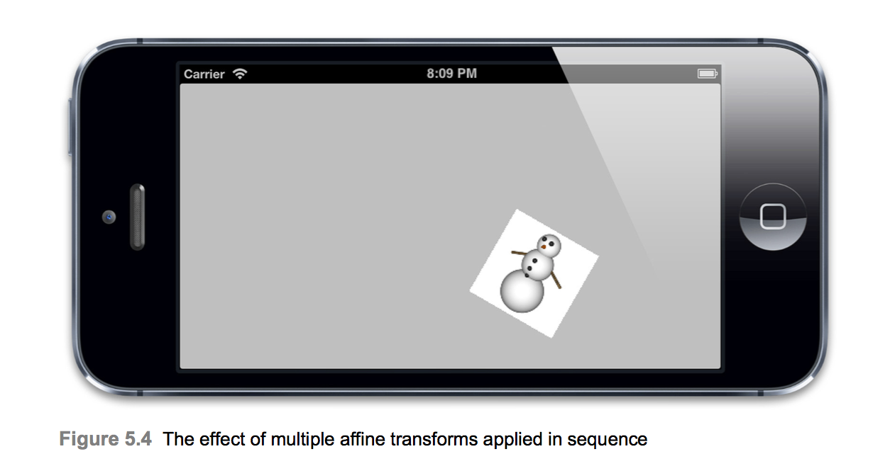
```Swift
class ViewController: UIViewController {
    @IBOutlet weak var layerView: UIView!

    override func viewDidLoad() {
        super.viewDidLoad()
        
        let image = UIImage(named: "Snowman")
        layerView.layer.contents = image?.cgImage
        layerView.layer.contentsGravity = kCAGravityResizeAspect
        
        var transform = CGAffineTransform.identity
        
        transform = transform.scaledBy(x: 0.5, y: 0.5)
        transform = transform.rotated(by: CGFloat(M_PI / 180.0 * 30.0))
        transform = transform.translatedBy(x: 200, y: 0)
        
        layerView.layer.setAffineTransform(transform)
    }
}
```
- 결과를 보면 알겠지만 우리가 원하던 결과가 안나왔다.(y축에 대한 이동이 없었는데 되었다.) 이는 스케일링 되고 회전되면서 실제로 100포인트 아래로 대각선으로 변환되었기 때분이다.

### The Shear Transform
- Core Graphoics는 변환 매트릭스의 올바른 값을 계산하는 함수를 제공하기 때문에 CGAffineTransform의 필드를 직접 설정해야 하는 경우는 거의 없다. 하지만 변경해야 할 상황 중 하나는 Core Graphics가 내장 기능을 제공하지 않는 전단 변환을 만들려는 경우이다.
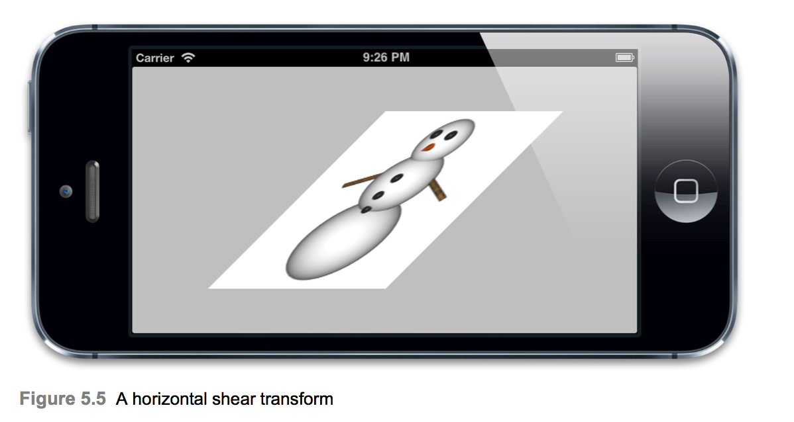
```Swift
class ViewController: UIViewController {
    @IBOutlet weak var layerView: UIView!

    override func viewDidLoad() {
        super.viewDidLoad()
        
        let image = UIImage(named: "Snowman")
        layerView.layer.contents = image?.cgImage
        layerView.layer.contentsGravity = kCAGravityResizeAspect
               
        layerView.layer.setAffineTransform(CGAffineTransformMakeShear(x: 1, y: 0))
    }
    
    func CGAffineTransformMakeShear(x: CGFloat, y: CGFloat) -> CGAffineTransform {
        var transform = CGAffineTransform.identity
        transform.c = -x
        transform.b = y
        return transform
    }
}
```

### 3D Transform
- CG 접두어 처럼 CGAffineTransform 유형은 Core Graphics 프레임 워크에 속하며, Core Graphics는 엄격하게 2D 드로잉 API이다. 3장에서 Layer의 속성 중 zPosition 프로퍼티를 배웠는데, 이는 카메라로 향하거나 카메라에서 멀어지게 하는 방향(사용자의 시점)을 이동할 수 있게한다. 이를 위해 CATransform3D 행렬이 존재하며 z축을 감안해야하기 때문에 기존의 CGAffineTransform과 달리 4x4 행렬이다.
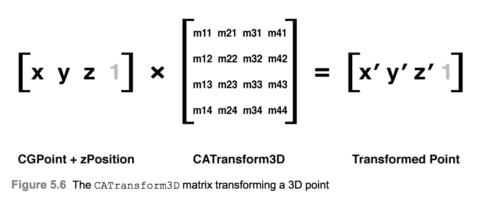
- 3D 변환을 위해서도 몇몇 API를 제공한다.
  - CATransform3DMakeRotation
  - CATransform3DMakeScale
  - CATransform3DMakeTranslation
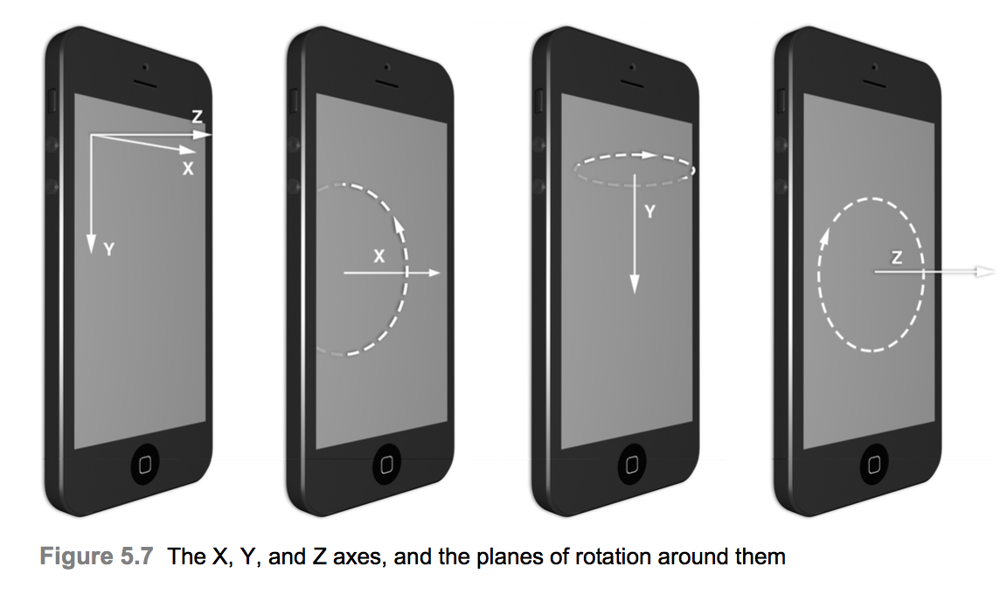
- 다음은 y축에 대한 3D 회전 예제를 볼것이다.
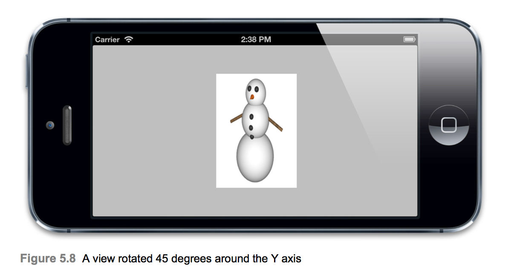
```Swift
class ViewController: UIViewController {
    @IBOutlet weak var layerView: UIView!

    override func viewDidLoad() {
        super.viewDidLoad()
        
        let image = UIImage(named: "Snowman")
        layerView.layer.contents = image?.cgImage
        layerView.layer.contentsGravity = kCAGravityResizeAspect

        let transform = CATransform3DMakeRotation(CGFloat(M_PI_4), 0, 1, 0)
        layerView.layer.transform = transform
    }
}
```
- 전혀 회전한것처럼 보이지 않는다. 단지 얇아진것처럼만 보인다. 하지만 실제로 위의 에제는 회전을 적용한 것이다. 이유는 단순히 원근감이 빠졌기 때문이다.

### Perspective Projection
- 위와 같은 문제를 해결하기 위해서는 원근감 변환(z 변환이라고도 불림)을 포함하도록 변환행렬을 수정해야한다. 원근감 변환을 설정하는 함수를 제공하지 않으므로 매트릭스의 값을 수동으로 수정해야 한다. 어려워 보이지만 실제로는 간단하다. CATransform3D의 원근감 효과는 행렬 요소 m34의 단일값으로 제어할 수 있다.
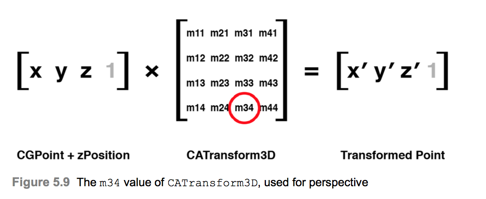
- 기본적으로 m34의 값은 0이다. m34의 값을 -1.0 / distance로 설정하여 뷰에 관점을 적용할 수 있다. 여기서 distance는 가상 카메라와 화면 사이의 거리이다. 카메라가 실제로 존재하지 않기 때문에 거리는 우리가 계산할 필요가 없다. 보통 500 ~ 1000 사이의 값은 잘 작동하지만 주어진 레이어 배치에 따라서 더 작거나 더 큰 값이 잘나타날 수도 있다. 거리값을 줄이면 원근감 효과가 증가하며, 거리값을 늘리면 전혀 원근감이 없는 것처럼 보일것이다.
- 다음은 원근감을 적용한 예제이다.
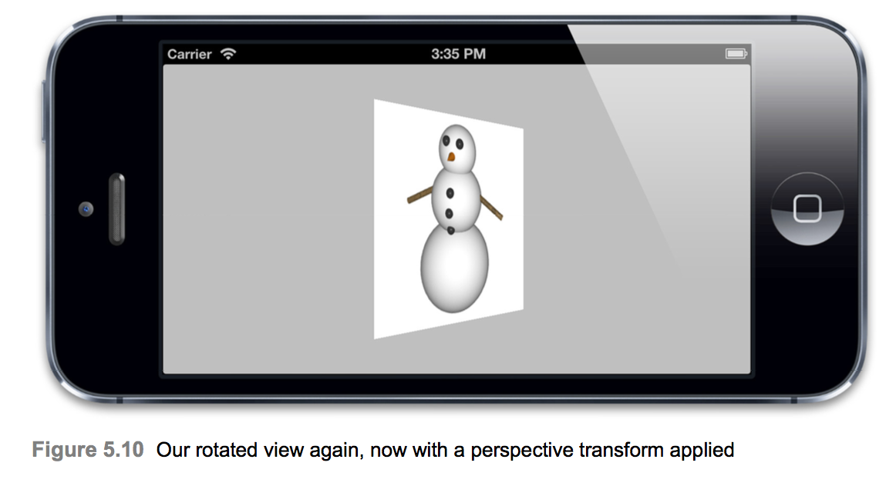
```Swift
class ViewController: UIViewController {
    @IBOutlet weak var layerView: UIView!

    override func viewDidLoad() {
        super.viewDidLoad()
        
        let image = UIImage(named: "Snowman")
        layerView.layer.contents = image?.cgImage
        layerView.layer.contentsGravity = kCAGravityResizeAspect
        
        var transform = CATransform3DIdentity
        transform.m34 = -1.0 / 500.0
        transform = CATransform3DRotate(transform, CGFloat(M_PI_4), 0, 1, 0)
        layerView.layer.transform = transform
    }
}
```

### The Vanishing Point
- 모든 객체들은 시점으로부터 멀어지면 결국 한 지점으로 축소되는데, 이 지점을 소실점이라고 부른다. 실 생활에서 소실점은 항상 보기의 중심에 있으며 일반적으로 앱에 사실적인 원근감 효과를 만들기 위해 소실점은 화면 중앙에 있어야 한다.
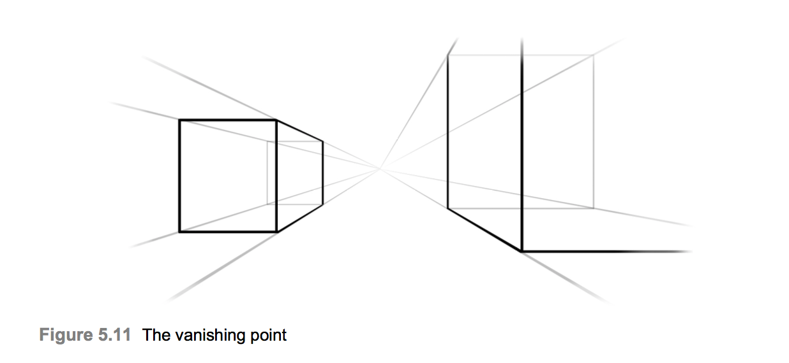

- 코어 애니메이션은 소실점이 변형되는 레이어의 `anchorPoint`에 위차하는것으로 정의한다.(일반적으로 레이어의 중심이지지만 자세한 내용은 3장 참조).
- 레이어의 위치를 변경하면 소실점도 변경된다. 3D를 작업할 때 이를 기억하는 것이 중요하다.
- `position`을 변경하면 레이어의 `Vanishing Point`도 변경된다.

### The sublayerTransform Property
- 3D변환이 가능한 다중 뷰 또는 레이어가 있는 경우 각각의 m34 값을 개별적으로 적용하기 때문에 번형되기 전에 화면 중앙의 공통 위치를 공유하는지 확인해야 한다. 이를 위해 상수 또는 함수를 정의하여 지정하면 비교적 간단하지만 Interface Builder에서 뷰를 정렬하지 못하는 경우 제한적이다.
- CALayer에는 sublayerTransform이라는 또 다른 변환 속성이 있는데. 이것은 적용되는 레이어의 모든 sublayers에만 영향을 준다. 즉 원근감 변환을 단 하나의 컨테이너 레이어에 적용할 수 있으며 하위 레이어는 모두 자동으로 해당 원근감을 상속받는다.
- 하나의 위치에서 원근감 변환을 설정하는 것만으로 편리하지만 또 다른 중요한 이점이 있다. 소실점은 각 하위 레이어에 개별적으로 설정되지 않고 컨테이너의 중심으로 설정된다. 즉 모든 위치를 화면 중심으로 설정하지 않고 위치나 프레임을 사용하여 하위 레이어를 자유롭게 배치하고, 소실점을 일관되게 유지하기 위해 Translation을 사용하여 하위 레이어를 이동시킬 수 있다.
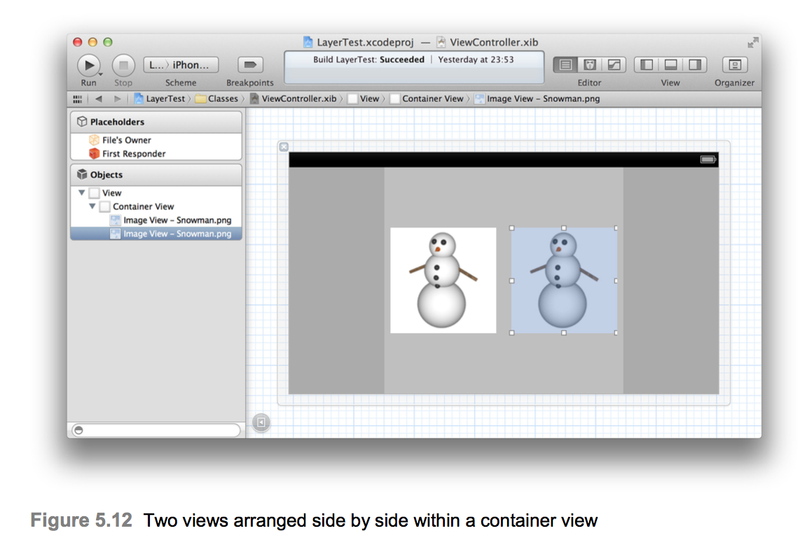
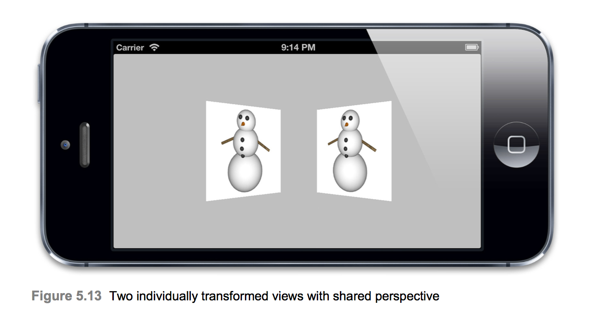

```Swift
class ViewController: UIViewController {
    @IBOutlet weak var layerView1: UIView!
    @IBOutlet weak var layerView2: UIView!

    override func viewDidLoad() {
        super.viewDidLoad()
        
        let image = UIImage(named: "Snowman")
        layerView.layer.contents = image?.cgImage
        layerView.layer.contentsGravity = kCAGravityResizeAspect

        var perspective = CATransform3DIdentity
        perspective.m34 = -1.0 / 500.0
        view.layer.sublayerTransform = perspective
        
        let transform1 = CATransform3DMakeRotation(CGFloat(M_PI_4), 0, 1, 0)
        layerView1.layer.transform = transform1
        layerView1.layer.contents = image?.cgImage
        
        let transform2 = CATransform3DMakeRotation(CGFloat(-M_PI_4), 0, 1, 0)
        layerView2.layer.transform = transform2
        layerView2.layer.contents = image?.cgImage
    }
}
```

### Backfaces
- 레이어를 M_PI_4(45도)가 아닌 M_PI(180)로 3D로 회전하여 뒤에서 볼 수 있다.
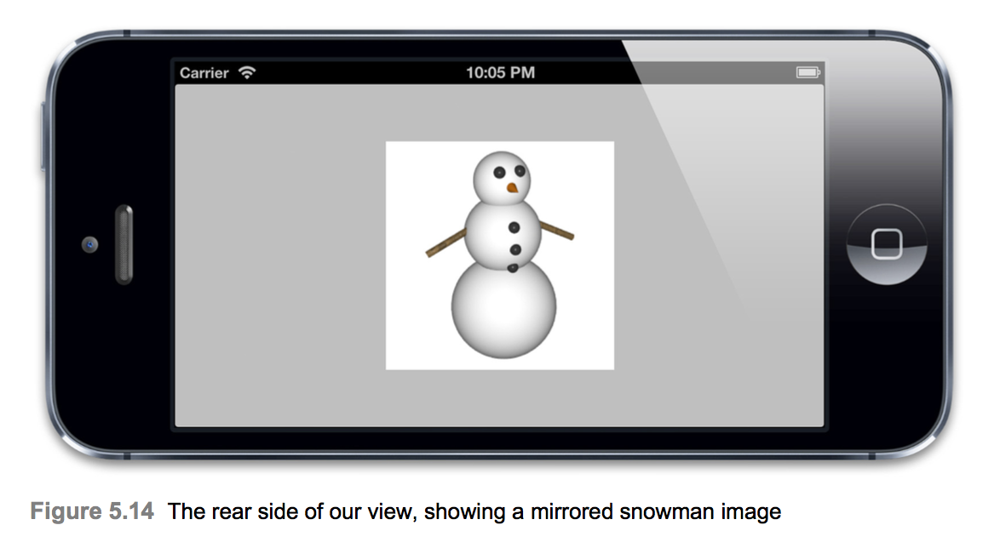

- 위의 그림을 보면 알 수 있듯이 레이어는 양면이다. 뒷면은 정면의 거울 이미지를 보여준다.(정말 흥미롭군..) 그러나 이것이 반드시 바람직한 특징은 아니다. 레이어에 텍스트 또는 컨트롤이 포함되어있는 경우 사용자가 텍스트 또는 컨트롤의 대칭 이미지를 보면 매우 혼란스러울것이다.
- CALayer에는 레이어의 뒷면을 그릴지 여부를 제어하는 doubleSided라는 속성이 있다. 기본값은 `true`이며 이 옵션을 `false`로 설정하면 레이어가 카메라에서 멀어질 때 전혀 그려지지 않는다.(꾀 유용한 옵션인듯?)

### Layer Flattening
- Z축 기준으로 -45도 방향으로 돌린 서브레이어의 슈퍼뷰의 레이어를 Z축 기준 45도 회전시키면 어떻게 될까?
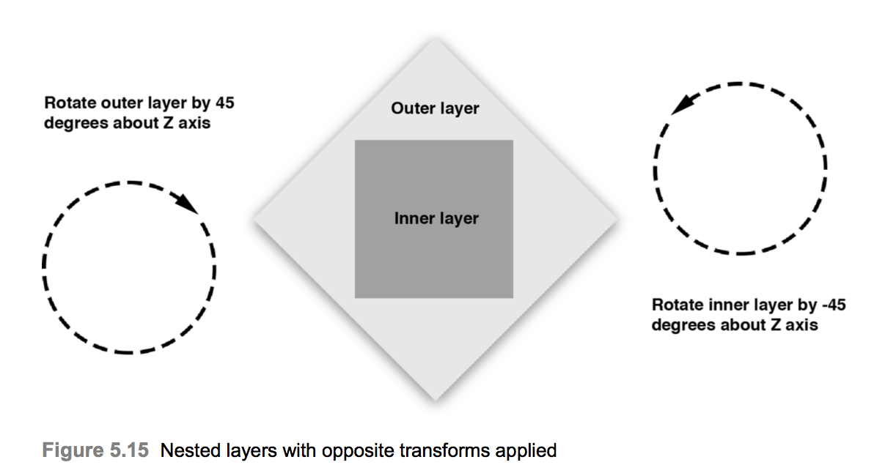

- 서브레이어가 Z축 기준 -45도로 회전되어 있는 상태에서 슈퍼레이어를 Z축 기준 45도 회전시키면 서브레이어의 회전이 취쇠 된다는 것을 잊지말자.
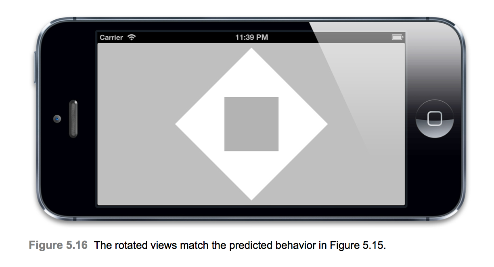

```Swift
class ViewController: UIViewController {
    @IBOutlet weak var layerView: UIView!
    
    @IBOutlet weak var layerView1: UIView!
    @IBOutlet weak var layerView2: UIView!

    @IBOutlet weak var outerLayer: UIView!
    @IBOutlet weak var innerLayer: UIView!
    
    override func viewDidLoad() {
        super.viewDidLoad()
        
        let image = UIImage(named: "Snowman")
        layerView.layer.contents = image?.cgImage
        layerView.layer.contentsGravity = kCAGravityResizeAspect
        
        var perspective = CATransform3DIdentity
        perspective.m34 = -1.0 / 500.0
        view.layer.sublayerTransform = perspective
        
        let transform1 = CATransform3DMakeRotation(CGFloat(M_PI_4), 0, 1, 0)
        layerView1.layer.transform = transform1
        layerView1.layer.contents = image?.cgImage
        
        let transform2 = CATransform3DMakeRotation(CGFloat(-M_PI_4), 0, 1, 0)
        layerView2.layer.transform = transform2
        layerView2.layer.contents = image?.cgImage
        
        let outer = CATransform3DMakeRotation(CGFloat(M_PI_4), 0, 0, 1)
        outerLayer.layer.transform = outer
        
        let inner = CATransform3DMakeRotation(CGFloat(-M_PI_4), 0, 0, 1)
        innerLayer.layer.transform = inner
        
    }
}
```
- 이번엔 Y축 기준으로 회전을 해보자.
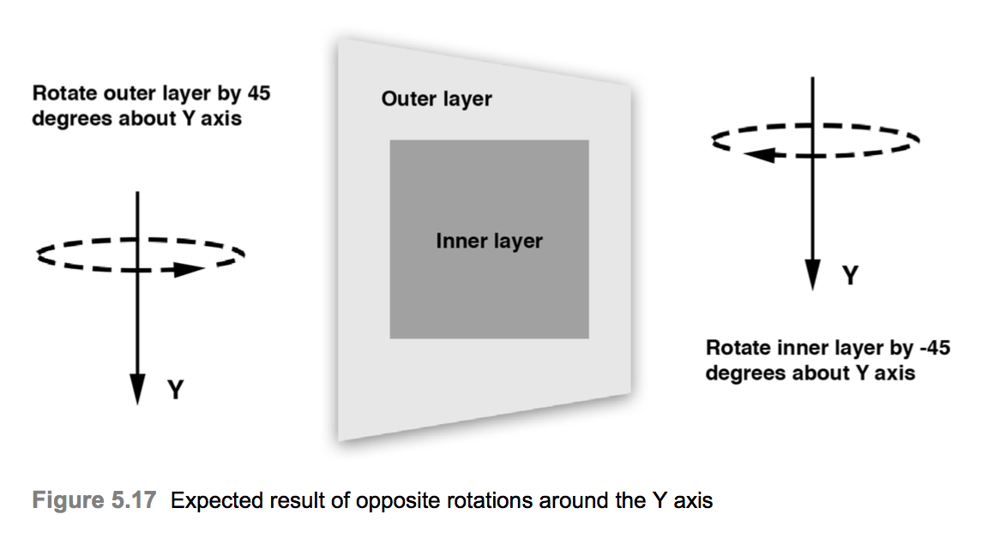
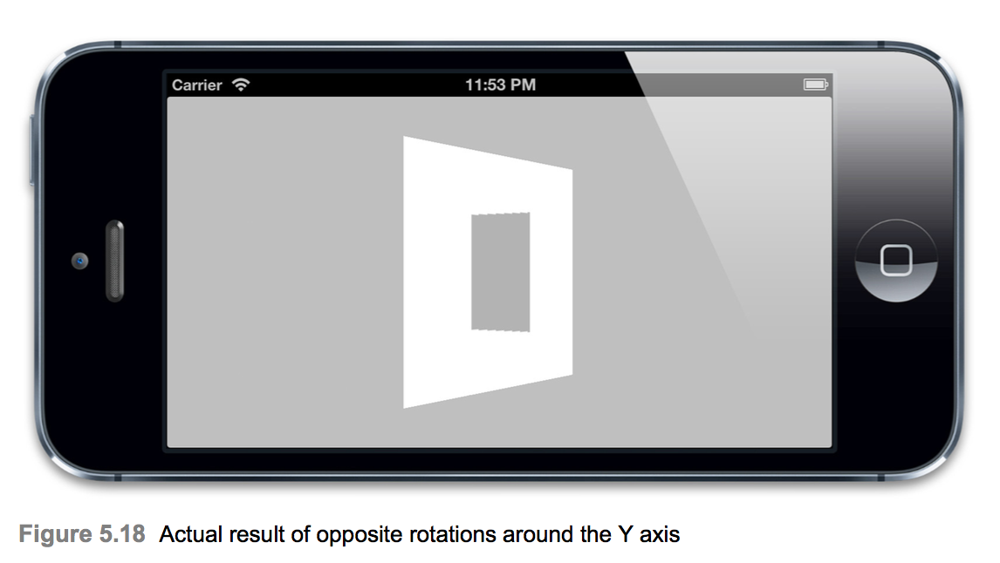
```Swift
class ViewController: UIViewController {
    @IBOutlet weak var outerLayer: UIView!
    @IBOutlet weak var innerLayer: UIView!
    
    override func viewDidLoad() {
        super.viewDidLoad()
        
        let image = UIImage(named: "Snowman")
        layerView.layer.contents = image?.cgImage
        layerView.layer.contentsGravity = kCAGravityResizeAspect
        
        var outer = CATransform3DIdentity
        outer.m34 = -1.0 / 500
        let transform1 = CATransform3DRotate(outer, CGFloat(M_PI_4), 0, 1, 0)
        outerLayer.layer.transform = transform1
        
        var inner = CATransform3DIdentity
        inner.m34 = -1.0 / 500
        let transform2 = CATransform3DRotate(inner, CGFloat(-M_PI_4), 0, 1, 0)
        innerLayer.layer.transform = transform2
    }
}
```
- Z축 회전은 서브 레이어의 회전이 취소 됬지만 Y축 회전은 우리의 예상과 반대로 취소되지 않았다. 왜지 ?
- Core Animation 레이어는 3D 공간에 존재하지만 모두 같은 3D공간에 존재하는것은 아니다. 각 레이어 내의 3D Scene이 모두 Flatten 된다.
- 레이어 트리를 사용하여 계층 적 3D구조를 만들 수 없다.(2D는 가능)
- CATransformLayer라는 CALayer 하위 클래스를 이용하여 이 문제를 해결할 수 있다.

### Solid Object
- 이제는 3D 공간에서 레이어를 배치하는 기본 사항을 이해했으므로 단색 3D 오브젝트를 구성할 것이다. 6개의 개별 뷰를 이용하여 큐브를 만들어보자.
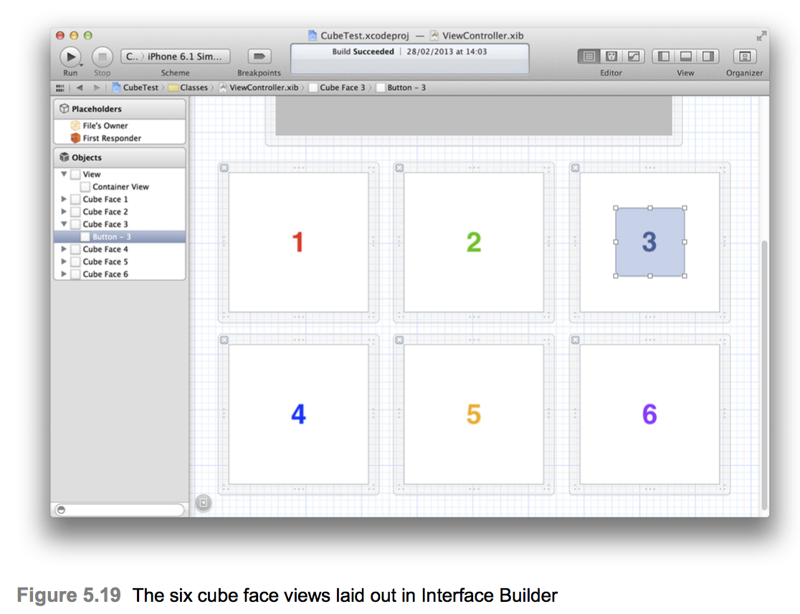
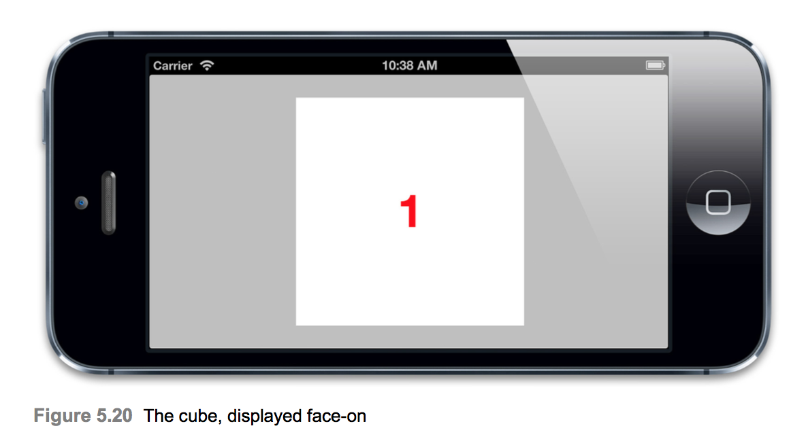

```Swift
class SolidObjectViewController: UIViewController {
    @IBOutlet var faces: [UIView]!
    
    override func viewDidLoad() {
        super.viewDidLoad()

        var perspective = CATransform3DIdentity
        perspective.m34 = -1.0 / 500
        view.layer.sublayerTransform = perspective
        
        //  face1
        var transform = CATransform3DMakeTranslation(0, 0, 100)
        addFace(index: 0, transform: transform)
        
        //  face2
        transform = CATransform3DMakeTranslation(100, 0, 0)
        transform = CATransform3DRotate(transform, CGFloat(M_PI_2), 0, 1, 0)
        addFace(index: 1, transform: transform)
        
        //  face3
        transform = CATransform3DMakeTranslation(0, -100, 0)
        transform = CATransform3DRotate(transform, CGFloat(M_PI_2), 1, 0, 0)
        addFace(index: 2, transform: transform)
        
        //  face4
        transform = CATransform3DMakeTranslation(0, 100, 0)
        transform = CATransform3DRotate(transform, CGFloat(-M_PI_2), 1, 0, 0)
        addFace(index: 3, transform: transform)
        
        //  face5
        transform = CATransform3DMakeTranslation(-100, 0, 0)
        transform = CATransform3DRotate(transform, CGFloat(-M_PI_2), 0, 1, 0)
        addFace(index: 4, transform: transform)
        
        //  face6
        transform = CATransform3DMakeTranslation(0, 0, -100)
        transform = CATransform3DRotate(transform, CGFloat(M_PI), 0, 1, 0)
        addFace(index: 5, transform: transform)
    }
}

extension SolidObjectViewController {
    func addFace(index: Int, transform: CATransform3D) {
        let face = faces[index]
        
        face.layer.transform = transform
    }
}
```
- 위의 입장체는 이 각도에서 그냥 정사각형으로 보인다. 이를 위해 큐브 자체를 회전시킨다고 생각한다면 굉장히 성가신 일이다. 쉬운방법 없을까?
- 큐브 자체를 해결하는것 보다는 카메라(즉 시점)을 회전시키는 것이다.
- 원근감 변환 행렬을 containerView Layer에 적용하기 전에 다음 행을 추가하여 원근감 변환 행렬을 회전시킨다.

```Swift
perspective = CATransform3DRotate(perspective, CGFloat(-M_PI_4), 1, 0, 0)
perspective = CATransform3DRotate(perspective, CGFloat(-M_PI_4), 0, 1, 0)
```

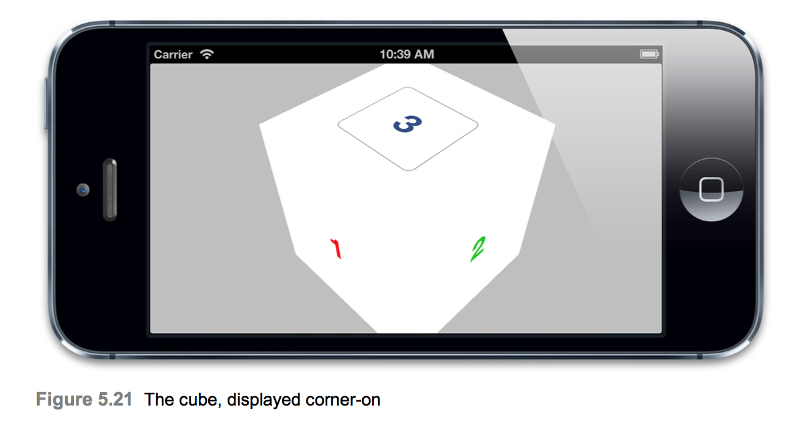

### Light and Shadow
- Core Animation은 3D로 레이어를 표시할 수 있지만 조명 개념이 없다. 큐브를 더욱 사실적으로 보이게 하려면 자체 음영 효과를 적용해야 한다. 각 면마다 다른 배경색을 적용하거나 미리 조명 효과가 적용된 이미지를 사용하여 이 작업을 수행할 수 있다.
- 동적 조명효과를 만들어야 하는 경우 보기 방향에 따라 다양한 알파를 사용하여 반투명 검정색 섀도우 레이어로 각 뷰를 겹쳐서 표시할 수 있다.
- 그림자 레이어의 불투명도를 계산하려면 각 면의 법선 벡터(표번에 수직인 벡터)를 가져와 가상의 광원에서 벡터와 벡터간의 외적을 계산해야 한다.
- 조명효과를 내기 위해서 GLKit 프레임 워크를 사용했다.

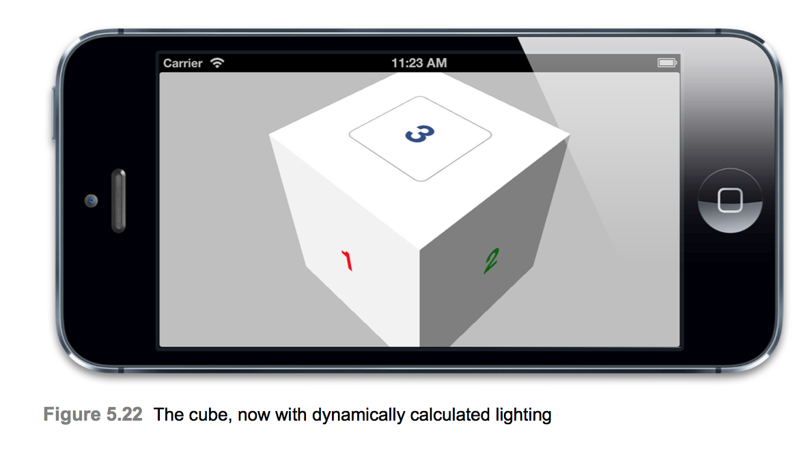

```Swift
class SolidObjectViewController: UIViewController {
    @IBOutlet var faces: [UIView]!
    
    override func viewDidLoad() {
        super.viewDidLoad()

        var perspective = CATransform3DIdentity
        perspective.m34 = -1.0 / 500
        perspective = CATransform3DRotate(perspective, CGFloat(-M_PI_4), 1, 0, 0)
        perspective = CATransform3DRotate(perspective, CGFloat(-M_PI_4), 0, 1, 0)
        view.layer.sublayerTransform = perspective
        
        //  face1
        var transform = CATransform3DMakeTranslation(0, 0, 100)
        addFace(index: 0, transform: transform)
        
        //  face2
        transform = CATransform3DMakeTranslation(100, 0, 0)
        transform = CATransform3DRotate(transform, CGFloat(M_PI_2), 0, 1, 0)
        addFace(index: 1, transform: transform)
        
        //  face3
        transform = CATransform3DMakeTranslation(0, -100, 0)
        transform = CATransform3DRotate(transform, CGFloat(M_PI_2), 1, 0, 0)
        addFace(index: 2, transform: transform)
        
        //  face4
        transform = CATransform3DMakeTranslation(0, 100, 0)
        transform = CATransform3DRotate(transform, CGFloat(-M_PI_2), 1, 0, 0)
        addFace(index: 3, transform: transform)
        
        //  face5
        transform = CATransform3DMakeTranslation(-100, 0, 0)
        transform = CATransform3DRotate(transform, CGFloat(-M_PI_2), 0, 1, 0)
        addFace(index: 4, transform: transform)
        
        //  face6
        transform = CATransform3DMakeTranslation(0, 0, -100)
        transform = CATransform3DRotate(transform, CGFloat(M_PI), 0, 1, 0)
        addFace(index: 5, transform: transform)
    }
}

extension SolidObjectViewController {
    func addFace(index: Int, transform: CATransform3D) {
        let face = faces[index]
        
        face.layer.transform = transform
        applyLightingToFace(face: face.layer)
    }
    
    func applyLightingToFace(face: CALayer) {
        let layer = CALayer()
        layer.frame = face.bounds
        face.addSublayer(layer)
        
        let transform = face.transform
        let matrix4 = GLKMatrix4(m: (Float(transform.m11), Float(transform.m12), Float(transform.m13), Float(transform.m14), Float(transform.m21), Float(transform.m22), Float(transform.m23), Float(transform.m24), Float(transform.m31), Float(transform.m32), Float(transform.m33), Float(transform.m34), Float(transform.m41), Float(transform.m42), Float(transform.m43), Float(transform.m44)))
        let matrix3 = GLKMatrix4GetMatrix3(matrix4)
        
        var normal = GLKVector3Make(0, 0, 1)
        normal = GLKMatrix3MultiplyVector3(matrix3, normal)
        normal = GLKVector3Normalize(normal)
        
        let light = GLKVector3Normalize(GLKVector3Make(0, 1, -0.5))
        let dotProduct = GLKVector3DotProduct(light, normal)
        let shadow = 1 + dotProduct - 0.5
        let color = UIColor(white: 0, alpha: CGFloat(shadow))
        layer.backgroundColor = color.cgColor
    }
}
```

### Touch Events
- 카메라 시점을 변형하면서 '3'이 있는 변을 볼수있게 되어 버튼을 누를 수 있게되었다. 하지만 버튼을 누르면 아무일도 일어나지 않는다. 왜일까?
- iOS가 3D에서 버튼 위치와 일치하도록 터치 이벤트를 올바르게 변형할 수 없기 때문이 아니다. 보기 순서에 대한 문제가 있기 때문이다.
- 3장에서 간단히 언급했듯이 터치 이벤트는 3D공간에서 Z위치가 아닌 슈퍼 뷰 내의 뷰 순서에 따라 처리된다. 큐브면 뷰를 추가할 때 숫자 순으로 추가 했으므로 면 4,5,6은 뷰 / 레이어 순서로 3 앞에 있다.
- 면 4,5,6은 면 1,2,3에 가려지기 때문에 볼 수는 없지만 iOS는 여전히 터치 이벤트에서 가장 먼저 처리되는 뷰 5 또는 6의 이벤트에 의해 가로막힌다.
- 이 문제는 3을 제외한 모든 큐브에 userInteractionEnabled를 false로 하면 되지만 음.. 내생각엔 별로 그닥 좋은 방법은 아닌 것 같다.
