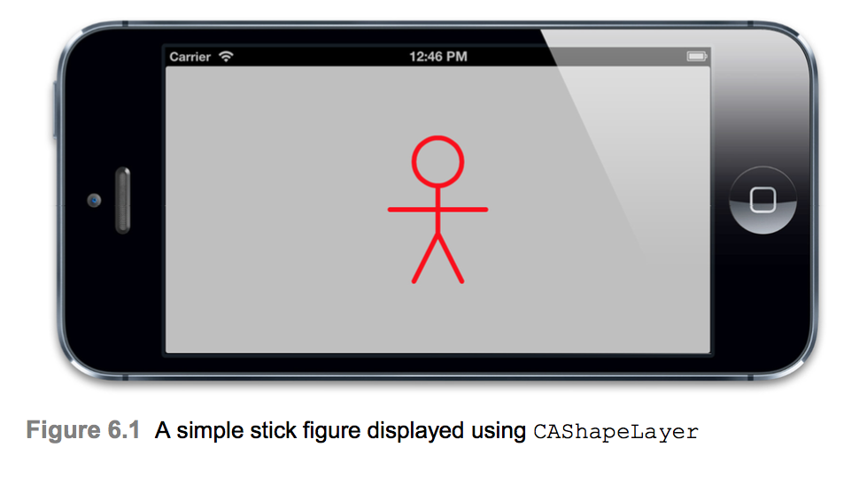
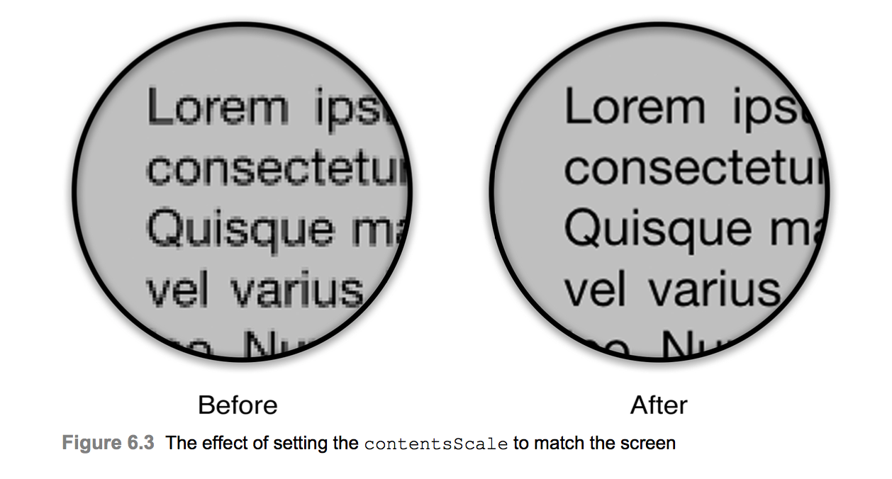
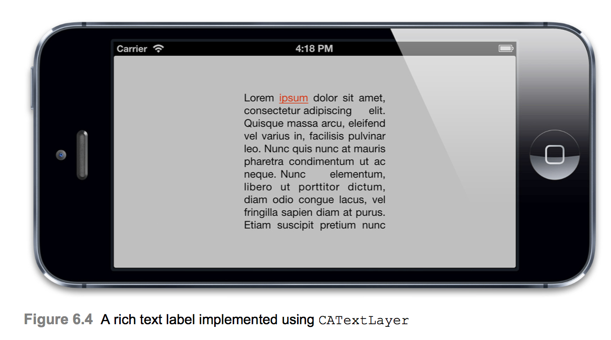

# Specialized Layers

## CAShapeLayer
* 4장 시각효과에서 이미지를 사용하지 않고 CGpath를 사용하여 임의의 모양의 그림자를 만들었다. 같은 방식으로 임의의 모양의 레이어를 만들 수 있다는것을 눈치챘을것이다.
* CAShapeLayer는 비트 맵 이미지 대신 벡터 그래픽을 사용하여 자체적으로 그려주는 레이어 하위 클래스이다. 색상 및 선 두께와 같은 속성을 지정하고 CGPath를 사용하여 원하는 모양을 정의하면 CAShapeLayer가 자동으로 랜더링한다.
* CALayer 대신 CAShapeLayer를 사용할 수 있으며 CAShapeLayer를 사용하면 몇가지 장점이 있다.
  * CAShapeLayer는 하드웨어 가속 드로잉을 사용하고 Core Graphics를 사용하여 이미지를 그리기 때문에 속도가 굉장히 빠르다.
  * CAShapeLayer는 CALayer처럼 backing image를 생성할 필요가 없으므로 아무리 크기가 크더라고 메모리를 많이 소비하지 않으므로 메모리 효율이 좋다.
  * 2장에서 보앗듯이 Core Graphics를 사용하여 일반 CALayer에 그림을 그릴 때 처럼 레이어에 클립되지 않는다. 즉 범위를 벗어나서 그릴 수 있다.
  * CAShapeLayer는 벡터그래픽 방식이기 때문에 scaling up을 하여 크기를 키워도 픽셀화(계단현상)이 없다.

### Creating a CGPath
* CAShapeLayer를 사용하여 CGpath로 표현할 수 있는 모든 모양을 그릴 수 있다. lineWidth, lineCap(끝 선 모양), lineJoin(선의 연결 모양)과 같은 다른 특성과 함께 경로의 strokeColor 및 fillColor를 제어할 수 있다. 하지만 이러한 속성은 레이어 수준에서 한 번 설정할 수 있다. 다른 생아이나 스타일로 여러 도형을 그리려면 각 도형에 별도의 레어어를 사용해야 한다.

```Swift
class ViewController: UIViewController {
    @IBOutlet weak var containerView: UIView!

    override func viewDidLoad() {
        super.viewDidLoad()
        
        let path = UIBezierPath()
        path.move(to: CGPoint(x: 175, y: 100))
        path.addArc(withCenter: CGPoint(x: 150, y: 100), radius: 25, startAngle: 0, endAngle: CGFloat(2.0 * M_PI), clockwise: true)
        path.move(to: CGPoint(x: 150, y: 125))
        path.addLine(to: CGPoint(x: 150, y: 175))
        path.addLine(to: CGPoint(x: 125, y: 225))
        path.move(to: CGPoint(x: 150, y: 175))
        path.addLine(to: CGPoint(x: 175, y: 225))
        path.move(to: CGPoint(x: 100, y: 150))
        path.addLine(to: CGPoint(x: 200, y: 150))
        
        let shapeLayer = CAShapeLayer()
        shapeLayer.strokeColor = UIColor.red.cgColor
        shapeLayer.fillColor = UIColor.clear.cgColor
        shapeLayer.lineWidth = 5
        shapeLayer.lineJoin = kCALineJoinRound
        shapeLayer.lineCap = kCALineCapRound
        shapeLayer.path = path.cgPath
        
        containerView.layer.addSublayer(shapeLayer)
    }
}
```
### Rounded Corners, Redux
* 2장에서 CAShapeLayer가 CALayer cornerRadius 속성을 사용하는 것과는 반대로 둥근 모서리가 있는 뷰를 만드는 또다른 방법을 제공한다고 언급했다. CAShapeLayer를 사용하는 것이 더 많은 작업이지만 각 모서리의 반경을 독립적으로 지정할 수 있다는 이점이 있다. 각각의 직선과 호를 사용하여 수동으로 둥근 사각형 경로를 만들 수 있지만 UIBezierPath에는 실제로 둥근 사각형을 만들기 위한 편리한 생성자가 자동으로 있다. 다음 코드는 세개의 둥근 모서리와 하나의 선명한 경로를 생성한다.
```Swift
let rect = CGRect(x: 50, y: 50, width: 100, height: 100)
let radii = CGSize(width: 20, height: 20)
let path = UIBezierPath(roundedRect: rect, byRoundingCorners: [.topRight, .topRight, .bottomLeft], cornerRadii: radii)
```

## CATextLayer
* 이미지만으로는 사용자 인터페이스를 구성할 수 없다. 잘 디자인 된 아이콘은 버튼이나 컨트롤의 목적을 전달하는 훌륭한 작업을 할 수 있지만 간혹 좋은 구식 텍스트 라벨이 필요할 때가 있다.
* 레이어에 텍스트를 표시하려면 레이어 위임자를 사용하여 Core Graphics(기본적으로 UILabel의 작동 방식)를 사용하여 레이어 내용에 문자열을 직접 그릴 수 없다. layer-backed views 대신 레이어로 직접 작업하는 것은 매우 번거로운 방법이다. 텍스트를 표시하는 각 레이어의 레이어 위임자 역할을 할 수 있는 클래스를 만든 다음 다른 글꼴, 색상 등을 추적하지 않고 어느 레이어에 어떤 문자열을 표시할지 결정하는 로직을 작성해야한다.
* 다행히 이것은 불필요하다. Core Animation은 UILabel의 문자열 드로잉 기능 대부분을 레이어 형식으로 캡슐화하고 good measure을 위해 추가 기능을 추가하는 CATextLayer라는 CALayer 하위 클래스를 제공한다.
* CATextLayer는 UILabel보다 훨씬 빠르게 렌더링된다. iOS6 및 이전 버전에서 UILabel은 텍스트를 그리기위해 WebKit을 사용하기때문에 실제로 많은 텍스트를 그리는 경우 성능에 상당한 오버헤드가 있는다는것은 이미 많이 알려져 있다.
* CATextLayer는 Core Text를 사용하기 때문에 굉장히 빠르다.

```Swift
class ViewController: UIViewController {
    @IBOutlet weak var containerView: UIView!

    override func viewDidLoad() {
        super.viewDidLoad()
        
        let textLayer = CATextLayer()
        textLayer.frame = containerView.bounds
        containerView.layer.addSublayer(textLayer)
        
        textLayer.foregroundColor = UIColor.black.cgColor
        textLayer.alignmentMode = kCAAlignmentJustified
        textLayer.isWrapped = true
        
        let font = UIFont.systemFont(ofSize: 15)
        
        textLayer.font = font
        textLayer.fontSize = font.pointSize
        
        let text = "Lorem ipsum dolor sit amet, consectetur adipiscing elit. Quisque massa arcu, eleifend vel varius in, facilisis pulvinar leo. Nunc quis nunc at mauris pharetra condimentum ut ac neque. Nunc elementum, libero ut porttitor dictum, diam odio congue lacus, vel fringilla sapien diam at purus. Etiam suscipit pretium nunc sit amet lobortis"
        textLayer.string = text
    }
}
```
* 위 예제를 진행하여 텍스트를 자세히 살펴보면 뭔가 이상하게 보인다. 텍스트가 픽셀화 되어 보인다.
* Retina 해상도에서 렌더링 되지 않기 때문이다. 2장에서 contentsScale 속성에 대하여 언급하였는데 이 속성은 레이어 내용이 렌더링되는 해상도를 결정하는데 사용된다. contentsScale 속성은 화면 배율 요소 대신 항상 기본값인 1.0이다. Retina 품질의 텍스트를 원한다면 CATextLayer의 contentsScale을 다음 코드를 사용하여 화면 크기와 일치하도록 해야한다.

```Swift
textLayer.contentsScale = UIScreen.main.scale
```
* CATextLayer 글꼴 속성은 UIFont가 아니며 CFTypeRef이다. 이렇게하면 요구사항에 따라서 CGFontRef 또는 CTFontRef 중 하나를 사용하여 글꼴을 지정할 수 있다. 글꼴 크기는 또한 fontSize 속성을 사용하여 독립적으로 설정된다. 왜냐하면 CTFontRef와 CGFontRef는 UIFont처럼 포이늩 크기를 캡슐화하지 않기 때문이다.
* 또한 CATextLayer 문자열 속성은 예상대로 NSString이 아니지만 id타입으로 입력된다. NSString 대신 NSAttributedString을 사용하여 텍스트를 지정할 수 있다(NSAttributedString은 NSString의 하위 클래스가 아니다.).

### Rich Text
* iOS 6에서 Apple은 속성이 지정된 문자열을 UILabel 및 다른 UIKit 텍스트 뷰에 직접 지원했다. 이 기능은 속성이 있는 문자열을 훨씬 쉽게 작업할 수 있게 해주는 편리한 기능이지만 CATextLayer는 iOS 3.2에서 도입 된 이후부터 NSAttributedString을 지원한다. 따라서 이 글을 작성하는 시점은 iOS 10이므로 전혀 관련없긴 하지만 3.2 ~ 6 이전 버전의 iOS를 계속 지원해야하는 경우 CATextLayer는 Core Text의 복잡성이나 UIWebView를 사용하는 번거로움을 해결하지 않고도 Rich Text Lable을 인터페이스에 추가할 수 있는 좋은 방법이 있다.

```Swift
class ViewController: UIViewController {
    @IBOutlet weak var containerView: UIView!

    override func viewDidLoad() {
        super.viewDidLoad()
        
        let textLayer = CATextLayer()
        textLayer.frame = containerView.bounds
        containerView.layer.addSublayer(textLayer)
        
        textLayer.foregroundColor = UIColor.black.cgColor
        textLayer.alignmentMode = kCAAlignmentJustified
        textLayer.isWrapped = true
        
        let font = UIFont.systemFont(ofSize: 15)
        
        textLayer.font = font
        textLayer.fontSize = font.pointSize
        
        let text = "Lorem ipsum dolor sit amet, consectetur adipiscing elit. Quisque massa arcu, eleifend vel varius in, facilisis pulvinar leo. Nunc quis nunc at mauris pharetra condimentum ut ac neque. Nunc elementum, libero ut porttitor dictum, diam odio congue lacus, vel fringilla sapien diam at purus. Etiam suscipit pretium nunc sit amet lobortis"
        
        let string = NSMutableAttributedString(string: text)
        var attributes: Dictionary<String, Any> = [
            kCTForegroundColorAttributeName as String: UIColor.black.cgColor,
            kCTFontAttributeName as String: font
        ]
        
        string.setAttributes(attributes, range: NSRange(location: 0, length: text.characters.count))
        
        attributes = [
        kCTForegroundColorAttributeName as String: UIColor.red.cgColor,
        kCTUnderlineStyleAttributeName as String: CTUnderlineStyle.single.rawValue,
        kCTFontAttributeName as String: font
        ]
        
        string.setAttributes(attributes, range: NSRange(location: 6, length: 5))
        
        textLayer.string = string
        textLayer.contentsScale = UIScreen.main.scale
    }
}
```

### Leading and Kerning
* CATextLayer를 사용하여 렌더링 된 텍스트의 선 간격(줄 간격)과 커닝 간격(문자 간격)은 다른 드로잉 구현(각각 Core text 및 WebKit)으로 인해 UILabel에서 사용되는 무자열 렌더링과 완전히 동일하지 않다. 불일치 범위는 사용 된 특정 글꼴 및 문자에 따라 다르며 일반적으로 매우 사소하지만 일반 레이블과 CATextLayer 사이의 모양을 정확하게 일치 시키려면 이 점을 유의해야한다.

### A UILabel Replacement
* 우리는 CATextLayer가 UILabel에 비해 성능상의 이점은 물론 추가 레이아웃 옵션과 iOS 5에서의 리치 텍스트 지원을 제공한다는 것을 입증했다. 그러나 UILabel을 대신할 수 있는 대체물로 만들고 싶다면 인터페이스 빌더에서 레이블을 생성할 수 있어야한다. 우리는 UILabel을 서브 클래스화하여 서브 레이어로 추가 한 CATextLayer에 텍스트를 표시하는 메서드를 재정의 할 수 있지만 UILabel의 drawRect 메서드가 있으면 중복 된 빈 백업 이미지가 생성된다. CALayer는 자동 크기 조절이나 Auto layer을 지원하지 않기 때문에 크기를 조정할 때마다 하위 레이어 크기를 수동으로 업데이트해야한다.
* 우리가 실제로 원하는 것은 UILabel 서브 클래스로서 CATextLayer를 실제로 지원 레이어로 사용하는 경우 뷰와 함께 자동으로 크기가 조정되므로 걱정할 중복 된 백업 이미지가 없다.
* 1장 "The Layer Tree"에서 논의했듯이 모든 UIView는 CALayer 인스턴스로 뒷받침된다. 해당 레이어는 뷰에 의해 자동으로 생성되고 관리되지만 다른 레이어 유형도 이와 같이 하려면 어떻게 해야 할까?
* 일단 만들어진 후에는 레이어를 대체할 수 없지만 UIView의 하위 클래스로 만들면 layerClass 메서드를 재정의 하면 다른 레이어 하위 클래스를 반환할 수 있다.
* UILabel이 사용하는 느린 drawRect 접근법 대신에 CATextLayer를 사용하여 텍스트를 그리는 LayerLabel이라는 UILabel 하위 클래스의 코드를 보여준다.

```Swift
class LayerLabel: UILabel {
    override class var layerClass: AnyClass {
        return CATextLayer.self
    }
    
    var textLayer: CATextLayer? {
        return self.layer as? CATextLayer
    }
    
    func setUp() {
        text = text
        textColor = textColor
        font = font
        
        textLayer?.alignmentMode = kCAAlignmentJustified
        textLayer?.isWrapped = true
        
        layer.display()
    }
    
    override init(frame: CGRect) {
        super.init(frame: frame)
        setUp()
    }
    
    required init?(coder aDecoder: NSCoder) {
        fatalError("init(coder:) has not been implemented")
    }
    
    override func awakeFromNib() {
        setUp()
    }
    
    func setText(text: String) {
        super.text = text
        textLayer?.string = text
    }
    
    func setTextColor(color: UIColor) {
        super.textColor = color
        textLayer?.foregroundColor = color.cgColor
    }
    
    func setFont(font: UIFont) {
        textLayer?.font = font
        textLayer?.fontSize = font.pointSize
    }
}
```
* 샘플 코드를 실행하면 contentsScale을 설정하지 않았음에도 불구하고 픽셀화(계단현상)이 발생하지 않는다. CATextLayer를 백업 레이어로 구현하는 또 다른 이점은 contentsScale이 뷰에 의해 자동으로 설정된다는 점이다. 이 간단한 예제에서는 UILabel의 스타일 및 레이아웃 속성 중 일부만 구현했지만 더 많은 작업을 통해 UILabel의 전체 기능을 지원하는 LayerLabel 클래스를 만들 수 있다.
* iOS 6 이상만 지원하려는 경우 CATextLayer 기반 Label이 제한적으로 사용될 수 있다. 하지만 일반적으로 `layerClass`를 사용하여 만들어진 다양한 레이어 유형의 views backed는 CALayer 하위 클래스를 활용할 수 있는 정말 좋고 재사용 가능한 방법이다.(정말 좋다!! 너무너무너무)
