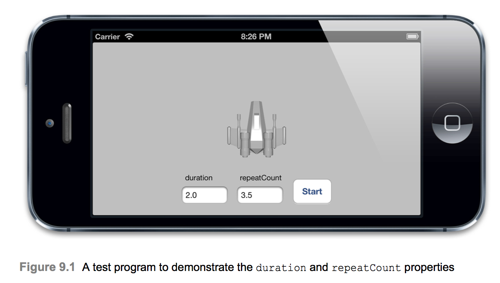
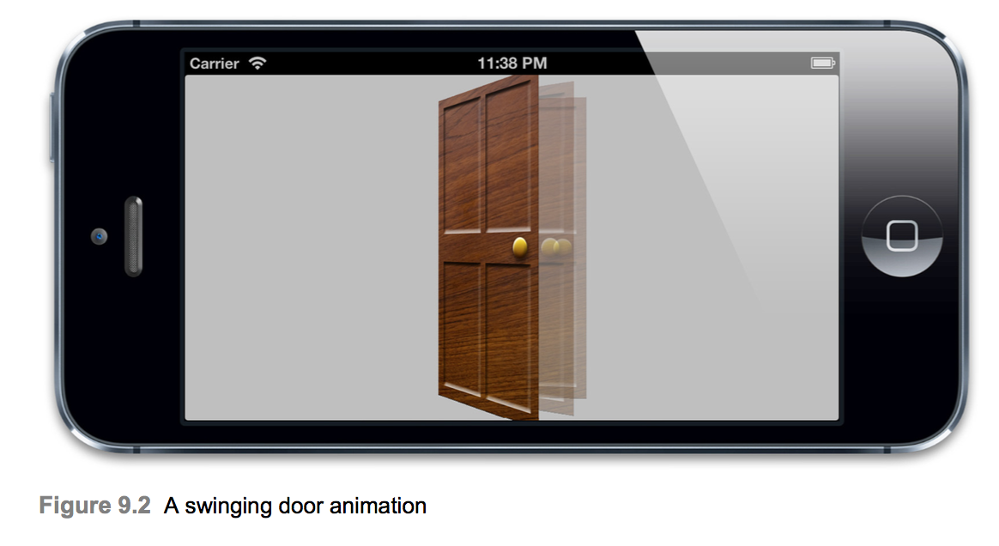
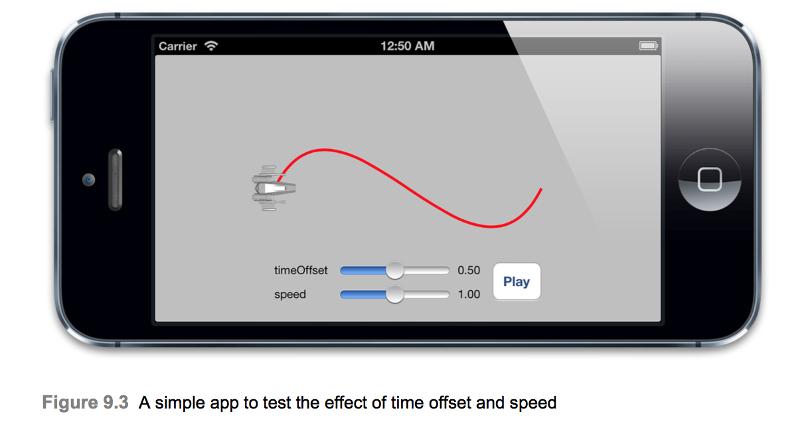

# Layer Time
  * The biggest difference between time and space is that you can't reuse time. - Merrick Furst -

  * 앞의 두 장에서는 CAAnimation과 그 서브 클래스를 사용하여 구현할 수 있는 다양한 유형의 레이어 애니메이션에 대해 살펴보았다. 애니메이션은 시간이 지남에 따라 발생하는 변화이므로 타이밍은 전체 개념에 결정적이다. 이 장에서는 Core Animation이 시간을 추적하는 방법인 CAMediaTiming 프로토콜을 살펴볼 것이다.

## The CAMediaTiming Protocol
  * CAMediaTiming Protocol은 애니메이션 중에 시간 경과를 제어하는데 사용되는 속성 모음을 정의한다. CALayer와 CAAniamtion은 모두 이 프로토콜을 따르므로 개별 레이어 및 애니메이션 별로 시간을 제어할 수 있다.

### Duration and repetition
  * 8장 `Explicit Animations`에서 duration(CAMediaTiming 속성 중 하나)에 대해 갼락하게 언급하였다. duration 속성은 CFTimeInterval 유형이며 NSTimeInterval과 마찬가지로 초를 나타내는 `double-precision floating-point value`이다.
  * 애니메이션의 단일 반복이 실행되는 기간을 지정하는데 사용된다.
  * CAMediaTiming의 또 다른 속성은 repeatCount이다. 이 속성은 애니메이션이 반복 될 반복 횟수를 결정한다. repeatCount의 값은 애니메이션이 재생되는 총 횟수를 나타내며, duration이 2초이고 repeatCount가 3.5(애니메이션 3.5초)초로 설정되면 총 애니메이션 시간은 7초가 소요된다.
  * duration 및 repeatCount 속성은 모두 기본값이 0이다. 이 것은 애니메이션의 지속시간이 0초이거나 0번 반복된다는 의미가 아니다. 이 경우 단지 0의 값은 `기본값`을 의미하는데 이는 각각 0.25초 및 1번 반복을 의미한다.


```Swift
class ViewController_9_1: UIViewController {
    @IBOutlet weak var containerView: UIView!
    @IBOutlet weak var durationField: UITextField!
    @IBOutlet weak var repeatField: UITextField!
    @IBOutlet weak var startButton: UIButton!
    
    @IBAction func startBtnAction(_ sender: Any) {
        let duration = Double(durationField.text ?? "") ?? 0
        let repeatCount = Float(repeatField.text ?? "") ?? 0
        
        let animation = CABasicAnimation(keyPath: "transform.rotation")
        animation.duration = duration
        animation.repeatCount = repeatCount
        animation.byValue = M_PI * 2
        animation.delegate = self
        shipLayer.add(animation, forKey: "rotateAnimation")
        
        setControlsEnabled(enabled: false)
    }

    let shipLayer = CALayer()
    
    override func viewDidLoad() {
        super.viewDidLoad()
        
        shipLayer.frame = CGRect(x: 0, y: 0, width: 128, height: 128)
        shipLayer.position = CGPoint(x: 100, y: 100)
        shipLayer.contents = UIImage(named: "Ship")?.cgImage
        
        containerView.layer.addSublayer(shipLayer)
    }
    
    override func touchesBegan(_ touches: Set<UITouch>, with event: UIEvent?) {
        super.touchesBegan(touches, with: event)
        
        hideKeyBoard()
    }
}

extension ViewController_9_1 {
    func setControlsEnabled(enabled: Bool) {
        for control: UIControl in [durationField, repeatField, startButton] {
            control.isEnabled = enabled
            control.alpha = enabled ? 1.0 : 0.25
        }
    }
    
    func hideKeyBoard() {
        durationField.resignFirstResponder()
        repeatField.resignFirstResponder()
    }
}

extension ViewController_9_1: CAAnimationDelegate {
    func animationDidStop(_ anim: CAAnimation, finished flag: Bool) {
        setControlsEnabled(enabled: true)
    }
}
```

* 반복 애니메이션을 만드는 또 다른 방법은 repeatDuration 속성을 사용하는 것이다. 이 속성은 고정 된 반복 횟수 대신 특정 시간 동안 애니메이션이 반복되도록 하는것이다. 각 alternate cycle 동안 애니메이션이 뒤로 재생되도록 autoreverses라는 속성을 설정할 수 도 있다. 이것은 문이 열리고 나서 닫히는 것과 같이 연속적이지 않은 애니메이션을 계속 재생할 때 유용하다.
* 아래 예제는 autoreverses 속성을 사용하여 문을 자동으로 닫도록 한다. 이 경우 애니메이션이 무한대로 재생되도록 repeatDuration을 INFINITY로 설정하였다. repeatCount 및 repeatDuration 속성은 잠재적으로 서로 모순될 수 있으므로 둘중 하나만 사용하여야 한다. 두 속성이 0이 아닌 경우 해당 속성들은 정의되지 않는다.

```Swift
class ViewController_9_2: UIViewController {
    @IBOutlet weak var containerView: UIView!

    override func viewDidLoad() {
        super.viewDidLoad()

        let doorLayer = CALayer()
        doorLayer.frame = CGRect(x: 0, y: 0, width: 128, height: 128)
        doorLayer.position = CGPoint(x: 100 - 64, y: 100)
        doorLayer.anchorPoint = CGPoint(x: 0, y: 0.5)
        doorLayer.contents = UIImage(named: "Door")?.cgImage
        
        containerView.layer.addSublayer(doorLayer)
        
        let animation = CABasicAnimation(keyPath: "transform.rotation.y")
        animation.toValue = CGFloat(-M_PI_2)
        animation.duration = 2.0
        animation.repeatDuration = 100
        animation.autoreverses = true
        
        doorLayer.add(animation, forKey: nil)
    }
}
```

### Relative Time
* Core Animation에 관한 시간은 상대적이다. 각 애니메이션은 독립적으로 속도를 올리거나 지연시키거나 오프셋할 수 있는 자체 representation of time을 갖는다.
* beginTime 속성은 애니메이션이 시작되기 전의 시간 지연을 지정한다. 이 지연은 애니메이션이 표시되는 레이어에 추가 된 지점으로부터 측정되며 기본값은 0이다(즉, 바로 시작된다는 의미이다.).
* speed 속성은 시간 배율이다. 기본값은 1.0이지만 값을 감소시키면 레이어, 애니메이션의 시간이 느려지고 증가시키면 시간이 빨라질 것이다. 2.0의 속도에서는 명목상의 지속시간이 1초인 애니메이션이 실제로 0.5초 안에 완료된다. timeOffset 속성은 애니메이션의 시간을 이동한다는 점에서 beginTime과 비슷하다. 그러나 beginTime을 늘리면 애니메이션이 시작되기 전에 지연시간이 늘어나고 timeOffset을 늘리면 애니메이션의 특정 지점으로 빨리감기한다. 예를들어 1초동안 지속되는 애니메이션의 경우 0.5초의 timeOffset을 설정하면 애니메이션이 중간에서 시작된다.
* beginTime과 달리 timeOffset은 속도에 영향을 받지 않는다. 따라서 속도를 2.0으로 높이고 timeOffset을 0.5로 설정하면 1초 애니메이션이 2배 빠른속도로 0.5초동안 지속되므로 애니메이션 끝가지 효과적으로 건너뛴다. 그러나 timeOffset을 사용하여 애니메이션의 끝으로 건너 뛰더라도 총 재생시간 동안 재생된다.
* 아래는 speed 및 timeOffset 슬라이더를 원하는 값으로 설정한 다음 재생을 눌러 해당 효과를 보기위한 예제이다.

```Swift
class ViewController_9_3: UIViewController {
    @IBOutlet weak var containerView: UIView!
    @IBOutlet weak var speedSlider: UISlider!
    @IBOutlet weak var speedLabel: UILabel!
    @IBOutlet weak var timeOffsetSlider: UISlider!
    @IBOutlet weak var timeOffsetLabel: UILabel!

    @IBAction func timeOffsetSliderAction(_ sender: Any) {
        updateTimeOffsetSlider()
    }
    
    @IBAction func speedSliderAction(_ sender: Any) {
        updateSpeedSlider()
    }
    
    @IBAction func playBtnAction(_ sender: Any) {
        let animation = CAKeyframeAnimation(keyPath: "position")
        animation.timeOffset = CFTimeInterval(timeOffsetSlider.value)
        animation.speed = speedSlider.value
        animation.duration = 1.0
        animation.path = bezierPath.cgPath
        animation.rotationMode = kCAAnimationRotateAuto
        animation.isRemovedOnCompletion = false
        shipLayer.add(animation, forKey: "slide")
    }
    
    let shipLayer = CALayer()
    let bezierPath = UIBezierPath()
    
    override func viewDidLoad() {
        super.viewDidLoad()

        bezierPath.move(to: CGPoint(x: 0, y: 100))
        bezierPath.addCurve(to: CGPoint(x: 300, y: 100), controlPoint1: CGPoint(x: 75, y: 100), controlPoint2: CGPoint(x: 225, y: 200))
        
        let pathLayer = CAShapeLayer()
        pathLayer.path = bezierPath.cgPath
        pathLayer.fillColor = UIColor.clear.cgColor
        pathLayer.strokeColor = UIColor.red.cgColor
        pathLayer.lineWidth = 3.0
        containerView.layer.addSublayer(pathLayer)
        
        shipLayer.frame = CGRect(x: 0, y: 0, width: 64, height: 64)
        shipLayer.position = CGPoint(x: 0, y: 100)
        shipLayer.contents = UIImage(named: "Ship")?.cgImage
        containerView.layer.addSublayer(shipLayer)
        
        updateSliders()
    }
}

extension ViewController_9_3 {
    func updateSliders() {
        updateSpeedSlider()
        updateTimeOffsetSlider()
    }
    
    func updateSpeedSlider() {
        let speed = speedSlider.value
        speedLabel.text = String(format: "%0.2f", speed)
    }
    
    func updateTimeOffsetSlider() {
        let timeOffset = timeOffsetSlider.value
        timeOffsetLabel.text = String(format: "%0.2f", timeOffset)
    }
}
```

### fillMode
* 0보다 큰 beginTime을 가진 애니메이션은 레이어에 연결되어 있지만 아직 애니메이션을 시작하지 않은 상태일 수 있다. 마찬가지로 removeOnCompletion 속성이 false로 설정된 애니메이션은 완료 후에 레이어에 계속 남아있다. 애니메이션이 시작되기 전과 끝난 후의 애니메이션 속성의 값에 대한 질문이 제기된다.
* 한 가지 가능성은 애니메이션이 전혀 첨부되지 않은 것처럼 속성 갑싱 같을 수 있다는 것이다. 즉 값은 모델 레이어에 정의 된 값이 된다.
* 또 다른 옵션은 애니메이션 시작 전과 끝난 후 대한 첫번째 프레임 값을 가져올 수 있는 속성들이다. 애니메이션의 시작 및 종료 값은 애니메이션 지속 시간 전후의 시간을 채우기 위해 사용되므로 filling(채우기)라고 한다.
* 이 동작은 개발자에게 맡겨져있다. CAMediaTiming의 fillMode 속성을 사용하여 제어할 수 있다. fillMode는 NSString이며 다음 상수 값 중 하나를 사용한다.
  * kCAFillModeForwards
  * kCAFillModeBackwards
  * kCAFillModeBoth
  * kCAFillModeRemoved

* 기본값은 kCAFillModeRemoved이다. 이 값은 애니메이션이 현재 재생되지 않을 때 레이어 모델이 지정하는 값으로 속성 값을 설정한다. 다른 세가지 모드는 애니메이션을 앞뒤로 채우거나 두가지 모두를 채우므로 애니메이션 가능 속성은 시작 전에 애니메이션에 지정된 시작 전의 값과 끝난 후의 값 둘중 하나 혹은 모두를 얻을 수 있다.

## Hierarchical Time
* 3장 `Layer Geometry`에서 각 레이어는 레이어 트리에서 super layer와 관련하여 정의된 공간 좌표계를 갖는 방법을 배웠다. 애니메이션 타이밍도 비슷한 방식으로 작동한다. 각 애니메이션과 레이어는 시간에 대하여 고유한 계층적 개념을 가진다. 레이어의 타이밍을 조정하면 고유한 애니메이션과 하위 레이어의 영향을 받지만 상위 레이어는 영향을 받지 않는다. 중첩된 CAAnimationGroup 인스턴스를 사용하여 계층적으로 그룹화된 애니메이션에도 동일하게 적용된다.
* CALayer 또는 CAGroupAnimation의 duration 및 repeatCount, repeatDuration 속성을 조정해도 해당 자식 애니메이션에 영향을 주지 않는다. 그러나 beginTime, timeOffset 및 speed 속성은 하위 애니메이션에 영향을 준다. 계층적 용어에서 beginTime은 부모 레이어 (또는 그룹화된 애니메이션의 경우 부모 애니메이션)가 애니메이션을 시작하는 시점과 해당 객체가 자체 애니메이션을 시작해야하는 시점 사이의 time offset을 지정한다. 비슷하게 CALayer 또는 CAGroupAnimation의 speed 속성을 조정하면 모든 하위 레이어의 애니메이션 속도에 스케일링 요소가 적용된다.

### Global Versus Local Time
* 코어 애니메이션은 mach time(`mach`는 iOS 및 MacOS의 시스템 커널 이름임)이라고도하는 글로벌 시간 개념을 갖고있다. mach time은 장치의 모든 프로세스에서 동일하다는 점에서 글로벌하다. 이는 다양한 장치에서 보편적이지는 않지만 애니메이션의 참조점으로 유용하다. mach time에 액세스하려면 다음과 같이 CACurrentMediaTime함수를 사용해야 한다.
```Swift
let time = CACurrentMediaTime()
```
* 이 함수에 의해 반한된 절대 값은 거의 무의미하다(장치가 마지막으로 재부팅 된 이후에 장치가 깨어 났을 대의 시간을 나타낸다.). 그러나 이 장치의 목적은 상대 값에 대해 타이밍을 측정할 수 있다. 장치가 대기 상태일 때 mach time은 일시중지 된다. 즉, mach time에 의존하는 모든 CAAnimation도 일시 중지된다.
* 이러한 이유로 mach time은 장기간의 시간 측정에 유용하지 않다. CACurrentMediaTime을 사용하여 실시간 시계를 업데이트하는 것은 현명하지 않을 수 있다(3장의 예제에서 했던것 처럼 NADate의 현재 값을 대신 폴링할 수 있다.).
* 각 CALayer와 CAAnimation 인스턴스는 시간에 대한 자체 로컬 개념을 가지고 있다. 이 개념은 레이어 / 애니메이션 계층에서 구조 부모 객체의 beginTime, timeOffset 및 speed 속성에 따라 전역 시간과 다를 수 있다. 서로 다른 레이어의 로컬 공간 좌표 시스템간에 변화하는 메서드가 있는것처럼 CALayer에는 다른 레이어의 로컬 시간 프레임간에 변하는 메서드도 있다.
```Objective-C
- (CFTimeInterval)convertTime:(CFTimeInterval)t fromLayer:(CALayer *)l;
- (CFTimeInterval)convertTime:(CFTimeInterval)t toLayer:(CALayer *)l;
```
* 이러한 메서드는 동일한 속도를 공유하지 않는 여러 레이어간에 애니메이션을 동기화하려고 하거나 timeOffset 또는 beginTime 값이 0이 아닌 경우 유요할 수 있다.

### Pause, Rewind, and Fast-Forward
* 애니메이션의 speed 속성을 0으로 설정하면 애니메이션이 일시 중지되지만 애니메이션이 레이어에 추가 된 후에는 실제로 수정할 수 없기 때문에 이 속성을 사용하여 진행중인 애니메이션을 일시중지 할 수 없다. 레이어에 CAAnimation을 추가하면 애니메이션 객체의 불변 복제본이 된다. 원본 애니메이션의 속성을 변경해도 실제 레이어에 연결된 애니메이션에는 아무런 영향을 미치지 않는다. 반대로 animationForKey를 사용하여 진행중인 애니메이션을 레이어에서 직접 검색하면 정확한 애니메이션 객체가 제공되지만 속성을 수정하려고하면 예외가 발생한다.
* 해당 레이어에서 진행중인 애니메이션을 제거하면 레어어가 애니메이션 이전 상태로 돌아간다. 그러나 애니메이션을 제거하기 전에 presentaion layer에서 model layer로 속성 값을 복사하면 애니메이션이 일시 중지 된 것처럼 보인다. 단점은 나중에 쉽게 애니메이션을 다시 시작할 수 없다는 것이다.
* 보다 간단하고 덜 파괴정인 접근법은 CAMediaTiming의 계층적 특성을 이용하고 계층 자체를 일시중지하는 것이다. 레이어 속도를 0으로 설정하면 해당 레이어에 연결된 모든 애니메이션이 일시중지된다. 마찬가지로 속도를 1.0보다 큰 값으로 설정하면 `fast-forward`되고 음수의 속도를 설정하면 애니메이션이 `rewind`된다.(좋네..)
* 앱의 main window에 대한 레이어 속도를 높이면 실제로 전체 응용 프로그램에서 애니메이션의 속도를 높일 수 있다. 이는 모든 뷰 전환속도를 높이면 테스트가 더 빨리 실행될 수 있는 UI 자동화와 같은 기능에 유용하다(헐 완전좋넹).
* UIAlertView와 같은 main window 외부에 표시되는 view는 영향을 받지 않는다는것을 참고해야한다.
* 앱에 아래의 줄을 추가하여 실제 사용 방법을 확인해보길 바란다.
```Swift
window.layer.speed = 100
```
* 이 방법으로 앱 전반의 애니메이션 속도를 낮출 수 있지만 디버그 메뉴의 느린 애니메이션 전환 옵션을 사용하여 iOS 시뮬레이터에서 애니메이션 속도를 늦출 수 있기 때분에 덜 유용하다.

## Manual Animation
* timeOffset 속성의 정말 흥미로운 기능은 애니메이션을 수동으로 스크럽할 수 있다는 것이다. 속도를 0으로 설정하면 애니메이션의 자동 재생을 비활성화 한다음 timeOffset을 사용하여 애니메이션 시퀀스를 앞뒤로 이동할 수 있다. 이것은 사용자가 제스처를 사용하여 움직이는 사용자 인터페이스 요소를 조작할 수 있게하는 훌륭한 방법일 수 있다(Hero Debug가 이것을 썻을듯).
* 먼저 간단한 예제를 시도해 보겠다. 이 장의 앞 부분에서 시작한 스윙 도어 애니메이션부터 손가락 동작을 사용하여 애니메이션을 제어할 수 있도록 코드를 수정해보자. 우리는 UIPanGestureRecognizer를 뷰에 첨부한 다음 왼쪽 및 오른쪽으로 스와이프 하여 timeOffset을 변경시켜 애니메이션을 제어할 것이다.
* 애니메이션이 레이어에 추가된 후에는 애니메이션을 수정할 수 없기 때문에 일시 중지하고 레이어의 timeOffset 값을 조정하면 된다. 이 경우 애니메이션을 직접 조작하는 것과 같은 효과가 있다.
```Swift
class ViewController_9_4: UIViewController {
    @IBOutlet weak var containerView: UIView!
    
    let doorLayer = CALayer()
    
    override func viewDidLoad() {
        super.viewDidLoad()
        
        doorLayer.frame = CGRect(x: 0, y: 0, width: 128, height: 128)
        doorLayer.position = CGPoint(x: 100 - 64, y: 100)
        doorLayer.anchorPoint = CGPoint(x: 0, y: 0.5)
        doorLayer.contents = UIImage(named: "Door")?.cgImage
        containerView.layer.addSublayer(doorLayer)
        
        var perspective = CATransform3DIdentity
        perspective.m34 = -1.0 / 500.0
        containerView.layer.sublayerTransform = perspective
        
        let panGesture = UIPanGestureRecognizer(target: self, action: #selector(pan))
        view.addGestureRecognizer(panGesture)
        
        doorLayer.speed = 0
        
        let animation = CABasicAnimation(keyPath: "transform.rotation.y")
        animation.toValue = CGFloat(-M_PI_2)
        animation.duration = 1.0
        doorLayer.add(animation, forKey: nil)
    }
}

extension ViewController_9_4 {
    func pan(gesture: UIPanGestureRecognizer) {
        var x = gesture.translation(in: view).x
        x /= 200.0
        
        var timeOffset = doorLayer.timeOffset
        timeOffset = min(0.999, max(0.0, timeOffset - Double(x)))
        doorLayer.timeOffset = timeOffset
        
        gesture.setTranslation(CGPoint.zero, in: view)
    }
}
```
* 위의 에제는 깔끔한 속임수지만, 애니메이션을 설정하고 한번에 하나의 프레임만 표시하는 대신 팬 동작을 사용하여 door's transform을 직접 설정하는 것이 더 쉬울 것이라고 생각할 수 있다.
* 이 간단한 경우에도 마찬가지지만 CAKeyframeAnimation이나 움직이는 레이어들이 있는 CAGroupAnimation과 같은 복잡한 경우에는 실제로 모든 개체의 각 속성을 수동으로 계산하지 않고도 주어진 시점에서 애니메이션을 스크럽하는 매우 간단한 방법이다.

## Summary
* 이 장에서는 CAMediaTiming 프로토콜과 Core Animation이 애니메이션을 제어하기위해 시간을 조작하는데 사용하는 메커니즘에 대해 학습했다. 다음 장에서는 애니메이션을 더 자연스럽게 보이게하는데 사용되는 또 다른 시간 조정 기법인 `cover easing`에 대하여 배울것이다.
